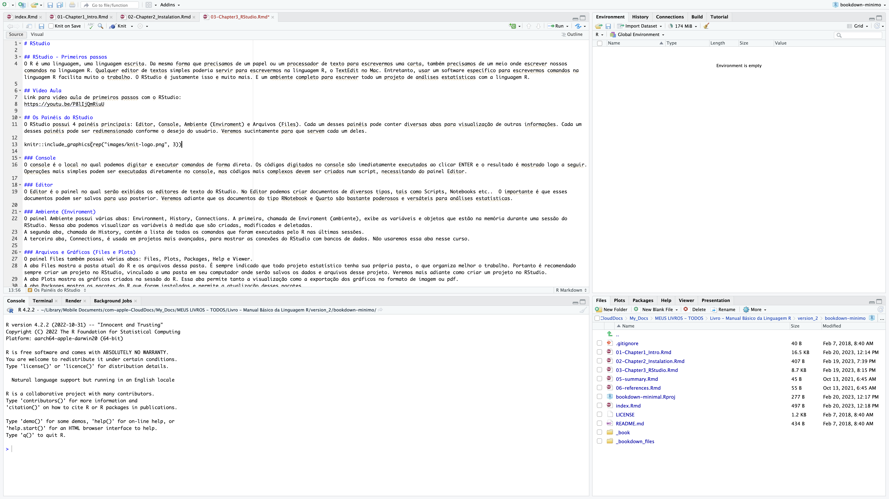
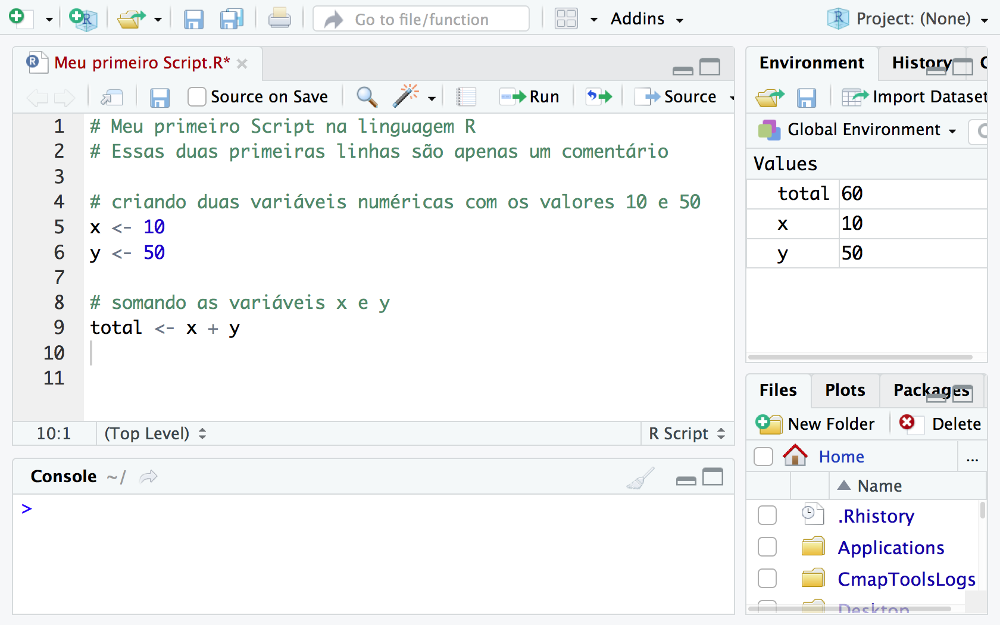
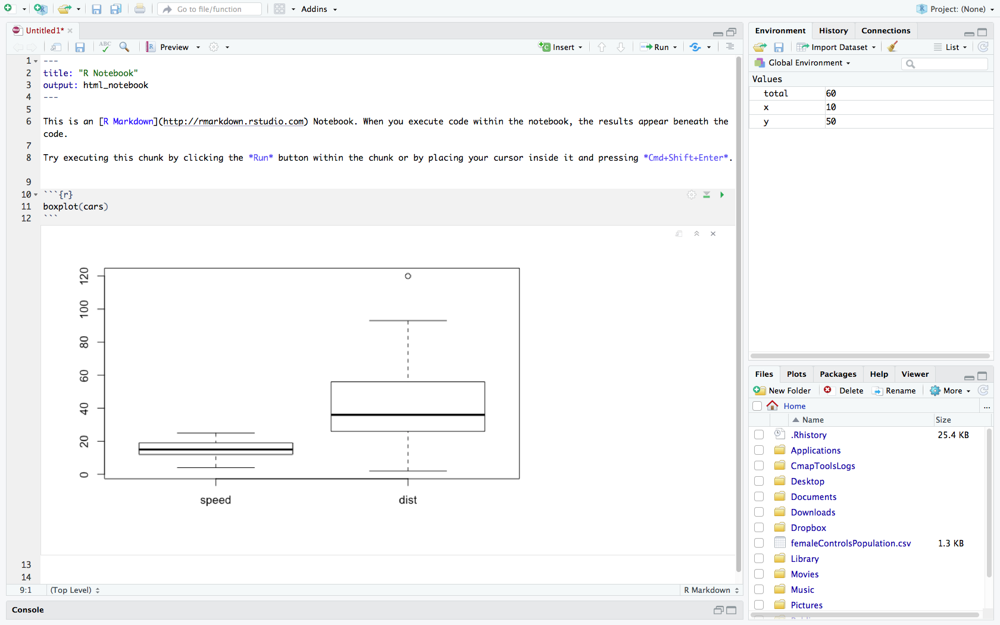
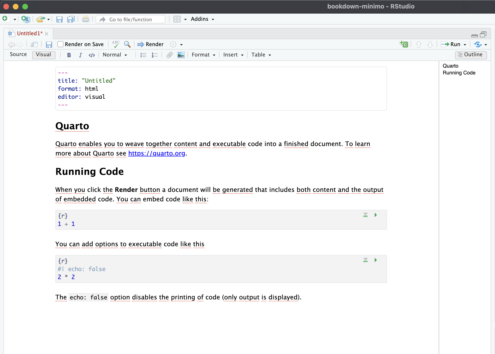

# RStudio

## RStudio - Primeiros passos

O R é uma linguagem, uma linguagem escrita. Da mesma forma que precisamos de um papel ou um processador de texto para escrevermos uma carta, também precisamos de um meio onde escrever nossos comandos na linguagem R. Qualquer editor de textos simples poderia servir para escrevermos na linguagem R, o TextEdit no Mac. Entretanto, usar um software específico para escrevermos comandos na linguagem R facilita muito o trabalho. O RStudio é justamente isso e muito mais. E um ambiente completo para escrever todo um projeto de análises estatísticas com a linguagem R.

## Video Aula

Link para video aula de primeiros passos com o RStudio: <https://youtu.be/P8lIjQmRiuU>

## Os Painéis do RStudio

O RStudio possui 4 painéis principais: Editor, Console, Ambiente (Enviroment) e Arquivos (Files). Cada um desses painéis pode conter diversas abas para visualização de outras informações. Cada um desses painéis pode ser redimensionado conforme o desejo do usuário. Veremos sucintamente para que servem cada um deles.

```{r RStudio-4Panels, echo=FALSE, out.width='100%', fig.show='hold', fig.cap='Os 4 Paineis do RStudio.'}

```

### Console

O console é o local no qual podemos digitar e executar comandos de forma direta. Os códigos digitados no console são imediatamente executados ao clicar ENTER e o resultado é mostrado logo a seguir. Operações mais simples podem ser executadas diretamente no console, mas códigos mais complexos devem ser criados num script, necessitando do painel Editor.

### Editor

O Editor é o painel no qual serão exibidos os editores de texto do RStudio. No Editor podemos criar documentos de diversos tipos, tais como Scripts, Notebooks etc.. O importante é que esses documentos podem ser salvos para uso posterior. Veremos adiante que os documentos do tipo RNotebook e Quarto são bastante poderosos e versáteis para análises estatísticas.

### Ambiente (Enviroment)

O painel Ambiente possui várias abas: Environment, History, Connections. A primeira, chamada de Enviroment (ambiente), exibe as variáveis e objetos que estão na memória durante uma sessão do RStudio. Nessa aba podemos visualizar as variáveis à medida que são criadas, modificadas e deletadas. A segunda aba, chamada de History, contém a lista de todos os comandos que foram executados pelo R nas últimas sessões. A terceira aba, Connections, é usada em projetos mais avançados, para mostrar as conexões do RStudio com bancos de dados. Não usaremos essa aba nesse curso.

### Arquivos e Gráficos (Files e Plots)

O painel Files também possui várias abas: Files, Plots, Packages, Help e Viewer. A aba Files mostra a pasta atual do R e os arquivos dessa pasta. É sempre indicado que todo projeto estatístico tenha sua própria pasta, o que organiza melhor o trabalho. Portanto é recomendado sempre criar um projeto no RStudio, vinculado a uma pasta em seu computador onde serão salvos os dados e arquivos desse projeto. Veremos mais adiante como criar um projeto no RStudio. A aba Plots mostra os gráficos criados na sessão do R. Essa aba permite tanto a visualização como a exportação dos gráficos no formato de imagem ou pdf. A aba Packages mostra os pacotes do R que foram instalados e permite a atualização desses pacotes. A aba Help mostra o arquivo help do R. A aba Viewer serve para visualização de arquivos da web. Não usaremos essa aba nesse curso.

## Os tipos de documentos do RStudio

### R Script

No cinema ou no teatro um script é o texto escrito do diálogos dos personagens. Na ciência da computação um script é um texto escrito em alguma linguagem de programação. No nosso caso, R Script é um texto com comandos da linguagem R. Ou seja, em última análise, um script é nada mais que um documento de texto, que pode ser salvo, assim como podemos salvar documentos que escrevemos com o uso de processadores de texto. Tal como salvamos documentos do Word, também podemos salvar os Scripts escritos no RStudio.

Um script contém a sequencia de comandos que desejamos que sejam executados pelo R, escrito na linguagem R. Podemos também escrever os comandos diretamente no console, entretanto os comando assim escritos não podem ser salvos. A vantagem de escrever os comandos num documento de texto é justamente poder salvar esse documento para uso posterior. Em computação é usual denominarmos os comandos num documento de texto como nosso código. Em especial, quando esse código está escrito na linguagem R, é usual denominar esses comando de código em R ou simplesmente de R code. Um Script contém principalmente códigos, mas deve conter também comentários, que explicam o código.

#### Comentários no R - \#

Um símbolo importante no R é o hashtag #.

Dentro de um Script ou num campo de código esse símbolo indica que o texto a seguir é um comentário, ou seja, é um texto para ser lido por humanos e que o computador ignora.

```{r Meu-Primeiro-RScript, echo=FALSE, out.width='100%', fig.show='hold', fig.cap='Meu Primeiro Script no R'}

```

No RStudio podemos criar outros tipos de documentos. Um RNotebook é um documento do tipo Markdown. Como veremos adiante, num RNotebook o hashtag \# tem outra função, serve para indicar uma seção do documento.

### RNotebook

O R Notebook é um documento de texto mais sofisticado que um R Script. Um documento do tipo R Notebook é um misto de texto e códigos. O texto de um R Notebook é escrito no formato mais usado em ciência chamado de Markdown, intercalado com trechos de código (chamados de code chunks). Essa mistura de texto com código proporciona criar documentos com toda nossa análise estatística de forma muito mais simples. Além disso, um R Notebook pode ser gravado em diferentes formatos (word, pdf ou html) o que simplifica os processos de transferência de arquivos entre colaboradores.

Veja na imagem abaixo que um trecho de código vem dentro de um campo (code chunk) delimitado por

````
```{r}

```
````

```{r Meu-Primeiro-RNotebook, echo=FALSE, out.width='100%', fig.show='hold', fig.cap='Meu Primeiro RNotebook no R'}

```

### Documento Quarto

O documento tipo Quarto no RStudio é um formato de arquivo muito versátil, que permite a criação de um ambiente de trabalho personalizado, contendo diversos elementos, como códigos, gráficos, tabelas e textos explicativos.

O nome Quarto é derivado do nome dado ao formato de um livro ou panfleto produzido a partir de folhas inteiras impressas com oito páginas de texto, quatro de cada lado, e depois dobradas duas vezes para produzir quatro folhas. O primeiro livro impresso europeu conhecido é um Quarto, o Sibyllenbuch, que se acredita ter sido impresso por Johannes Gutenberg em 1452-53.

O documento Quarto se parece muito com o RNotebook, mas combina as funcionalidades de muitos pacotes do R, inclusive o pacote `bookdown` para autoria de livros. Esse livro, não por acaso, foi escrito totalmente em documentos tipo Quarto.

Esse é um tipo de documento mais moderno, criado há poucos anos e especialmente útil para análises de dados, que envolvem diversos passos e resultados intermediários, pois permite a organização e a documentação dos procedimentos utilizados.

Os documentos tipo Quarto também são criados no RStudio por meio da extensão `.qmd`. Combina o uso da linguagem R com o formato Markdown, utilizado para a criação de textos com formatação simples. Assim, também é possível incluir no documento tanto trechos de código em R quanto texto formatado com títulos, parágrafos, listas, entre outros elementos.

Além disso, os documentos tipo Quarto no RStudio permitem a utilização de recursos avançados, como a inclusão de gráficos interativos, tabelas dinâmicas e widgets, que possibilitam a interação do usuário com os resultados obtidos. Também é possível personalizar o tema visual do documento, alterando cores, fontes e outros aspectos de design.

Uma vez criado o documento tipo Quarto, é possível exportá-lo em diversos formatos, como PDF, HTML e Word, mantendo a formatação e a interatividade dos elementos. Isso permite a compartilhamento dos resultados e da metodologia utilizada com outros usuários e colaboradores.

Em resumo, o documento tipo Quarto no RStudio é uma ferramenta poderosa para análises de dados, que combina a linguagem R com o formato Markdown e permite a organização, a documentação e a interação com os resultados obtidos.

O documento tipo Quarto no RStudio e o RNotebook são formatos de arquivo similares e ambos oferecem algumas vantagens para os usuários. No entanto, há diferenças entre eles que podem tornar um mais adequado para determinadas situações do que o outro.

Uma das principais vantagens do documento tipo Quarto é que ele permite criar um ambiente de trabalho personalizado que combina códigos, gráficos, tabelas e textos explicativos, além de oferecer recursos avançados como gráficos interativos e tabelas dinâmicas. Isso faz com que seja uma ferramenta muito útil para análises de dados complexas, em que é necessário organizar e documentar os procedimentos utilizados e também compartilhar os resultados com outras pessoas.

Uma desvantagem do RNotebook em relação ao documento tipo quarto é que ele pode ser mais limitado em termos de personalização do ambiente de trabalho, uma vez que segue um modelo de formato fixo. Além disso, os R Notebooks podem ser mais complexos de editar e compartilhar com outras pessoas que não estão familiarizadas com o R.

Em resumo, ambos os formatos de arquivo oferecem recursos úteis para análises de dados, mas o documento tipo quarto é um formato mais moderno, com mais opções de formatação e mais interativo.

```{r Meu-Primeiro-Quarto, echo=FALSE, out.width='100%', fig.show='hold', fig.cap='Meu Primeiro Documento Quarto no R'}

```
