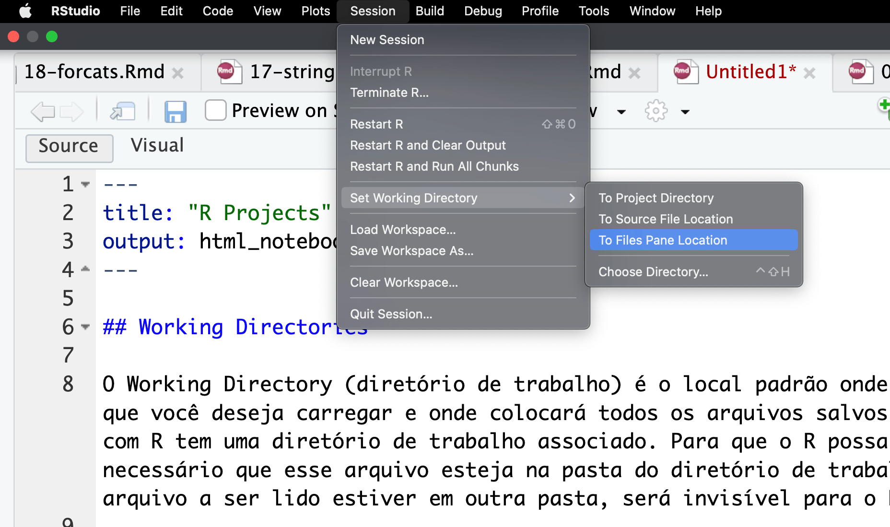
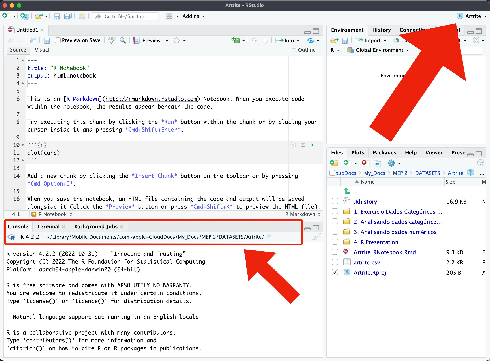
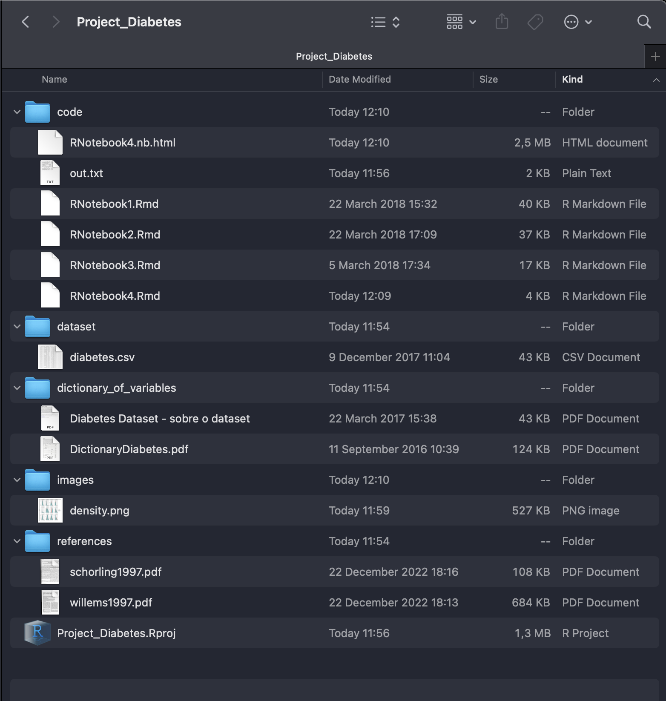

# Projetos do R {#sec-projects}

## Conceitos e Vantagens

Projetos no R são uma maneira organizada e eficiente de gerenciar seu trabalho de análise de dados. Um projeto no R cria um ambiente isolado onde todos os arquivos relacionados ao seu trabalho específico são armazenados juntos, facilitando o gerenciamento e a reprodução de análises. Isso é especialmente útil quando se trabalha em múltiplos projetos ou quando se colabora com outras pessoas.

## Diretórios de Trabalho (Working Directories)

Para entender melhor o que é um projeto no R, é essencial compreender o conceito de diretório de trabalho ou working directories.

O diretório de trabalho é a pasta no seu computador onde o R lê e grava arquivos por padrão. Quando você inicia uma sessão do R, ele define um diretório de trabalho inicial. Se você não especificar um caminho completo para um arquivo, o R procurará esse arquivo no diretório de trabalho atual.

Os diretórios de trabalho são importantes porque:

-   **Organização**: Eles ajudam a manter seus arquivos organizados.

-   **Facilidade de Acesso**: Simplificam o acesso a arquivos, sem a necessidade de especificar caminhos completos.

-   **Reprodutibilidade**: Facilita a reprodução do trabalho, garantindo que todos os arquivos necessários estejam no mesmo lugar.

O Working Directory (diretório de trabalho) é o local padrão onde o R procurará os arquivos que você deseja carregar e onde colocará todos os arquivos salvos. Toda sessão de trabalho com R tem uma diretório de trabalho associado. Para que o R possa ler um arquivo, é necessário que esse arquivo esteja na pasta do diretório de trabalho da sessão do R.

Se o arquivo a ser lido estiver em outra pasta, será invisível para o RStudio.

Então uma das coisas mais importantes quando trabalhamos no RStudio é sabermos exatamente qual o diretório de trabalho estamos usando.

O R tem duas funções básicas para lidar com o working directory:

-   `getwd()`
-   `setwd(dir)`

A função `getwd()` indica qual o working directory atual, ou seja, indica qual folder o R está usando no momento.

A função `setwd()` muda o working directory para o folder indicado como argumento.

Além dessas funções, você pode mudar o diretório de trabalho diretamente no menu do RStudio.

Podemos indicar ao R que diretório da sessão de trabalho seja o diretório aberto naa aba Files. Para isso:

1.  clique em `Session` (no menu do RStudio)
2.  Em seguida em `Set Working Directory`
3.  Escolha a opção `To Files Pane Location`.

```{r SettingWorkingDirectory, echo=FALSE, fig.show='hold', fig.cap='Definindo o diretório de trabalho'}

```

Entretanto, esse é um método muito desajeitado e trabalhoso para fazer toda vez que se usar o RStudio. A melhor forma de resolver esse problema é usar sempre um Project do RStudio.

## Projetos no R

Um projeto no R é essencialmente um diretório de trabalho bem organizado. Quando você cria um projeto no RStudio (um ambiente de desenvolvimento integrado para R), ele cria uma pasta específica para o projeto e define essa pasta como o diretório de trabalho sempre que você abre o projeto. Isso significa que todos os arquivos e scripts que você criar ou usar no projeto serão armazenados nessa pasta.

### Vantagens dos Projetos no R

-   **Isolamento**: Cada projeto tem seu próprio diretório de trabalho, isolando os arquivos e pacotes específicos para esse projeto. Isso evita conflitos entre diferentes projetos.

-   **Organização**: Facilita a organização dos seus arquivos, scripts, dados e resultados em um único lugar.

-   **Facilidade de Compartilhamento**: Você pode facilmente compartilhar o diretório do projeto com outras pessoas, garantindo que elas tenham acesso a todos os arquivos necessários para reproduzir sua análise.

-   **Gerenciamento de Pacotes**: Projetos no R podem ter seu próprio conjunto de pacotes, o que garante que todas as dependências necessárias estão disponíveis e na versão correta.

-   **Reprodutibilidade**: Mantém um ambiente consistente, o que é crucial para a reprodutibilidade das análises.

A grande importância de criar um Projeto no RStudio é que um projeto define automaticamente seu diretório de trabalho.

O nome do seu projeto aparece na barra na parte superior RStudio, e o caminho completo do diretório de trabalho aparece na barra superior do painel Console, como mostra a figura abaixo.

```{r SettingWorkingDirectory2, echo=FALSE, fig.show='hold', fig.cap='Criando um Projeto'}

```

### Criando um Projeto no RStudio

Antes de criar um projeto, é necessário criar primeiro a pasta que servirá de diretório de trabalho em seu computador e salvar nessa pasta os arquivos com os dados a serem analisados.

Para criar um projeto (project) clique em `Project` (na parte superior à direta do RStudio) e em seguida em `New Project`.

A seguir, escolha a opção `Existing Directory - Associate a project with an existing directory`.\
Em seguida, clique em `Browse` para encontrar a pasta existente e associá-la ao seu projeto.

**Video de Criação de Projetos no RStudio** <https://youtu.be/YYRb_7yJSlQ>

### Estrutura de pastas de um projeto

Em geral uma pesquisa possui um monte de arquivos. Temos arquivos com os dados brutos, arquivos com dados modificados, arquivos em formatos específicos tal como Excel, Word, PDFs, artigos de referências, imagens, gráficos etc. Colocar tudo isso numa única pasta do projeto não é uma boa prática. A pasta do projeto fica caótica.

A técnica ideal é criar um conjunto de subpastas dentro da pasta principal do projeto. Uma dessas pastas, talvez a mais importante, é a pasta de dados. Escolha um nome adequado, tal como `dados`, `dataset`, etc. E use essa pasta para armazenar o banco de dados de sua pesquisa.

Um projeto no R geralmente inclui:

-   **Scripts**: arquivos .R contendo seu código, no formato Scripts, Notebooks, Quarto etc.

-   **Dados**: arquivos de dados que você está analisando (por exemplo, arquivos .csv, .xlsx).

-   **Resultados**: resultados das análise, gráficos e tabelas, criadas pelo seus scripts.

-   **Documentação**: arquivos de texto ou markdown documentando seu trabalho.

-   **Configurações do Projeto**: arquivos específicos do RStudio, como .Rproj, que armazena as configurações do projeto.

Veja abaixo um exemplo de como organizar sua pasta do projeto:

```{r SettingWorkingDirectory3, echo=FALSE, fig.show='hold', fig.cap='Estrutura de Diretórios de um Projeto'}

```
