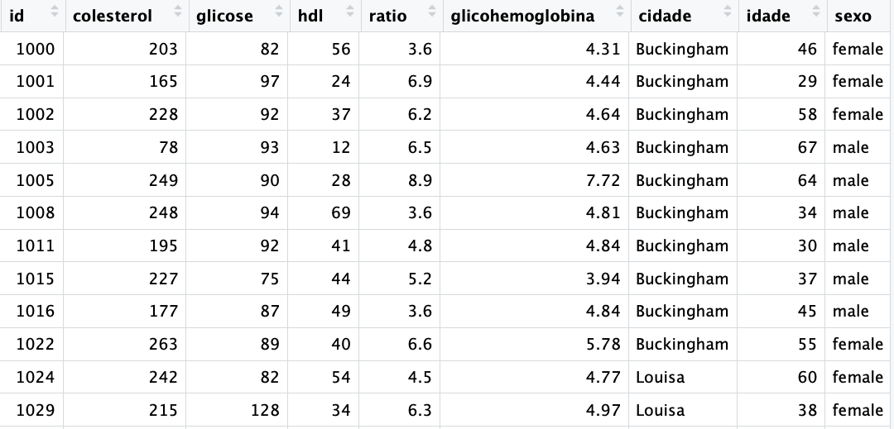

# Data Frames e Tibbles {#sec-dataframes}

Data frames e Tibbles são os objetos do R para armazenar dados. Se os vetores são a base o R, os data frames e as tibbles são o coração do R.

Pacotes usados neste capítulo, carregados uma única vez no início, como recomendado no capítulo sobre pacotes (@sec-packages):

```{r, message=FALSE, warning=FALSE}
library(tibble)
library(tidyr)
library(dplyr)
library(readr)
```

## Data frames

Data frames são a forma usual do R para armazenar dados. Veremos depois que as tibbles são a versão mais nova dos data frames, com melhorias em vários aspectos.

Superficialmente os data frames e as tibbles são como planilhas do Excel, com colunas e linhas, onde cada coluna é uma variável da pesquisa (ex: sexo, idade, peso) e cada linha uma observação (ex: um paciente ou um caso).

```{r data frameExemplo, echo=FALSE, out.width='100%', fig.show='hold', fig.cap='Exemplo de data frame'}

```

O R possui vários datasets (conjuntos de dados) para facilitar o aprendizado. Para saber mais sobre os datasets inclusos no R digite no console o comando abaixo: `data()`

Podemos carregar os datasets já inclusos no R com a função mesma função `data()`, bastando incluir como argumento o nome do dataset desejado. No exemplo a seguir iremos carregar o dataset `USArrests`. Este dataset contém estatísticas das prisões por 100.000 habitantes por assalto, assassinato e estupro em cada um dos 50 estados dos EUA em 1973, como também a porcentagem da população urbana.

```{r}
data(USArrests)
```

Como esse dataset carregado podemos agora visualizar os dados simplesmente digitando o nome do dataset no console.

```{r}
head(USArrests)
```

Experimente também usar a função `str()`, que mostra a estrutura dos dados de um objeto.

Você verá que o dataset `USArrests` é um data frame com 50 observações (50 linhas) e 4 variáveis (Murder, Assault, UrbanPop, Rape), como mostrado abaixo.

```{r}
str(USArrests)
```

Vejamos a estrutura de um dataset com 403 pacientes e 19 variáveis num estudo sobre diabetes, obesidade e outros fatores de risco para doenças coronarianas. O data frame contém então 403 linhasa e 19 colunas. Esse dataset foi obtido no site da universidade de Vanderbilt no link a seguir:

<https://hbiostat.org/data/repo/diabetes.csv>

Para usar esse dataset é necessário fazer o download desse arquivo e depois carregar esse arquivo no R. Veremos mais tarde como fazer isso.

```{r, echo=FALSE}
diabetes = read.csv("dataset/diabetes.csv")
head(diabetes)
```

```{r}
str(diabetes)
```

Podemos criar um data frame com a função `data.frame()`, como a seguir:

```{r}
nome  <- c("Henrique", "Antônio", "Fabiano") 
idade <- c(45, 40, 48) 
staff  <- data.frame(nome, idade) 
staff
```

A última linha acima criou o data frame, com as as duas colunas (nome e idade) e as 3 linhas, uma para cada participante da pesquisa e armazenou esse data frame no objeto `staff`. Veja que o objeto `staff` é um `data.frame` do R.

```{r}
class(staff)
```

Podemos visualizarmos a estrutura desse data frame com a função `str(staff)`.

```{r}
str(staff)
```

Para visualizarmos o data frame basta digitar seu nome `staff`.

```{r}
staff
```

## tidy: wide x long

A palavra data frame pode ser traduzida grosseiramente por quadro de dados e se refere a dados dispostos numa estrutura com linhas e colunas. Ou seja, um data frame é um objeto com estrutura bidimensional, composto de linhas e colunas, tais como uma matriz de dados.

A forma de organização mais comum de dados num data frame é chamada de tidy [@Hadley2014] que significa, segundo o dicionário Cambridge, **"having everything ordered and arranged in the right place"**.

Um dataset ou um data frame organizado (tidy data) as informações estão dispostas da seguinte forma:

1.  Cada variável é uma coluna (ou cada coluna é uma variável).
2.  Cada observação é uma linha (ou cada linha é uma observação).
3.  Cada célula é um valor de uma variável em uma determinada observação.

A figura a seguir ilustra o conceito de tidy data. 

Existem duas formas de organizar os dados numa tabela: **wide** e **long**. Vamos ver cada uma dessas formas a seguir.

Vamos primeiro criar um pequeno data frame para exemplo, no qual 3 pacientes se submeteram a dois tipos de tratamento, obtendo um determinado resultado para cada tratamento.

```{r}
# criando os vetores do data frame simulado
pacientes   <- c("João", "José", "Maria")
tratamentoA <- c(25,16,20) 
tratamentoB <- c(12,8,9) 

# criando o data frame a partir dos vetores já criados
result <- data.frame(pacientes, tratamentoA, tratamentoB)

# mostrando o data frame criado
result
```

Esse data frame é um exemplo de dados no formado wide (largo). E é muitas vezes a forma usual de um conjunto de dados.

Entretanto, frequentemente, precisamos colocar esses dados numa outra disposição que facilita a análise dos dados. O formato long (comprido) é essa outra forma.

Podemos ajustar esse data frame no formato long, colocando o tipo de tratamento numa coluna e o resultado noutra coluna. Ou seja, as duas colunas anteriores chamadas `tratamentoA` e `tratamentoB` serão juntadas em uma única coluna, chamada `tratamento` e os resultados passarão a ser uma única coluna.

Veja no exemplo abaixo a transformação desse conjunto de dados para o formato long:

```{r}
result |>  
  pivot_longer(!pacientes,  
               names_to = "tratamento", 
               values_to = "resultado")
```

Não se preocupe com o código usado aqui para fazer essa transformação. O objetivo aqui é entender que existem dois tipos de formatação do data frame, wide e long e que existem ferramentas para essa transformação num sentido e no outro.

Sugiro a leitura do artigo **Tidy Data** de Hadley Wickham, publicado no Journal of Statistical Software, Vol VV, Issue 2, no link a seguir: <https://vita.had.co.nz/papers/tidy-data.pdf>

## `Tibbles`, os dataframes do tidyverse

Tibbles são data frames mais amigáveis. As `tiblles` foram criadas para resolver alguns problemas dos data frames e fazem parte do pacote `tibble` do `tidyverse`. Veremos nos capítulos adiante o que são pacotes, o que é o `tidyverse`.

Tibbles são a versão moderna dos data frames do R. Um dataframe é uma estrutura de dados em R que organiza dados em uma tabela, onde cada coluna pode conter um tipo diferente de dados (como números, texto, ou datas). Cada linha do dataframe representa uma observação.

Por exemplo, imagine que você tem uma tabela com informações sobre pacientes:

| Nome  | Idade | Tipo Sanguíneo |
|-------|-------|----------------|
| João  | 30    | A+             |
| Maria | 25    | B-             |
| Ana   | 40    | O+             |

Essa tabela pode ser representada como um dataframe em R.

### O que são Tibbles?

Tibbles são uma versão moderna dos dataframes, oferecida pelo pacote `tibble`, parte do tidyverse. Eles são projetados para serem mais simples e robustos do que os dataframes tradicionais. Embora sejam semelhantes aos dataframes, as tibbles trazem várias vantagens que facilitam o trabalho com dados em R.

### Vantagens das Tibbles

1.  **Exibição Melhorada**:

    -   Quando você exibe uma tibble, ela é formatada de forma amigável. Apenas as primeiras 10 linhas e as colunas que cabem na tela são mostradas, evitando sobrecarregar a tela com informações.
    -   Dataframes tradicionais podem mostrar grandes quantidades de dados de uma só vez, o que pode ser confuso.

```{r}
# Exibindo um dataframe tradicional
df <- data.frame(nome = c("João", "Maria", "Ana", "Marcos", "Antônio", 
                          "Pedro", "José", "Gustavo", "Carlos", "Rafaela", 
                          "Luiza", "Lucas", "Laura", "Lavinia", "Carla"), 
                 idade = c(30, 25, 40, 35, 60, 
                           75, 27, 54, 59, 12, 
                           19, 22, 65, 87, 90), 
                 tipoSanguineo = c("A+", "B-", "O+", "A+", "B-", 
                                   "O+", "A+", "B-", "O+","B-", 
                                   "O+", "A+", "A+", "B-", "O+"))
df
```

```{r}
# Exibindo uma tibble
tib <- tibble(nome = c("João", "Maria", "Ana", "Marcos", "Antônio", 
                          "Pedro", "José", "Gustavo", "Carlos", "Rafaela", 
                          "Luiza", "Lucas", "Laura", "Lavinia", "Carla"), 
             idade = c(30, 25, 40, 35, 60, 
                       75, 27, 54, 59, 12, 
                       19, 22, 65, 87, 90), 
             tipoSanguineo = c("A+", "B-", "O+", "A+", "B-", 
                               "O+", "A+", "B-", "O+","B-", 
                               "O+", "A+", "A+", "B-", "O+"))
tib
```

2.  **Colunas Consistentes**:

    -   As tibbles sempre mantêm as colunas como os tipos de dados corretos. Por exemplo, se você tiver uma coluna de números, ela não será automaticamente convertida em caracteres, mesmo se houver um valor de texto nela.
    -   Dataframes tradicionais às vezes convertem automaticamente os tipos de dados de colunas, o que pode causar problemas.

3.  **Facilidade de Subsetting (Subconjuntos)**:

    -   Subsetting em tibbles é mais intuitivo. Você pode usar colchetes `[]`, `$` ou funções específicas do `tidyverse` sem surpresas.
    -   Dataframes tradicionais podem se comportar de maneiras inesperadas ao fazer subsetting, especialmente com colunas de uma única linha.

```{r}
# Subsetting com tibble
tib$nome  # Acesso à coluna 'Nome'
```

```{r}
# Subsetting com tibble
tib[1, ]  # Acesso à primeira linha
```

```{r}
# Subsetting com dataframe tradicional pode causar problemas se não tomar cuidado
df$nome # Acesso à coluna 'Nome'
```

```{r}
# Subsetting com dataframe tradicional pode causar problemas se não tomar cuidado
df[1, ] # Acesso à primeira linha
```

4.  **Mensagens de Erro Mais Úteis**:

    -   As tibbles fornecem mensagens de erro mais claras e informativas, ajudando a entender o que deu errado e como corrigir.

5.  **Melhor Compatibilidade com o Tidyverse**:

    -   As tibbles são projetadas para funcionar perfeitamente com outras ferramentas do `tidyverse` (como `dplyr` e `ggplot2`), facilitando operações de manipulação de dados e visualização.

### Criando e Usando Tibbles

Aqui está um exemplo de como criar e usar tibbles no R:

```{r, message=FALSE, warning=FALSE}
# Criando uma tibble
dados_pacientes <- tibble(nome = c("João", "Maria", "Ana", "Marcos", "Antônio", 
                                  "Pedro", "José", "Gustavo", "Carlos", "Rafaela", 
                                  "Luiza", "Lucas", "Laura", "Lavinia", "Carla"), 
                         idade = c(30, 25, 40, 35, 60, 
                                   75, 27, 54, 59, 12, 
                                   19, 22, 65, 87, 90), 
                         tipoSanguineo = c("A+", "B-", "O+", "A+", "B-", 
                                           "O+", "A+", "B-", "O+","B-", 
                                           "O+", "A+", "A+", "B-", "O+"))
```

```{r}
# Exibindo a tibble
dados_pacientes
```

```{r}
# Acessando colunas
dados_pacientes$nome
```

```{r, message=FALSE, warning=FALSE}
# Filtrando dados com o dplyr (do tidyverse)
pacientes_mais_jovens <- dados_pacientes |> filter(idade < 35)
pacientes_mais_jovens
```

### transformando data frames em `tibbles`

Caso você tenha um data frame, é fácil transformá-lo numa `tibble` usando a função `as_tibble()`.

O código a seguir lê um banco de dados chamado `diabetes.csv` que está na pasta `dataset` do projeto. A leitura será feita através da função base do R `read.csv()`, que coloca os dados lidos num data frame. Em seguida, usaremos a função `as_tibble()` para transformar o data frame numa `tibble`.

```{r, message=FALSE, warning=FALSE}
# lendo os dados com a função read.csv do R Base
diabetes <- read.csv("dataset/diabetes.csv") 

# verificando que os dados foram armazenados num data frame
str(diabetes)
```

```{r, message=FALSE, warning=FALSE}
# transformando o data frame numa tibble
diabetes <- as_tibble(diabetes)

# verificando que os dados agora esão armazenados numa tibble
str(diabetes)
```

Veremos mais adiante que a função `read_csv()` do `readr` já lê os dados como uma tibble.

```{r, message=FALSE, warning=FALSE}
# lendo os dados com a função read_csv() do readr, que já devolve uma tibble
diabetes <- read_csv("dataset/diabetes.csv") 

# verificando que os dados foram armazenados num data frame
str(diabetes)
```
