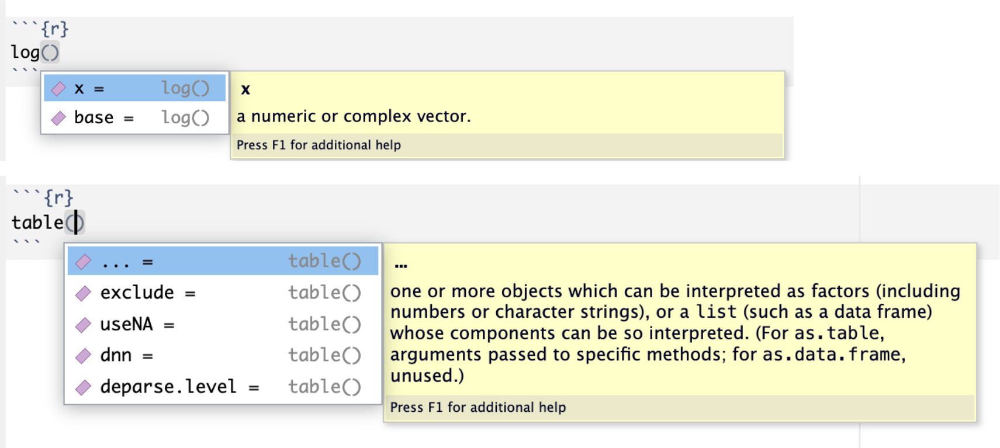

# Funções no R {#sec-functions}

As funções são a base de uma linguagem de programação. Assim como uma função matemática, na computação uma função recebe um conjunto de dados, processa esses dados e retorna um resultado. Os dados inseridos numa função são chamados de **argumentos** da função. Os resultados da função são chamados de **output** da função. E geralmente usamos o termo *retornar* para nos referirmos ao output da função, os resultados da função.

O R possui diversas funções prontas para serem usadas, mas também permite que você crie suas próprias funções. Isso será útil quando uma determinada análise tem de ser feita diversas vezes, evitando que você precise reescrever o código dessa análise toda vez que tiver de fazê-la novamente.

Já vimos em capítulos anteriores algumas funções como `str(x)`, que retorna a estrutura do objeto x; a função `c()`, que combina os objetos num vetor; e algumas funções matemáticas como `mean()`, `median()`, `sd()` que retornam a média, a mediana e o desvio padrão de um conjunto de dados numéricos. Todos dados inseridos numa função são denominados `argumentos` da função.

Uma função pode receber como input (argumento) um valor numérico e dar como resultado o dobro desse valor. Uma outra função recebe como input um valor numérico e dá como resultado o seno desse valor. Outra função recebe um valor numérico e dá como resultado a raiz quadrada desse valor, etc.

Vejamos um exemplo simples de como extrair a raiz quadrada de um número no R. O nome da função é `sqrt()`, é uma abreviação de *square root*, ou raiz quadrada. Inserimos na função o número cuja raiz quadrada desejamos saber. Esse valor é o argumento dessa função. Portanto, para obter a raiz quadrada de 225 basta usar a função `sqrt()` com o valor desejado.

```{r}
sqrt(225) 
```

Na computação, as funções podem receber mais do que apenas valores numéricos. Podem receber tanto números quanto quaisquer outros objetos e informações para saber como se comportar e o que fazer. Tudo que é inserido numa função para que seja executada alguma operação é chamado de argumento da função.

## Argumentos de uma função {#sec-arguments}

Existem dois tipos de argumentos de função:

1.  **dados**, argumentos para calcular o que se pretende;
2.  **controles**, argumentos que controlam outros aspectos da função, por exemplo como lidar com dados faltantes.

A função `mean()` é um exemplo de função que possui argumentos de dados e argumentos de controle. Os argumentos de dados são os valores numéricos que serão usados para calcular a média. Os argumentos de controle são os argumentos que controlam o comportamento da função, como por exemplo, o argumento `na.rm` que indica se a função deve remover ou não os valores faltantes.

```{r}
x <- c(1,2,3,4,NA)
mean(x, na.rm = TRUE) # na.rm=TRUE é um argumento de controle
```

Os argumentos de uma função são os parâmetros sobre os quais a função realiza alguma operação. Por exemplo, na função $f(x)=sen(x)$, $x$ é o argumento da função. A operação de calcular o seno será realizada sobre o valor de $x$. Da mesma forma, nas funções $f(x)=\sqrt{x}$, $f(x)=2x$, e $f(x)=x^2$, $x$ é o argumento das funções.

Algumas funções possuem mais de um argumento, tal como a função logarítmica $f(x,b)=\log _{b} (x)$. Para calcularmos o logaritmo de $x$ na base $b$ , precisamos informar à função o valor de $x$ e de $b$. Então $x$ e $b$ são os argumentos da função $f(x,b)=\log _{b} (x)$.

Esse é um exemplo de função que precisa de dois argumentos para ser executada. No R a função para calcular o logaritmo de 2 na base 10 seria escrita da seguinte maneira:

```{r}
log(2,10)
```

Toda função no R tem a seguinte estrutura: `nome(argumento, argumento, argumento, …)`. Ou seja, o nome da função, seguido dos argumentos da função entre parênteses. Observe que não há espaços entre o nome da função e os parênteses com os argumentos. Os argumentos, por sua vez, são separados por vírgulas. A inserção dos argumentos numa função pode ser feita de duas maneiras:

-Pela ordem\
-Pelo nome do argumento

A função logaritmo interpreta o primeiro valor como sendo $x$ e o segundo valor como sendo a base $b$. Mas podemos escrever essa função explicitando cada argumento individualmente. Essa forma de escrever, embora mais longa, deixa a função mais compreensível para o leitor. Além disso, quando inserimos os argumentos pelo nome, a ordem não importa, pois já estamos indicando ao R o significado de cada argumento.

Veja abaixo as diferentes formas de inserir os argumentos numa função no R.

```{r}
# inserindo os argumentos pela ordem
log(2,10) 
```

```{r}
# inserindo os argumentos pelo nome
log(x = 2, base = 10) 
```

Além disso, para facilitar o uso, muitas funções no R já têm argumentos padronizados, *default*. Ou seja, caso não sejam informados, o R irá usar o valor padrão desses argumentos. A função logaritmo no R tem como padrão o logaritmo natural, a base $e$. Então, se a base não for inserida como argumento, o R interpretará que deverá ser usado o valor padrão. Veja abaixo o exemplo, para calcular o logaritmo natural de 10 - $log _{e} (10)$ - simplesmente digitamos no R:

```{r}
# usando a o argumento default (padrão) da função logaritmo no R
# será calculado o logaritmo natural (base e) de 10
log(10)
```

### Visualizando os possíveis argumentos de uma função

Podemos verificar alguns dos argumentos possíveis de serem passados para uma função digitando a tecla `tab` quando o cursor estiver dentro da função. Quando clicamos a tecla `tab` o RStudio abre um menu contextual com os mais importantes argumentos da função. Veja nas imagens abaixo alguns exemplos.

```{r function-arguments, echo=FALSE, out.width='100%', fig.show='hold', fig.cap='argumentos da função.'}

```

## Criando suas próprias funções

Vamos agora criar nossas próprias funções.

Para criar uma função precisamos: 1. Dar um nome para a função a ser criada. 2. Definir os argumentos da função. 3. Definir o que a função irá *retornar*, seu *output*.

Suponha que você tenha em seu banco de dados a altura e o peso dos pacientes e necessite calcular o imc (índice de massa corporal). Podemos facilmente criar uma função que recebe os valores do peso e da altura como argumentos, calcula o IMC e *retorna* esse valor. O termo *retornar* é usualmente usado para se referir ao objeto que a função devolve depois de receber seus argumentos.

Então:\
1. O nome da função será: `imc`.\
2. Os argumentos da função serão: `peso` e `altura`.\
3. A função irá calcular e *retornar* um valor numérico.\

Com essas informações, basta colocar tudo isso na função.\

```{r}
imc <- function(peso, altura)
{
return(peso/(altura*altura))
}
```

A primeira linha acima indica que estamos criando uma função chamada `imc` que recebe dois argumentos: `peso` e `altura`.\
As linhas entre os `{}` realizam o cálculo do imc, que é o peso dividido pela altura ao quadrado.\
O comando `return()` é usado para indicar o que a função irá *retornar*.\

Para usar essa função, basta inserir os argumentos peso e altura na própria função

```{r}
imc(peso = 64, altura = 1.75)
```

## Funções anônimas

As funções que criamos com o comando `function()` acima todas tiveram um nome. Entretanto, o R também permite criar funções anônimas, ou seja, sem nome. Elas também são criadas com o comando `function()` e são usadas para realizar operações simples e rápidas, quando não há necessidade de reutilizar a função novamente. Funções anônimas são frequentemente utilizadas em conjunto com funções da família `apply`, como `lapply`, `sapply`, que aplicam uma função (anônima) a cada elemento de uma lista ou vetor. Essa combinação permite transformar e processar dados de maneira eficiente e elegante, tornando-as uma ferramenta poderosa para a manipulação e análise de dados em R.

Entretanto, as funções da família `apply` são bastante sofisticadas, e estão além do escopo desse livro de introdução ao R. Para mais informações sobre essas funções, consulte a documentação do R ou o livro *R for Data Science* de Hadley Wickham e Garrett Grolemund.
