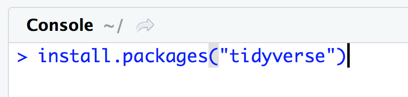
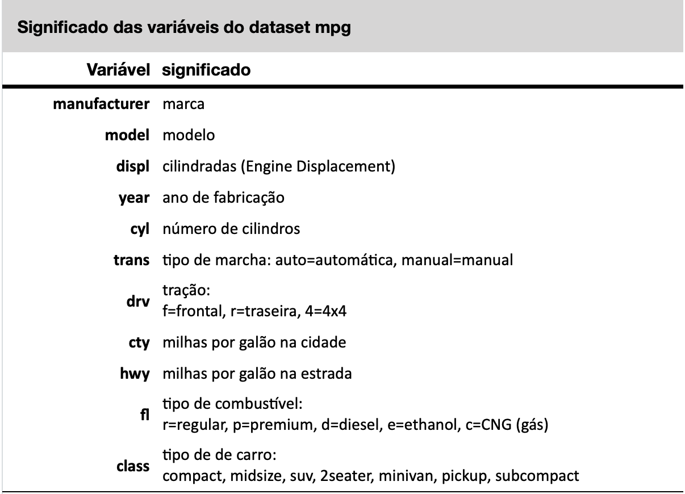

# Pacotes do R {#sec-packages}

Uma das maiores forças da linguagem R é o seu excelente conjunto de pacotes (packages) [@Hornik2012]. Pacotes são conjuntos de funções criadas por outras pessoas que contribuem para o desenvolvimento da linguagem R. Como o R é uma linguagem aberta, qualquer pessoa pode contribuir criando pacotes. Atualmente o R é um dos mais importantes repositórios de funções estatísticas, sendo muito comum que teses de mestrado na área da estatística se tornem pacotes do R.

Uma das principais razões do sucesso do R são os pacotes extremamente versáteis que a linguagem hoje dispõe. Até dezembro de 2018 o R tinha mais de 13 mil pacotes só no site do CRAN, além de milhares de outros em diferentes sites. Em maio de 2024, esse número já ultrapassava 20.000 pacotes.

Dentre esses tantos pacotes, alguns se destacam pela sua extrema versatilidade e um nome se destaca no universo da estatística: Hadley Wickham, um estatístico neozelandês, é o responsável pela criação dos pacotes mais famosos do R, entre eles o `ggplot2` para geração de gráficos e o `dplyr` para manipulação de dados. O pacote `ggplot2` é o pacote gráfico mais importante do R, já tendo sido baixado mais de 10 milhões de vezes do site do CRAN. O pacote `dplyr`, por sua vez, já foi baixado mais de 6 milhões de vezes do site do CRAN, sendo um dos pacotes mais usados para manipulação de dados.

Esses dois pacotes e vários outros podem ser instalados mais facilmente através da instalação do pacote `tidyverse`. O `tidyverse` é uma coleção de pacotes, instalando automaticamente uma série de pacotes úteis em análises de dados, entre eles o `dplyr`, `ggplot2` e outros, sendo o modo mais prático de instalar esses pacotes, pois com um único comando são instalados diversos pacotes. Mais informações sobre o pacote `tidyverse` podem ser encontradas em <https://www.tidyverse.org>.

## Tidyverse

O `tidyverse` é uma coleção de pacotes R projetados para ciência de dados, para manipulação, exploração e visualização de dados, inicialmente desenvolvidos por Hadley Wickham, mas que continuam sendo expandidos por vários colaboradores.

Entre os pacotes mais importantes estão:

**1.readr**\
O pacote `readr` fornece uma maneira rápida e amigável de ler dados tabulados (como .csv, .tsv e fwf). Veremos as funções `read_csv()` e `read_csv2()` para leitura de dados em formato `csv`.

**2.tibble**\
O pacote `tibble` atualiza o objeto data frame para a `tibble`, uma versão mais moderna dos data frames.

**3.tidyr**\
O pacote `tidyr` fornece um conjunto de funções que ajudam você a organizar os dados. Veremos como transformar data frames no formato wide em formato long e vice-versa com as funções `pivot_longer()` e `pivot_wider()`; veremos como retirar observações com valores `NA` com a função `drop_na()` e como substituir observações com valores `NA` com a função `replace_na()`.

**4.dplyr**\
O pacote `dplyr` fornece uma gramática de manipulação de dados, fornecendo um conjunto consistente de funções que resolvem os desafios mais comuns de manipulação de dados. Veremos como extrair linhas que preencham certos critérios com a função `filter()`; selecionar uma ou um conjunto de colunas (variáveis) com a função `select()`; extrair os valores de uma coluna na forma de um vetor com a função `pull()`; agrupar dados segundo as categorias de uma variável categórica com a função `group_by()`; criar novas colunas (variáveis) a partir de outras já existentes com a função `mutate()` e como modificar valores de variáveis, numéricas ou categóricas, com as funções `recode_values()` e `replace_values()`.

**5.forcats**\
O pacote `forcats` fornece um conjunto de ferramentas que resolve problemas comuns com variáveis categóricas.

**6.ggplot2**\
O pacote `ggplot2` é um sistema para criação declarativa de gráficos, baseado em **The Grammar of Graphics**. Você fornece os dados, diz ao ggplot2 como mapear variáveis, quais tipos de gráficos usar e ele cuida dos detalhes.

O `tidyverse` tem diversos outros pacotes para funções mais complexas que estão fora do escopo desse livro, tais como o pacote `purrr` de programação funcional (FP) do R, para trabalhar com funções e vetores; o pacote `stringr` para trabalhar com strings, dentre vários outros.

## Instalando o tidyverse

Para instalar um pacote, você pode usar a função `install.packages()` no console. É importante salientar que um pacote deve ser sempre instalado a partir do console e nunca a partir de um script ou de qualquer outro documento de texto. Além disso, vale a pena lembrar que um pacote só precisa ser instalado uma única vez.

Por outro lado, sempre que desejamos usar o pacote precisamos carregar esse pacote na memória (na sessão do R) com o comando `library()`. Esse carregamento do pacote na sessão deve ser feito uma vez na sessão em que o pacote for usado, de preferência no início da sessão. Em geral o comando `library()` deve ser um dos primeiros comandos de um script ou de um documento RNotebook ou Quarto. Frequentemente você verá que as primeiras linhas de um código contêm diversos comandos `library()` cada um carregando um dos pacotes a serem usados naquela sessão.

Para instalar o tidyverse usamos o comando `install.packages()` no console, como mostrado abaixo:\
`> install.packages("tidyverse")`

```{r Install-tidyverse, echo=FALSE, out.width='100%', fig.show='hold', fig.cap='Installing the tidyverse package'}

```

Ao executar esse comando você verá que o R instala diversos pacotes do `tidyverse.` Será necessária uma conexão com a internet para que esses pacotes sejam todos instalados. Dependendo da velocidade de sua conexão isso pode levar alguns minutos.

> Atenção, isso só precisa ser feito uma vez!! Se você já instalou esse pacote, passe para a próxima etapa. Lembre-se, que um pacote só precisa ser instalado uma única vez.

## Carregando pacotes

A segunda etapa é carregar o pacote na sessão. Isso é feito com o comando `library()`. O carregamento dos pacotes necessários deve ser feito sempre no início de seu código.

Para carregar o pacote tidyverse em sua sessão R, use o comando `library()` no início de seu script ou de seu R Notebook ou documento Quarto, como mostrado abaixo.

```{r load-tidyverse, echo=FALSE, out.width='100%', fig.show='hold', fig.cap='Loading the tidyverse package'}
knitr::include_graphics(rep("images/Libray-at-begining.png", 1))
```

Observe que no comando `library()` o nome do pacote não precisa ser escrito entre aspas.

## Datasets do ggplot2

O pacote `ggplot2` também possui vários datasets (conjuntos de dados) para facilitar o aprendizado. Podemos carregar os datasets já inclusos no `ggplot2` com a função `data()`, bastando incluir como argumento o nome do dataset desejado, desde que o `ggplot2` ou o `tidyverse` já tenham sido previamente carregados.

Para acessar o dataset `mpg` use o código abaixo:

```{r}
library(ggplot2) # necessário para acessar os datasets do ggplot2
data(mpg)
```

Experimente usar a função `str()`, que mostra a estrutura dos dados de um objeto. Você verá que o dataset `mpg` é um data frame com 234 observações (234 linhas) e 11 variáveis, como mostrado abaixo.

```{r}
str(mpg)
```

O acrônimo `mpg` significa **Miles Per Gallon** - uma medida de quantas milhas um carro pode viajar se você colocar apenas um galão de gasolina ou diesel em seu tanque (1 galão equivale a 3.79 litros e uma milha equivale a 1.6km). Esta medida padronizada serve para comparar carros com base na sua eficiência. O conjunto de dados `mpg` que vem junto com o `ggplot2` é apenas um subconjunto dos dados de economia de combustível que a EPA (Environmental Protection Agency - USA) disponibiliza em <https://fueleconomy.gov>. O conjunto completo dos dados pode ser obtido nesse site, no link a seguir: <https://fueleconomy.gov/feg/download.shtml>.

Esse dataset possui 234 linhas (observações) com 11 variáveis. O significado de cada variável está descrito na documentação de ajuda do dataset mpg e pode ser visualizado com o comando `?mpg` no console. A tabela a seguir mostra o significado de cada variável desse dataset.

```{r mpg-dictionary, echo=FALSE, out.width='100%', fig.show='hold', fig.cap='dicionário de variáveis do dataset mpg'}

```
