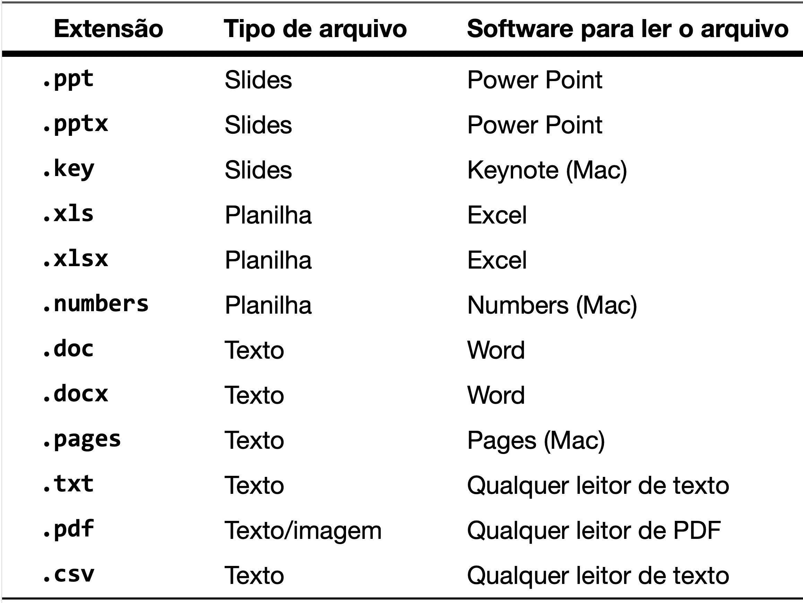
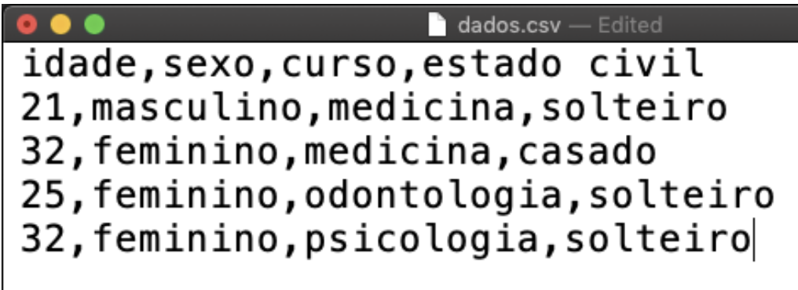
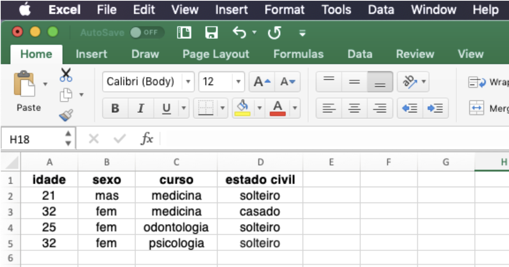
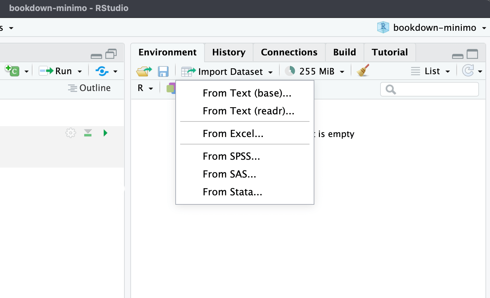
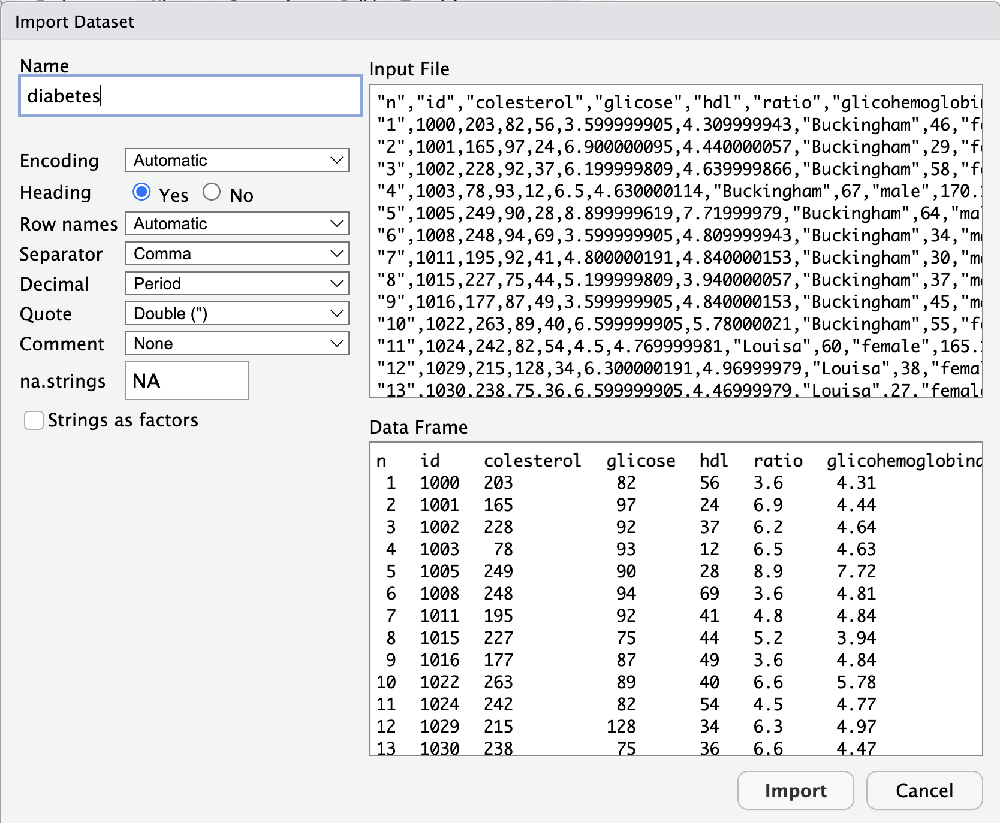
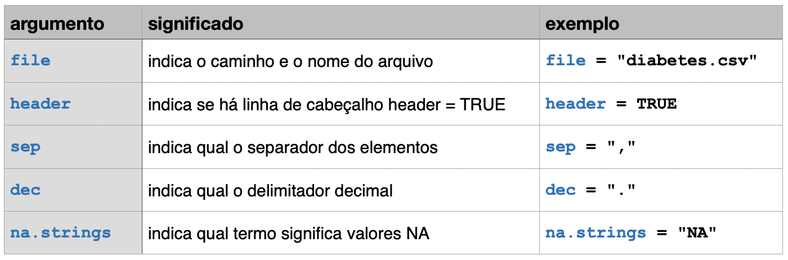

# Lendo dados {#sec-reading}

Neste capítulo, exploraremos como ler dados no R a partir de diferentes formatos de arquivos. A capacidade de importar dados corretamente é crucial para qualquer análise de dados, pois impacta diretamente a qualidade e a precisão dos resultados. Vamos começar com uma visão geral dos diferentes formatos de arquivos de dados e, em seguida, aprenderemos a ler esses dados utilizando funções base do R e funções do pacote `readr` do `tidyverse`. Finalmente, veremos como importar dados de outros formatos comuns, como arquivos Excel, JSON e XML.

Até agora, a maioria dos exemplos usados foram de bancos de dados do próprio R e, portanto, não foi necessário ler ou carregar nenhum banco de dados. Entretanto, ler dados externos é uma das primeiras etapas de um processo de análise de dados. Com o R podemos ler dados em diversos formatos.

## Formatos de arquivos de dados.

Vamos primeiro entender esses diferentes formatos de arquivos de dados. Cada documento digital possui uma estrutura particular. Por exemplo, arquivos do Word (`.doc` ou `.docx`) possuem uma estrutura própria da Microsoft, que o aplicativo Word compreende e, portanto, consegue abrir. Arquivos do tipo PDF (`.pdf`) possuem uma outra estrutura e, portanto, necessitam de softwares que saibam ler essa estrutura para poderem ser abertos.

Existem diversos formatos de arquivos para armazenar dados, cada um apropriado para ser lido por determinados aplicativos. As letras finais em cada arquivo, depois do ponto final (extensão), indicam o tipo de arquivo. Vejamos alguns tipos comuns de arquivos

```{r file-extensions, echo=FALSE, out.width='100%', fig.show='hold', fig.cap="file extensions"}

```

Alguns formatos de arquivos dependem de um software específico para sua leitura. Outros formatos são menos específicos, podendo ser lidos por um grande número de softwares, como é o caso dos arquivos `.txt` e dos arquivos `.pdf`. Esses formatos são mais universais, sendo padrões comuns para comunicação de informações. Dados de pesquisa, em formato de tabelas como mostrado, são usualmente armazenados em arquivos próprios para essa finalidade. Um formato comum é o usado por softwares de planilhas eletrônicas como o Excel da Microsoft. Existem inúmeros softwares desse tipo e cada um utiliza um formato específico, o que é justamente a desvantagem desse formato. O Excel usa arquivos que terminam com a extensão `.xls` ou `.xlsx`, o software de planilhas da Apple usa arquivos que terminam com a extensão `.numbers`, etc. O problema é que cada arquivo desse só pode ser lido pelo próprio software que criou o arquivo.

Um dos formatos mais usuais para arquivar dados é o `.csv`, que em inglês significa "comma-separated values", ou seja "dados separados por vírgulas" [@csv2005; @csv2016]. Esse é um formato comum de arquivo de dados suportado por inúmeros softwares em todas as plataformas de computador (Mac, Windows, Linux etc), sendo por isso mesmo um dos tipos de arquivos mais usados para transferência de dados entre programas. Todo software de planilhas, tal como o Excel (PC ou Mac), Numbers (Mac), Libre Office etc. são capazes de ler e salvar os dados nesse formato.

## Os arquivos .csv

A extensão `.csv` no final do nome de um arquivo indica que esse é um arquivo de dados no formato separado por vírgulas. A estrutura desse arquivo é bastante simples: existem várias linhas, cada linha com vários dados, separados por vírgulas.

Existem, entretanto variações nesse formato, por exemplo, no Brasil as casas decimais são separadas por vírgulas, nesse caso o delimitador dos valores não poderia ser a vírgula e é usado então o ponto e vírgula. Portanto, ao ler dados no formato `.csv` é sempre importante informar se os dados são separados por `,` ou `;` e se o separador do decimal é a vírgula, ou o ponto final. Caso contrário a leitura dos dados poderá ser corrompida. Um outro detalhe é que, em alguns arquivos, os valores faltantes são indicados por `NA`, em outros por um espaço em branco, ou por outro símbolo. É importante informar ao R como esses valores faltantes estão indicados no arquivo.

Um arquivo de dados do tipo `.csv` pode ser visualizado através de qualquer leitor simples de texto, tal como o TextEdit do Mac ou o Notepad no Windows. Abaixo podemos ver como um conjunto de dados simples está gravado num arquivo separado por vírgulas. Observe que a primeira linha representa o nome das variáveis.

```{r csv-files, echo=FALSE, out.width='100%', fig.show='hold', fig.cap="csv_files"}

```

Os arquivos `.csv` podem ser lidos por softwares de planilhas eletrônicas, tal como o Excel ou Numbers. A figura abaixo mostra como o Excel interpreta a primeira linha como sendo a dos nomes das variáveis e já separa as variáveis nas colunas e os dados de cada participante nas linhas.

```{r csv-excel, echo=FALSE, out.width='100%', fig.show='hold', fig.cap="csv_files"}

```

Existem diversos modos de carregar dados no R. Podemos fazer isso usando os menus do RStudio ou através das funções do R base (`read.csv`, `read.csv2`, `read.delim`, etc.) ou com as funções de leitura mais modernas do pacote `readr` (`read_csv`, `read_csv2`, etc.), que faz parte do `tidyverse`. Vamos ver como fazer isso de cada uma dessas formas.

## Lendo dados com o menu do RStudio.

O painel **Environment** possui uma aba chamada **Import Dataset**. Ao clicar nessa opção, podemos escolher que tipo de dados serão importados (lidos): Texto, Excel, SPSS, SAS ou STATA. Para ler arquivos do tipo `.csv` podemos usar qualquer das duas primeiras opções **From Text (base)** ou **From Text (readr)**, como mostra a figura abaixo.

```{r ImportDataset, echo=FALSE, out.width='100%', fig.show='hold', fig.cap="ImportDataset"}

```

Você deverá escolher o arquivo `.csv` que deseja carregar no R. Será aberta uma aba para definir algumas opções.

A figura abaixo mostra a janela de opções que será aberta ao clicar em **From Text (base)**.

```{r ImportDataset-artrite, echo=FALSE, out.width='100%', fig.show='hold', fig.cap="ImportDataset_artrite"}

```

**Você deverá informar ao R alguns parâmetros:**.\

1.  Heading: Há um cabeçalho com o nome das variáveis?\
2.  As linhas têm nomes?\
3.  Qual o elemento que separa os valores? Vírgula, ponto e vírgula, tabulação ou outro?\
4.  Qual o elemento que separa o decimal: Vírgula ou ponto final?\
5.  Há elementos entre aspas? Qual tipo de aspas são usados: " " ou ' ' ?\
6.  Há algum símbolo para comentários?\
7.  Como estão registrados os valores NA: NA, em branco, ou de outra forma?\
8.  Você deseja que os elementos em texto sejam carregados no formato `factor`?

O R já deverá ter escolhido a maioria desses parâmetros. Se deu tudo certo, os dados deverão aparecer na janela inferior, chamada de data frame, todos alinhados em colunas como mostrado na imagem acima. Agora basta clicar em `import`.

Entretanto, apesar da facilidade de importar dados dessa forma, essa não é a maneira ideal. A melhor técnica é criar o código que irá realizar a importação e incorporar esse código no início de seu script. Assim, automatizamos o processo de leitura dos dados e evitamos ter de clicar na função `Import Dataset` toda vez que formos trabalhar com nossos dados.

## Lendo dados com `read.csv()`

Caso o arquivo esteja no formato `.csv` com os seus valores separados por vírgula (que é o padrão usual), podemos usar a função `read.csv( )` para carregar os dados, bastando indicar o nome do arquivo a ser lido. Se por acaso o arquivo se chama `diabetes.csv`, então o comando de leitura será:

`read.csv(file = "diabetes.csv")`.

O primeiro argumento da função `read.csv` é o mais importante, é o **caminho** e o **nome do arquivo** a ser lido. Um detalhe importante é saber qual é o `working directory` que você está usando. Lembre-se que a melhor forma de trabalhar no RStudio é criando um projeto, que define o diretório de trabalho como a pasta do projeto. Já detalhamos isso em capítulos anteriores sobre Working Directories e Projetos do RStudio (@sec-projects).

O código acima irá funcionar se o arquivo chamado `diabetes.csv` estiver dentro do atual diretório de trabalho do R.

Se o arquivo estiver numa pasta chamada `dataset`, dentro do diretório de trabalho, então teremos de incluir esse caminho no nome, tudo dentro das aspas, como abaixo:

`read.csv(file = "dataset/diabetes.csv")`.

Ou seja, com os dados no formato `csv`, a leitura dos dados é extremamente fácil com o comando acima. Esse comando lê o arquivo chamado `diabetes.csv`, que está na pasta `dataset`, dentro do diretório de trabalho atual.

Mas falta ainda um detalhe: é preciso colocar os dados lidos numa variável. O comando correto deve ser parecido com a linha abaixo.

`mydata <- read.csv(file = "dataset/diabetes.csv")`

No caso acima a variável, ou melhor, o objeto, que vai receber os dados foi chamado de `mydata` e os dados estão sendo lidos de um arquivo chamado `diabetes.csv`. Dessa forma, os dados são lidos e colocados na variável `mydata`. Você verá que, ao ler um arquivo de dados dessa forma, o objeto `mydata` será um **data frame**, com linhas representando cada paciente (observação) e colunas representando as variáveis da pesquisa.

Caso o arquivo contenha dados separados por `ponto e vírgula`, a função a ser usada é `read.csv2()`:

`mydata <- read.csv2(file = "dataset/diabetes.csv")`

Ambas as funções `read.csv()` e `read.csv2()` são derivadas da função `read.table()`. Essas funções podem receber diversos argumentos para otimizar a leitura dos dados.

```{r read-table, echo=FALSE, out.width='100%', fig.show='hold', fig.cap="read.table"}

```

O comando acima poderia ser reescrito com todos esses argumentos de forma **explícita** como abaixo:

```{r}
diabetes <- read.table(file       ="dataset/diabetes.csv", 
                       header     = TRUE,
                       sep        = ",",
                       dec        = ".",
                       na.strings = "NA")
```

O código acima faz o seguinte:

-   Lê um arquivo denominado `diabetes.csv`; que está na pasta `dataset`\
-   No qual há um cabeçalho com os nomes das variáveis: `header = TRUE`\
-   Cujos dados estão separados por vírgula: `sep = ","`\
-   Cujos decimais são identificados pelo ponto final : `dec  = "."`\
-   E os valores faltantes estão identificados no arquivo pelas letras NA: `na.strings = "NA"`.\
-   Finalmente, esse data frame é armazenado num objeto chamado `diabetes`.

## Lendo arquivos na internet

Lembre-se que o principal argumento da função `read.csv()` é o caminho do arquivo. Podemos também usar um caminho de um arquivo na internet. O arquivo `diabetes.csv` pode ser obtido na internet no site do departamento de estatística da Universidade de Vanderbilt.

A página com os bancos de dados pode ser acessada no seguinte link: <https://hbiostat.org/data>

É possível então navegar por essa página e fazer o download manualmente do dataset `diabetes.csv`.

Mas podemos automatizar esse processo inserindo o endereço exato do banco de dados na função `read.csv()`: <https://hbiostat.org/data/repo/diabetes.csv>

Veja o código abaixo:

```{r, eval=FALSE}
mydata <- read.csv(file = "https://hbiostat.org/data/repo/diabetes.csv")
```

Na verdade nem precisamos explicitar o argumento `file`, podemos inserir apenas o endereço e obteremos o mesmo resultado. Lembre-se que é preciso colocar o endereço entre aspas.

```{r, eval=FALSE}
mydata <- read.csv("https://hbiostat.org/data/repo/diabetes.csv")
```

Ler da internet tem um inconveniente: o código só funciona com conexão, e para de funcionar se o site mudar de endereço. Por isso, neste livro, o arquivo original foi baixado uma única vez e guardado na pasta `dataset` do projeto com o nome `diabetes_hbiostat.csv`. É dessa cópia que os capítulos seguintes leem os dados:

```{r}
mydata <- read.csv("dataset/diabetes_hbiostat.csv")
```

## Lendo dados com `readr`

O pacote `readr` do `tidyverse` fornece funções para leitura mais amigável de dados tabulados (como `.csv`, `.tsv` e `.fwf`), sendo preferível em relação às funções base do R.

O pacote `readr` vem também com diversos bancos de dados para servirem de exemplo, que podem ser acessados com a função `readr_example()`. Para a lista completa dos exemplos basta usar esse comando como mostrado a seguir.

Lembre-se que para usar as funções de algum pacote é preciso primeiro instalar o pacote com o comando `install.packages()` no console. Além disso, no corpo do código, é preciso inserir o comando `library()` com o nome do pacote que será usado. Só precisamos inserir o comando `library()` uma única vez. O estilo ideal de escrever é sempre carregar os pacotes necessários no início do código.

```{r}
library(readr)
readr_example()
```

Quando inserimos o nome do banco de dados desejado como argumento da função, o resultado é o endereço do banco de dados em seu computador.

```{r}
readr_example("chickens.csv")
```

Agora, para podermos usar esse banco de dados, basta usar a função `read_csv()` usando esse endereço, como feito abaixo:

```{r, message=FALSE, warning=FALSE}
read_csv(readr_example("chickens.csv"))
```

Podemos usar o pipe para o código ficar mais limpo:

```{r}
readr_example("chickens.csv") |> 
  read_csv()
```

Finalmente, o código acima apenas lê os dados e mostra, mas precisamos armazenar os dados num objeto na memória do R, como feito a seguir:

```{r}
galinhas <- readr_example("chickens.csv") |> 
            read_csv()
```

Observe que a função `read_csv()` mostra os detalhes do que ela fez:\
1. Mostra que o arquivo lido tinha 5 linhas e 4 colunas.\
2. Mostra que interpretou que o delimitador entre os elementos era a vírgula: `Delimiter: ","`.\
3. Mostra que interpretou as variáveis `chicken`, `sex` e `motto` como texto (`char`, caracteres).\
4. Mostra que interpretou a variável `eggs_laid` como numérica (`double`).\
5. Explica que você pode usar o comando `spec()` para ver as especificações das colunas\
6. Explica que você pode usar o argumento `show_col_types = FALSE` para que o comando não mostre essas explicações todas.

```{r}
galinhas
```

Vamos repetir a leitura, agora com o argumento `show_col_types = FALSE`:

```{r}
galinhas <- readr_example("chickens.csv") |> 
            read_csv(show_col_types = FALSE) # lendo os dados sem mostrar todas as explicações
```

Podemos verificar esses detalhes com a função `spec()`. Observe que essa função vai inspecionar o objeto que recebeu o arquivo que foi lido (`galinhas`) e não o arquivo `csv`. Portanto o argumento é `galinhas` não `chickens.csv`.

```{r}
spec(galinhas)
```

## A função `read_csv()`

As funções de leitura do pacote `readr` têm diversas vantagens sobre as funções básicas de leitura de dados do R.

Em primeiro lugar, ao ler os dados usando `read_csv()` é criada uma `tibble` e não um `data frame`. E como já discutimos antes, uma `tibble` é uma versão melhorada de um `data frame`.

Além disso, a função `read_csv()` é mais rápida que a versão base do R.

Em resumo, sugiro usar a função `read_csv()` ou `read_csv2()` do pacote `readr` em vez das funções base do R `read.csv()` e `read.csv2()`.

#### Argumentos de `read_csv()` ou `read_csv2()`

As funções do pacote `readr` podem ser ajustadas com diversos argumentos.

O primeiro argumento é o mais importante, é o caminho e o nome do arquivo a ser lido. Um detalhe importante é saber qual é o `working directory` que você está usando. Lembre-se que a melhor forma de trabalhar no RStudio é criando um projeto, que define o diretório de trabalho como a pasta do projeto. Já detalhamos isso em capítulos anteriores sobre Working Directories e Projetos do RStudio (@sec-projects).

O arquivo `diabetes.csv` que eu tenho em meu computador está salvo na pasta `dataset`, dentro da pasta do meu projeto. Portanto, preciso informar isso nos argumentos da função `read_csv()`.

É necessário também armazenar os dados lidos num objeto, que irei chamar de `diabetes`. Obs: eu poderia escolher outro nome, não é necessário que o objeto que irá armazenar os dados tenha o mesmo nome que o arquivo com os dados.

Eu fiz o download dos dados (<https://hbiostat.org/data/repo/diabetes.csv>) e salvei esses dados numa pasta chamada `dataset` em meu projeto, então o código para ler esses dados é o seguinte. Nesse meu arquivo eu já modifiquei alguns dos nomes das variáveis para português.

```{r}
diabetes <- read_csv("dataset/diabetes.csv")
```

A cópia do arquivo original, com os nomes das variáveis ainda em inglês, é a que fica em `dataset/diabetes_hbiostat.csv`. É essa versão que usaremos daqui em diante.

```{r}
diabetes <- read_csv(file = "dataset/diabetes_hbiostat.csv")
```

Para mostrar a `tibble` basta digitar no console o nome da `tibble`:

```{r}
diabetes
```

Observe que as variáveis `location`, `gender` e `frame` foram interpretadas como `char`. Essas variáveis são melhor analisadas quando são do tipo `factor`. Temos duas alternativas para resolver esse problema:

1.  Transformar em `factor` depois de ler, com a função `as.factor()`.
2.  Indicar que são `factor` na própria função `read_csv()`.

Vamos ver como fazer isso de cada uma dessas maneiras.

**Transformando variáveis em factor depois de ler os dados**

A função `as.factor()` tem como argumento um vetor, por exemplo uma coluna de um data frame ou de uma tibble.

1.  Transformando um vetor numérico em factor:

```{r}
# criando um vetor numérico
x <- c(1:10)

# verificando a estrutura do vetor x antes de transformar em factor
str(x)

# transformando em factor
x2 <- as.factor(x)


# verificando a estrutura do vetor x2 depois de transformar em factor
str(x2)
```

2.  Transformando um vetor de caracteres em factor:

```{r}
# criando um vetor com caracteres
x <- c("A","B", "C", "D")

# verificando a estrutura do vetor x antes de transformar em factor
str(x)

# transformando em factor
x2 <- as.factor(x)


# verificando a estrutura do vetor x2 depois de transformar em factor
str(x2)
```

3.  Transformando uma coluna de um data frame ou tibble em factor

```{r}
diabetes$location  <- as.factor(diabetes$location)
diabetes$gender    <- as.factor(diabetes$gender)
diabetes$frame     <- as.factor(diabetes$frame)
```

Veja que agora essas variáveis são do tipo factor.

```{r}
str(diabetes) 
```

**Transformando variáveis em factor no momento da leitura dos dados**

Podemos usar o argumento `col_types` da função `read_csv()` para indicarmos qual o tipo correto da variável de cada coluna ou de algumas colunas em particular. No código abaixo foi indicado que as colunas (variáveis) `sexo`, `cidade` e `biotipo` deveriam ser interpretadas como `factor`.

```{r}
diabetes <- read_csv(file = "dataset/diabetes_hbiostat.csv", 
                     col_types = list(gender   = col_factor(), 
                                      location = col_factor(),
                                      frame    = col_factor()))
str(diabetes)
```

## Lendo arquivos em outros formatos

O R também pode ler arquivos em outros formatos, tal como Excel, SAS, STATA, SPSS etc. Existem pacotes específicos para ler cada um desses formatos.\

O pacote `readxl` serve para ler arquivos do Excel, sendo capaz de ler tanto `.xls` quanto os novos formatos `.xlsx`. A função para ler esses arquivos é `read_excel()`.\
O pacote `xml2` é capaz de ler arquivos XML com a função `read_xml()`; o pacote `XML`, mais antigo, faz o mesmo com `xmlParse()` ou `xmlToDataFrame()`.\
Os pacotes `rjson` e `jsonlite` têm funções para leitura de arquivos JSON. A função para ler esses arquivos é `fromJSON()`.\
O pacote `haven` do tidyverse é capaz de ler arquivos de vários tipos, tais como SAS, SPSS e STATA, através das seguintes funções: `read_sas()`, `read_sav()`, `read_por()`, `read_dta()`, `read_xpt()`.\
O pacote `foreign` possui também funções para ler arquivos SPSS, a função para ler esses arquivos é `read.spss()`.

**Tabela de Funções e Pacotes de Leitura de Dados**

| Função         | Pacote   | Descrição                         | Exemplo                                                           |
|--------------|--------------|---------------|-------------------------------|
| `read.table()` | base     | Leitura de arquivos tabulares     | `data <- read.table("file.txt", header = TRUE)`                   |
| `read.csv()`   | base     | Leitura de arquivos CSV           | `data <- read.csv("https://hbiostat.org/data/repo/diabetes.csv")` |
| `read_csv()`   | readr    | Leitura de arquivos CSV           | `data <- read_csv("https://hbiostat.org/data/repo/diabetes.csv")` |
| `read_excel()` | readxl   | Leitura de arquivos Excel         | `data <- read_excel("file.xlsx", sheet = 1)`                      |
| `fromJSON()`   | jsonlite | Leitura de arquivos JSON          | `data <- fromJSON("file.json")`                                   |
| `read_xml()`   | xml2     | Leitura de arquivos XML           | `data <- read_xml("file.xml")`                                    |
| `read_sas()`   | haven    | Leitura de arquivos SAS           | `data <- read_sas("file.sas7bdat")`                               |
| `read_sav()`   | haven    | Leitura de arquivos SAV           | `data <- read_sav("file.sav")`                                    |
| `read_dta()`   | haven    | Leitura de arquivos Stata         | `data <- read_dta("file.dta")`                                    |
| `read_por()`   | haven    | Leitura de arquivos POR           | `data <- read_por("file.por")`                                    |
| `read_xpt()`   | haven    | Leitura de arquivos transportados | `data <- read_xpt("file.xpt")`                                    |
| `read_stata()` | haven    | Leitura de arquivos Stata         | `data <- read_stata("file.dta")`                                  |
| `read.spss()`  | foreign  | Leitura de arquivos SPSS          | `data <- read.spss("file.sav", to.data.frame = TRUE)`             |
