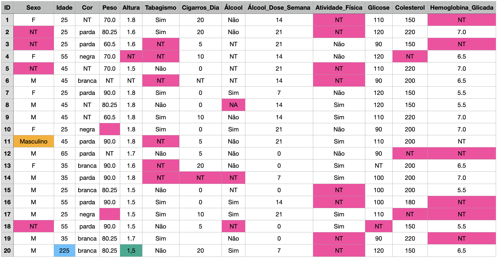

## Limpando os dados

A limpeza de dados é uma etapa crucial no processo de análise de dados. Ela assegura que os dados sejam consistentes, completos e utilizáveis, permitindo que análises subsequentes sejam precisas e significativas. Ignorar a limpeza de dados pode levar a conclusões errôneas e comprometer a validade dos resultados. Portanto, é sempre sempre importante investir algum tempo na preparação e limpeza dos dados antes de iniciar qualquer análise.

O pacote `janitor` fornece funções simples e eficazes para limpeza de dados em R, facilitando a tarefa de preparar os dados para análise. O pacote `skimr` fornece um conjunto de funções para resumir e visualizar dados de forma rápida e eficiente. Ele fornece uma visão geral dos dados, incluindo estatísticas descritivas, tipos de dados, valores ausentes e muito mais. Lembre-se que é necessário instalar esses pacotes usando o comando `install.packages("janitor")` e `install.packages("skimr")` antes de carregá-los com a função `library()`. Essa instalação deve ser feita sempre no console e não no script.

## Problemas comuns de limpeza de dados

Vamos ansalisar um dataset fictício fornecido os problemas que precisam ser resolvidos antes de realizar qualquer análise significativa. Em seguida, vamos propor soluções para esses problemas e fornecer um exemplo de código em R para realizar a limpeza dos dados.



Ao analisar o dataset acima, identificamos diversos problemas que precisam ser resolvidos antes de realizar qualquer análise significativa. Aqui estão alguns dos problemas e possíveis soluções:

1.  **Nomes das Colunas**
    -   **Problema**: Nomes de colunas como "Cigarros_Dia" e "Álcool_Dose_Semana" contêm caracteres especiais e espaços que podem dificultar a manipulação dos dados.
    -   **Solução**: Renomear as colunas para nomes mais simples e consistentes, como "CigarrosPorDia" e "AlcoolDosePorSemana".
2.  **Dados Faltantes**
    -   **Problema**: Presença de valores faltantes e diferentes símbolos para dados faltantes (`NT`, `NA`, e `casas vazias`) em várias colunas.
    -   **Solução**: Substituir todos os valores faltantes por `NA` para padronizar a representação de dados faltantes. Em seguida, decidir sobre a melhor abordagem para lidar com esses valores, como imputação ou remoção de linhas incompletas.
3.  **Valores Numéricos**
    -   **Problema**: Colunas numéricas contêm decimais separados por pontos em quase todas as células, mas numa das altura o valor está separado por vírgula.
    -   **Solução**: Verificar e corrigir o uso de vírgulas em vez de pontos decimais, se necessário.
4.  **Categorias e Valores de Texto**
    -   **Problema**: Valores de texto inconsistentes e uso de diferentes símbolos para categorias, como `M`, `Masculino`.
    -   **Solução**: Padronizar os valores categóricos (ex.: substituir `M` por `Masculino`, `F` por `Feminino`). Verificar consistência e corrigir possíveis erros de digitação ou categorização.

Primeiro vamos ler os dados fictícios criados.

```{r, warning=FALSE, message=FALSE}
# Carregar o pacote janitor e readr
library(janitor)
library(readr)

# lendo os dados brutos com problemas
dados_brutos <- read_csv("dataset/raw-data.csv")
```

## Identificando os problemas

A primeira etapa depois da leitura dos dados é identificar os problemas que precisam ser resolvidos antes de realizar qualquer análise significativa. Uma das formas mais simples de verificar os dados é através da função `str()` que já usamos antes.

```{r}
str(dados_brutos)
```

Aqui já podemos identificar algums problemas. As variáveis `Altura`, `Peso`, `Cigarros_Dia`, `Álcool_Dose_Semana`, `Glicose`, `Colesterol` e `Hemoglobina Glicada` foram identificada como sendo do tipo `chr`, porém deveriam ser numéricas.

O pacote `skimr` tem algumas funções interessantes para isso. Vamos usar a função `skim_without_charts()` para obter uma visão geral dos dados e identificar possíveis problemas.

```{r, warning=FALSE, message=FALSE}
library(skimr)
skim_without_charts(dados_brutos)
```

Vamos agora implementar essas soluções em um exemplo de código em R para limpar os dados com o pacote `janitor.`

## Renomeando as variáveis

**1. Renomeando as colunas**

A função `clean_names()` do pacote `janitor` é usada para renomear as colunas de um dataframe para nomes mais simples e consistentes. Ela remove espaços, remove caracteres especiais, retira os acentos, e converte os nomes das colunas para minúsculas. Vamos aplicar essa função ao nosso dataset para renomear as colunas.

```{r}
# Verificando os nomes originais das variáveis
colnames(dados_brutos)
```

```{r}
# Renomear as colunas
dados_limpos <- dados_brutos|>
  clean_names()
colnames(dados_limpos)
```


