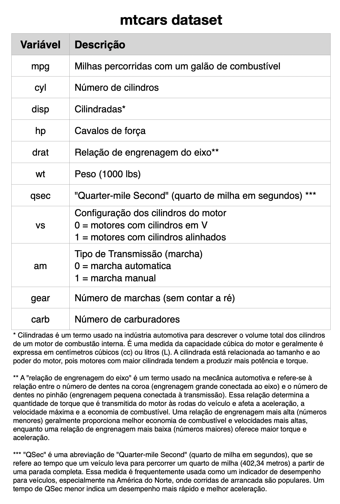

## Trabalhando com Dados Numéricos

### Estatística Descritiva para dados numéricos

Vamos examinar as principais funções do R para descrever numéricamente um conjunto de dados: as medidas de centralidade (media, mediana), de partição (percentis) e de dispersão (amplitude, variância e desvio padrão). Veremos como aplicar essas funções em vetores e em data frames ou `tibbles.`

#### Medidas de Centralidade

As principais medidas de centralidade, ou posição, (média e mediana) são facilmente calculadas no R com as funções `mean()` e `median()`. Essa funções recebem valores numéricos como argumentos. Para exemplificar essas funções vamos usar novamente um vetor numérico simulando um conjunto de idades e pesos. Observe que no conjunto de pesos há uma dado faltante (NA). Podemos inserir tanto o próprio vetor isolado como argumento, como também uma coluna do data frame ou tibble como mostraremos adiante. nos próximos exemplos iremos usar geralmente a forma do tidyverse para calcular medidas estatísticas em variáveis de um data frame, usando o operador \$ para acessarmos as colulnas.

```{r}
# cria um conjunto de idades (anos)
idade <- c(45, 10, 12, 27, 32, 18, 30)
# cria um conjunto de pesos (kg)
peso  <- c(70,  6,  8, 66, 72, 68, NA)

df <- tibble(idade, peso)
```

```{r}
# calcula a média aritmética da idade num vetor
mean(idade)
```

Para calculara a média do peso, será necessário incluir o argumento `na.rm=TRUE`, pois a variável contem valores `NA`. Veja o resultado do cálculo com e sem esse argumento.

```{r}
# calcula a média do peso, sem retirar os NA (o R não consegue calcular)
mean(peso)
```

```{r}
# calcula a média do peso, retirando os NA
mean(peso, na.rm = TRUE)
```

```{r}
# calcula a média do peso, retirando os NA, usando a tibble criada
mean(df$peso, na.rm = TRUE)
```

#### Medidas de Partição e Posição

##### Máximo e Mínimo

```{r}
# a função min calcular o valor mínimo do conjunto numérico indicado como argumento
min(df$idade)
```

```{r}
# a função max calcular o  o valor máximo do conjunto numérico indicado como argumento
max(df$idade)
```

##### Quantil, quartil e percentil

O percentil é uma medida de localização que divide uma amostra ordenada em 100 partes. Cada valor de percentil indica o percentual de dados abaixo daquele valor. Por exemplo, o percentil 25% indica o valor abaixo do qual estão 25% dos dados. Em estatística é usual usar-se o termo quantil ao invés de percentil. A diferença é que o quantil é escrito com valores decimais (0.25) e percentil com valores percentuais (25%). Os percentis (ou quantis) mais importantes são os de 25%, 50% e 75%, conhecidos, respectivamente, como 1º quartil, 2º quartil e 3º quartil, por dividirem a amostra dos dados em 4 partes iguais, cada uma com 1/4 (ou 25%) dos dados.

```{r, echo=FALSE}
ggplot(NULL, aes(c(-4,+4))) + 
  geom_density(stat = "function", 
        fun = dnorm, 
        args = list(mean = 0, sd = 1), 
        col="deepskyblue4", 
        fill = "deepskyblue4", 
        alpha=0.4, 
        xlim = c(-4,+4)) + 
  geom_segment(aes(x =  c(-0.6744898, 0, 0.6744898), y = 0, xend =  c(-0.6744898, 0, 0.6744898), yend = 0.4), colour = "firebrick4") +
  annotate("text", 
           x =   c( -0.7, 0,    0.7), 
           y =   c( -0.01, -0.01, -0.01), 
           label = c("Q1", "Q2", "Q3"),
           color = "firebrick4",
           size=4 , 
           angle=0, 
           fontface="bold") +
   annotate("text", 
            x =     c( -1.15, -0.35,   0.35,   1.15), 
            y =     c( 0.1,    0.1,    0.1,    0.1), 
            label = c("25%",  "25%",  "25%",  "25%") , 
            color="white", 
            size=4 , 
            angle=0, 
            fontface="bold") +
    theme_void() 
```

A função `quantile()` do R calcula todos esses quartis de uma só vez.

```{r}
# calcula os quartis 25% (1º), 50% (2º) e 75% (3º)
quantile(df$idade)
```

Podemos usar essa função para calcular individualmente o quantil desejado, bastando inserir esse valor como argumento logo depois da variável com os dados. Lembrando que é necessário usar o valor decimal e não o percentual (mais uma dica: lembre-se que no R o decimal é o ponto final e não a vírgula). Mais uma vez, se houver valores NA será necessário incluir o argumento na.rm=TRUE.

```{r}
quantile(df$idade, 0.25)
```

```{r}
quantile(df$idade, 0.10)
```

```{r}
quantile(df$peso, 0.25, na.rm = TRUE)
```

```{r}
# a função range retornao valor mínimo e máximo do conjunto numérico indicado como argumento
range(df$idade)
```

```{r}
# a função diff calcula a diferença entre os valores indicados como argumentos, nesse caso, a amplitude (máximo - mínimo) da idade
diff(range(df$idade))
```

##### Amplitude interquartil

A amplitude interquartil é uma medida de dispersão que mede a amplitude de 50% das observações centrais do conjunto. O primeiro e o terceiro quartis, respectivamente os percentis 25% e 75%, dividem a amostra de forma que 50% dos dados estão entre esses pontos. A amplitude desses dados centrais é conhecida como amplitude interquartil (interquartile range - IQR) e é uma medida de amplitude mais robusta que a amplitude, pois não é sensível aos valores extremos. Seu cálculo é simplesmente o valor do 3º quartil menos o valor do 1º quartil.

A amplitude interquartil é também conhecida pelos termos em inglês midspread, **middle 50%** ou **H-spread**.

```{r}
# calcula a amplitude interquartil
IQR(df$idade)
```

#### Medidas de Dispersão

##### Variância e Desvio Padrão

As funções do R para calcular a variância `var()` e desvio padrão `sd()` utilizam as fórmulas para a variância e desvio padrão com a correção de Bessel, feita para corrigir o viés da estimativa da variância e do desvio padrão, que tendem a subestimar a variabilidade da população quando calculados a partir de uma amostra. As funções `var()` e `sd()` utilizam no denominador os valores `n-1` e não `n`. Ou seja, as funções do R estão calculando a estimativa da variância da população a partir de uma amostra. Ou seja, essas funções assumem que os dados representam uma amostra da população e não a população inteira.

Quando for necessário estimar o desvio padrão ou variância levando em consideração apenas os elementos da amostra precisamos fazer um pequeno ajuste.

Vejamos isso nos próximos exemplos.

```{r}
# criando um vetor de dados distribuidos de frorma normal com 100 elementos
set.seed(1)
n=100
x <- rnorm(n)
```

**Variância com e sem a correção de Bessel**

```{r}
# Calculando a variância com a correção de bessel
# Ou seja, calculando a estimativa do variância da população a partir de uma amostra
 var(x) 

# Calculando a variância sem a correção de bessel
# nesse caso precisamos multiplicar o resultado por (n-1)/n
var(x) * ((n-1)/n)
```

**Desvio padrão com e sem a correção de Bessel**

```{r}
# Calculando o desvio padrão com a correção de bessel
# Ou seja, calculando a estimativa do desvio da população a partir de uma amostra
sd(x) 

# calculando o desvio padrão sem a correção de bessel
# nesse caso precisamos multiplicar o resultado por sqrt((n-1)/n)
 sd(x) * sqrt((n-1)/n) # população
```

### Agrupando dados numéricos

Frequentemente precisamos agrupar dados numéricos com base em variáveis categóricas. Por exemplo, quando desejamos separar as médias de uma determinada medida entre cada gênero, ou entre diferentes faixas etárias ou entre um grupo experimental e um grupo controle.

A linguagem R possui funções criadas especialmente para esse fim: a função `by()` do R base e a função `group_by()` do `tidyverse` são as mais importantes para essa finalidade.

A função `by()` do R base é usada para aplicar uma função a subconjuntos de um data frame, organizados por um fator ou combinação de fatores. Aqui estão algumas vantagens de usar `by()`:

-   *Simplicidade*: Uma solução base do R, sem necessidade de carregar pacotes adicionais.
-   *Flexibilidade*: Pode ser usada com qualquer função que aceite data frames como input, o que permite operações complexas nos subconjuntos de dados.
-   *Compatibilidade*: Por ser parte do R base, não depende de pacotes externos e é garantido funcionar em qualquer instalação do R.
-   *Resulta em listas*: O output é uma lista, que pode ser útil para manipulações subsequentes.

A função `group_by()` do pacote `dplyr`, que faz parte do `tidyverse`, é usada para agrupar dados em um data frame. Aqui estão algumas das vantagens de usar `group_by()`:

-   *Facilidade de uso*: A sintaxe é intuitiva e fácil de usar, especialmente quando combinada com outras funções do `dplyr` como `summarise`, `mutate`, etc.
-   *Integração com a pipe* (\|\>): Permite a construção de pipelines de manipulação de dados de maneira clara e legível.
-   *Flexibilidade*: Pode ser usada com múltiplas colunas para criar grupos mais complexos.
-   *Performance*: Otimizado para grandes conjuntos de dados, especialmente quando combinado com outras operações do `dplyr.`
-   *Compatibilidade*: Facilmente combinado com outros pacotes do `tidyverse`, como `ggplot2` para visualização de dados, `tidyr` para transformação, entre outros.

A função `group_by()` é geralmente mais fácil de ler e entender, especialmente em pipelines de dados, se integra perfeitamente com outras funções do `tidyverse`, proporcionando uma maneira coesa e eficiente de manipulação de dados. Por outro lado, `by()` é útil quando não se deseja depender de pacotes externos e quando se trabalha em um ambiente onde a simplicidade é essencial. Ambas as funções têm suas vantagens e a escolha entre elas pode depender do contexto específico e das necessidades do seu projeto.

#### Agrupando com `by()`

A função `by()` agrupa a variável desejada segundo alguma outra variável categórica. A função `by()` tem como argumentos:

-   data: um objeto do R, geralmente um data frame ou `tibble`.\
-   INDICES: uma variável categórica (factor) que define a separação dos grupos.\
-   FUN: uma função a ser aplicada aos subconjuntos data frame.

O dataset `mtcars` do R é um conjunto de dados sobre 32 carros de 1973-1974, com dados sobre 10 aspectos do design dos carros. Nesse dataset variável `am` representa a marcha do carro, sendo 0 = câmbio automático, 1 = câmbio manual. Podemos, portanto, aplicar a função `summary()` no dataset mtcars através da função `by()`, estratificando alguma variável de acordo com o tipo de câmbio (manual ou automático) e aplicando o comando em cada grupo.

Veja como fazer isso no código abaixo.

```{r}
by(data =  mtcars, INDICES =  mtcars$am, FUN =   summary)
```

Podemos usar a função by inserindo os argumentos na ordem, sem necessidade de explicitar o que é cada um, como feito a seguir:

```{r}
by(mtcars, mtcars$am, summary)
```

Como os valores dessa `am` variável são números (`0` e `1`), o R os interpreta como numéricos. O mesmo acontece nas variáveis `cyl`, `am`, `vs`, `gear` e `carb`, que na verdade são categóricas. A tabela abaixo descreve as variáveis desse conjunto de dados.

```{r mtcars, echo=FALSE, out.width='100%', fig.show='hold', fig.cap='mtcars dictionary'}

```

Vamos verificar como essas variáveis estão sendo interpretadas no R usando a função `str()`, que verifica a estrutura dos dados.

```{r}
str(mtcars)
```

Observe que `cyl`, `am`, `vs`, `gear` e `carb` foram interpretadas como numéricas. Nesse caso, a função `summary()` irá erroneamente calcular medidas numéricas nas nessas variáveis, que na verdade são categóricas.

```{r}
summary(mtcars)
```

Para resolver esse problema precisamos informar ao R que as variáveis `cyl`, `am`, `vs`, `gear` e `carb` são categóricas com a função `as.factor()` como mostrado a seguir.

```{r}
mtcars$cyl  <- as.factor(mtcars$cyl)
mtcars$am   <- as.factor(mtcars$am)
mtcars$vs   <- as.factor(mtcars$vs)
mtcars$gear <- as.factor(mtcars$gear)
mtcars$carb <- as.factor(mtcars$carb)
```

Agora a função `summary()` irá corretamente fazer as tabelas, pois já estão configuradas como sendo categóricas. Podemos ver no código abaixo que existem 19 carros com cambio automático (am=0), e 13 carros com cambio manual (am=1).

```{r}
summary(mtcars)
```

Veja que essa função resolve muitas de nossas necessidades no processo de análise de dados, porém, como já dito, é comum que uma variável categórica seja codificada com números, nesse caso, temos de fazer o ajuste antes de usar a função `summary()`, como fizemos antes de usar a função `summary()` com o dataset `mtcars` em seções anteriores.

#### Agrupando com `group_by()`

Vamos usar a função `group_by()` para separar grupos antes de calcular alguma medida estatística. Como exemplo, vamos comparar de níveis de glicose entre grupos com diferentes hábitos de exercício. Para isso precisaremos agrupar os dados numéricos dos níveis de glicose com base nas categorias de exercício (ex: Sedentário, Moderado, Intenso). Para isso será preciso carregar o pacote `dplyr.` Iremos também usar uma variável para armazenar os dados para análise e usar o operador pipe para melhorar a estética do código.

```{r, warning=FALSE, message=FALSE}
# carregando o pacote dplyr e tibble
library(dplyr)
library(tibble)

# Criando o data frame com 15 pacientes
df <- tibble(paciente = 1:15,
             exercicio = c("Sedentário", "Moderado", "Intenso", 
                           "Moderado", "Sedentário", "Intenso", 
                           "Sedentário", "Moderado", "Intenso", 
                           "Moderado", "Sedentário", "Intenso", 
                           "Sedentário", "Moderado", "Intenso"),
             nivel_glicose = c(150, 130, 110, 140, 160, 100, 
                               155, 135, 115, 145, 165, 105, 
                               158, 138, 112))

print(df)
```

Agora vamos usar a função `group_by()` para calcular a média dos níveis de glicose por grupo de exercício.
```{r, warning=FALSE, message=FALSE}
# Usando group_by() para calcular a média dos níveis de glicose por grupo de exercício
result_exercicio <- df |>
  group_by(exercicio) |>
  summarise(mean_glicose = mean(nivel_glicose))

print(result_exercicio)
```

Vamos tentar analisar novamente o dataset `mtcars`, mas agora usando a função `group_by()` do `dplyr.`
```{r}
# Carregar o pacote dplyr
library(dplyr)

# Carregar o dataset mtcars
data(mtcars)

# Estratificar os dados segundo a variável "am" e calcular estatísticas resumidas
mtcars_analysis <- mtcars |>
  group_by(am) |>
  summarise(mean_mpg = mean(mpg),          # Média de milhas por galão
            mean_hp = mean(hp),            # Média de potência
            mean_wt = mean(wt),            # Média de peso
            mean_qsec = mean(qsec),        # Média de tempo no quarto de milha
            count = n())                   # Contagem de carros em cada grupo

# Exibir o resultado
print(mtcars_analysis)
```

O código acima agrupou diversos dados segundo o tipo de transmissão (transmissão: 0 = automática, 1 = manual) usando `group_by()` e em seguida usou a função `summarise()` para calcular diversas medidas em cada grupo:

-   mean_mpg: Média de milhas por galão (mpg).
-   mean_hp: Média de potência (hp).
-   mean_wt: Média de peso (wt).
-   mean_qsec: Média de tempo no quarto de milha (qsec).
-   count: Contagem de carros em cada grupo.

##### Resumindo numericamente os dados:

As funções `summary()` do R base e `summarise()` ou `summarize()` do pacote `dplyr` servem para resumir um conjunto de dados.

A diferença nas funções `summarise()` ou `summarize()` do `dplyr` precisamos especificar quais medidas estatísticas serão calculadas. Apesar de dar um trabalho a mais escrever o código, você tem muito mais flexibilidade, podendo criar um novo dataframe com qualquer medida de interesse.

Outro ponto importante é que a função `summary()` do R retorna um objeto do tipo `tabela`, enquanto as funções `summarise()` ou `summarize()` do pacote `dplyr` retornam um objeto do tipo `data frame`, que é muito mais flexivel de usar e extrair dados do que uma tabela.

Para verificar novamente como usar essa função veja o capítulo sobre o pacote `dplyr` (@sec-dplyr).

### Categorizando variáveis numéricas

#### Categorizando com a função `cut( )`

A função `cut()` nos permite criar uma variável categórica a partir de uma variável numérica. A forma dessa função é:

> cut(variável, breaks=c(-Inf, x1, x2, Inf), labels=c("label", "label", "label"))

Veja que o parâmetro breaks pode usar `-Inf` como limite inferior e `Inf` como limite superior. Entre esses limites extremos serão definidos os pontos de corte. Podemos colocar quantos pontos desejarmos, mas é sempre prudente evitar excessos.

Veja também que com 2 pontos intermediários serão criados 3 categorias. Por padrão os intervalos são do abertos à esquerda e fechados à direita, tal como em (x1, x2\]. De tal forma que o intervalo termina no valores indicados, incluindo esse valor.

```{r cut1, echo=FALSE, out.width='100%', fig.show='hold', fig.cap='Cut'}
knitr::include_graphics(rep("images/cut1.png", 1))
```

Vamos continuar usando o dataset `mpg`. Para exemplificar o uso da função `cut()` vamos criar uma variável categórica `cty_cat` a partir `cty` (milhas percorridas na estrada com 1 galão de combustível). A variável `cty` é numérica, com valores variando de 9 milhas a 35 milhas. Vamos definir 3 categorias de carros:

```{r cut2, echo=FALSE, out.width='100%', fig.show='hold', fig.cap='Cut'}
knitr::include_graphics(rep("images/cut2.png", 1))
```

Como o limite superior do intervalo é aberto, o valor desse ponto de corte será parte da 1º categoria, portanto, o primeiro ponto de corte deve ser 15, já que definimos o primeiro intervalo como menor ou igual a 15. O segundo ponto de corte será 20, pois será o limite superior da segunda categoria é menor ou igual a 20. O código ficará então:

```{r}
library(ggplot2) # necessário para usar o dataset mpg
data(mpg) # carregando o dataset mpg na memória
mpg$cty_cat <- cut(mpg$cty,
                   breaks=c(-Inf, 15, 20, Inf),
                   labels=c("0","1", "2"))
```

Agora o data frame mpg contém uma nova variável categórica denominada `cty_cat` com 3 níveis, o que podemos verificar com a função `class()` e `unique()`.

```{r}
class(mpg$cty_cat)
```

Entretanto, ainda falta um pequeno detalhe. A variável criada deveria ser ordenada, mas foi criada como sendo uma variável nominal. Por padrão o R cria uma variável categórica nominal com a função `cut()`. Para indicar que desejamos que a nova variável seja ordenada devemos modificar o parâmetro `ordered_result` para TRUE (`ordered_result = TRUE`).

```{r}
mpg$cty_cat <- cut(mpg$cty,                  
                   breaks=c(-Inf, 15, 20, Inf),                  
                   labels=c("0","1", "2"),                  
                   ordered_result = TRUE)
```

Vamos verificar agora que a variável `cty_cat( )` é ordenada e qual a ordenação.

```{r}
class(mpg$cty_cat)
```

```{r}
unique(mpg$cty_cat)
```

Observe que apesar dos valores da variável `cty_cat` serem 0, 1 e 2, essa variável é uma variável categórica e esses valores não representam números no R. Poderíamos muito tem ter nomeado essas categorias de A, B e C ou usar a função `fct_recode()` do pacote `forcats` para tornar esses dados mais compreensíveis.

```{r, message=FALSE, warning=FALSE}
library(forcats)
mpg <- mpg |>
  mutate(cty_cat = fct_recode(cty_cat,
                            "0 a 15 milhas com um galão" = "0",
                            "15 a 30 milhas com um galão" = "1",
                            "Mais de 30 Milhas com um galão" = "2"))
```

Podemos agora criar uma tabela mais fácil de compreender com a função `table()` do R como mostrado abaixo. Observe que usamos como argumento da função `table()` o dataset `mpg` seguido do operador `$` para selecionar a coluna com a variável `cty_cat`.

```{r}
table(mpg$cty_cat)
```

Mas podemos melhorar ainda mais esse código usando a função `count()` do `dplyr` já tratada em capítulos anteriores (@sec-count) e usando o operador pipe.

Veja que no código abaixo começamos com o dataset `mpg`, seguido do operador pipe para *passar* esse datase para a função `count()`. E inserimos como argumento da função `count()` o nome da variável categórica a ser usada.

```{r, message=FALSE, warning=FALSE}
library(dplyr)
mpg |> count(cty_cat)
```

#### Categorizando com a função `ifelse( )`

Às vezes precisamos criar uma variável categórica com apenas dois valores a partir de uma variável numérica. Nesse caso, para criar uma variável dicotômica a partir de uma variável numérica a função `ifelse()` é mais simples de usar.

Para exemplificar vamos criar uma nova variável categoria denominada de `hwy_cat` a partir da variável `hwy` (milhas percorridas com um galão na estrada). Iremos definir como `BEBE MUITO` os carros que fizerem menos de 20 milhas na estrada e como `ECONOMICO` os outros.

A função ifelse tem o seguinte formato: \> ifelse(condição, rótulo.da.condição.verdadeira, rótulo.da.condição.falsa)

> O código fica então da seguinte maneira Condição: Testa se valor da variável hwy é menor que 20. Quando a condição for verdadeira, - o rótulo será o primeiro (“BEBEMUITO”), - se não o rótulo será o seguinte (“ECONOMICO”).

O código acima na liguagem R é o seguinte:

```{r}
mpg$hwy_cat <- ifelse(mpg$hwy<20, "BEBEMUITO", "ECONOMICO")
table(mpg$hwy_cat)
```

Em sua forma mais simples poderíamos ter escrito:

```{r}
mpg$hwy_cat <- ifelse(mpg$hwy<20, 0, 1)
table(mpg$hwy_cat)
```

Entretanto, cuidado, dessa última forma a variável criada será identificada no R como sendo numérica. Para indicar que a variável criada não é numérica coloque os rótulos entre aspas.

```{r}
mpg$hwy_cat <- ifelse(mpg$hwy<20, "0", "1")
table(mpg$hwy_cat)
```

De qualquer forma, no R a função ifelse não gera variáveis categóricas, para isso deveremos explicitamente indicar que desejamos que a nova variável seja categórica com a função `as.factor()`.

```{r}
mpg$hwy_cat <- as.factor(ifelse(mpg$hwy<20, "BEBEMUITO", "ECONOMICO"))
table(mpg$hwy_cat)
```
