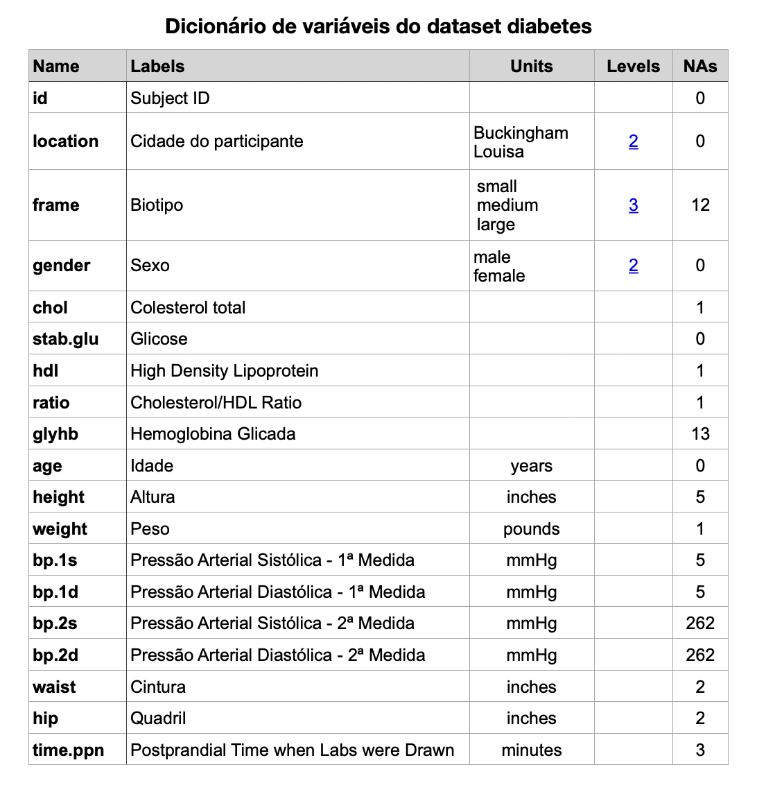

## Resumindo dados

Resumir dados é uma tarefa muito comum em análise de dados. Podemos resumir dados de várias formas, como por exemplo, calculando medidas de tendência central, medidas de dispersão, tabelas de frequência, etc.

Pacotes usados nesta seção, carregados uma única vez no início, como recomendado no capítulo sobre pacotes (@sec-packages):

```{r, message=FALSE, warning=FALSE}
library(readr)
library(skimr)
library(psych)
```

O R possui diversas funções para resumir dados. As funções `summarise()` ou `summarize()` do pacote `dplyr` são sinônimas e servem para criar um novo dataframe com informações resumidas, ou seja, estatísticas de um conjunto de dados. A diferença entre essas funções e a função `summary` do R é que precisamos especificar quais medidas estatísticas serão calculadas. Apesar de dar um trabalho a mais escrever o código, você tem muito mais flexibilidade, podendo criar um novo dataframe com qualquer medida de interesse.

O pacote `skimr` possui também algumas funções interessantes para resumir dados. A função `skim()` é uma delas. Ela fornece um resumo estatístico de um conjunto de dados, incluindo medidas de tendência central, dispersão, distribuição e muito mais. A função `skim()` é útil para obter uma visão geral rápida dos dados e identificar possíveis problemas ou padrões. Lembre-se que para usar essa função é necessário que você já tenha instalado o pacote skimr. Se ainda não tiver feito isso, use o comando `install.packages("skimr")` para instalar o pacote. Depois será necessário usar o comando `library(skimr)` para carregar esse pacote.

O pacote `psych` possui a função `describe()` que fornece um resumo estatístico de um conjunto de dados, incluindo medidas de tendência central, dispersão, distribuição e muito mais. A função `describe()` é útil para obter uma visão geral rápida dos dados e identificar possíveis problemas ou padrões. Lembre-se que para usar essa função é necessário que você já tenha instalado o pacote psych. Se ainda não tiver feito isso, use o comando `install.packages("psych")` para instalar o pacote. Depois será necessário usar o comando `library(psych)` para carregar esse pacote.

### Resumindo dados com `summary()` {#sec-summary}

Podemos resumir um conjunto de dados com a função `summary()`. O argumento dessa função é um data frame.

Essa função cria tabelas de todas as variáveis categóricas de um conjunto de dados de uma só vez e também calcula as medidas de mínimo, máximo, média, mediana e quartis de medidas numéricas.

Veja essa função aplicada no dataset `esoph` do R, que contém dados de um estudo de caso controle de câncer de esôfago na França.

```{r}
str(esoph)
```

Podemos ver acima que o dataset esoph contém 5 variáveis, 3 delas categóricas ordinais (chamadas no R de Ordered factor) e 2 numéricas.

```{r}
summary(esoph)
```

Veja que a função `summary()` cria tabelas para as variáveis categóricas e calcula várias medidas estatísticas para as variáveis numéricas.

Poderíamos também tabular essas variáveis com a função `table()` como mostrado abaixo, para cada variável categórica separadamente.

```{r}
table(esoph$agegp)
```

```{r}
table(esoph$alcgp)
```

```{r}
table(esoph$tobgp)
```

Frequentemente variáveis categóricas são representadas por algum valor numérico. Por exemplo, em muitas pesquisas o sexo masculino pode ser representado por `0` e o feminino por `1`. Nesses casos a variável sexo poderá ser erroneamente interpretada no R como numérica, quando na verdade é categórica.

Veja por exemplo o data frame `mtcars` no qual a variável `am` representa a marcha do carro, sendo 0 = câmbio automático, 1 = câmbio manual. Como os valores dessa variável são números (`0` e `1`), o R os interpreta como numéricos. O mesmo acontece na variável `vs`.

```{r}
data(mtcars)
str(mtcars)
```

Nesse caso, a função `summary()` irá erroneamente calcular medidas numéricas nas variáveis `am` e `vs`, que na verdade são categóricas:

```{r}
summary(mtcars)
```

Para resolver esse problema basta informar ao R que essas variáveis são categóricas com a função `as.factor()` como mostrado a seguir.

```{r}
mtcars$am <- as.factor(mtcars$am)
mtcars$vs <- as.factor(mtcars$vs)
```

Agora a função `summary()` irá corretamente fazer as tabelas das variáveis `vs` e `am`, pois já estão configuradas como sendo categóricas. Podemos ver no código abaixo que existem 19 carros com câmbio automático (am=0), e 13 carros com câmbio manual (am=1).

```{r}
summary(mtcars)
```

Vejamos alguns outros exemplos dessa função aplicada a alguns outros data frames.

```{r}
summary(USArrests)
```

```{r}
summary(mpg)
```

Veja que essa função resolve muitas de nossas necessidades no processo de análise de dados, porém, como já dito, é comum que uma variável categórica seja codificada com números, nesse caso, temos de fazer o ajuste antes de usar a função `summary()`, como fizemos antes de usar a função summary com o dataset `mtcars` em seções anteriores.

### Resumindo dados com `summarise()` do pacote `dplyr`

Vamos usar como exemplo o dataset `diabetes` disponível no site da Vanderbilt University School of Medicine:\
<https://hbiostat.org/data/repo/diabetes.csv>

Esse dataset contém dados de 403 pacientes e 19 variáveis num estudo sobre diabetes, obesidade e outros fatores de risco para doenças coronarianas. O data frame contém então 403 linhas e 19 colunas. O dicionário de variáveis desse dataset pode ser obtido no link a seguir: <https://hbiostat.org/data/repo/Cdiabetes.html>

```{r diabetes-dictionary, echo=FALSE, out.width='100%', fig.show='hold', fig.cap='diabetes dictionary'}

```

Para usar esse dataset é necessário fazer o download desse arquivo e depois carregar esse arquivo no R. Neste livro o arquivo foi baixado uma vez para `dataset/diabetes_hbiostat.csv` (ver o capítulo sobre leitura de dados, @sec-reading), e é dessa cópia que o código lê:

```{r reading-diabetes}
diabetes <- read_csv("dataset/diabetes_hbiostat.csv")
```

```{r}
str(diabetes)
```

Lembre-se que será sempre útil recodificar as variáveis categóricas como factor usando `as.factor()`

```{r}
diabetes$gender   <- as.factor(diabetes$gender)
diabetes$frame    <- as.factor(diabetes$frame)
diabetes$location <- as.factor(diabetes$location)
```

Com os dados lidos, podemos agora verificar as primeiras linhas com a função `head()`:

```{r}
head(diabetes)
```

Agora sim, estamos prontos para usar a função `summarise()` do `dplyr`. Vamos usar a função `summarise()` para calcular a média e o desvio padrão da glicose, que está na variável denominada `stab.glu`. Vou precisar usar as funções `mean(stab.glu)` e `sd(stab.glu)`. Essas funções serão os argumentos da função `summarise()`.

1º - Indicar o data frame a ser usado (`diabetes`);\
2º - usar o operador pipe para passar esse data frame adiante;\
3º - agrupar os dados de acordo com o sexo (`gender`);\
4º - chamar a função `summarise()`;\
5º - definir os argumentos da função `summarise()`: a média (usando a função `mean()`) e o desvio padrão (usando a função `sd()`)

```{r}
diabetes |> 
  group_by(gender) |> 
  summarise(media_da_glicose = mean(stab.glu), desvio_padrao_da_glicose = sd(stab.glu))
```

Podemos incluir as medidas que desejarmos como argumentos da função `summarise()`. Vamos acrescentar a medida da média e desvio padrão da idade, altura e peso, e dessa vez, estratificando pelo biotipo (variável `frame`), incluindo o número de participantes em cada grupo:

```{r}
diabetes |> 
  group_by(frame) |> 
  summarise(media_glicose = mean(stab.glu), 
            dp_glicose    = sd(stab.glu),
            media_altura  = mean(height),
            dp_altura     = sd(height),
            media_peso    = mean(weight),
            dp_peso       = sd(weight), 
            n             = n())
```

Como várias das estatísticas retornaram com valores NA, é preciso incluir o argumento na.rm=TRUE, como faremos a seguir. Podemos também ordenar o data frame criado conforme desejarmos. Por exemplo, vou colocar a quantidade de participantes como a primeira coluna.

```{r}
diabetes |> 
  group_by(frame) |> 
  summarise(n             = n(),
            media_glicose = mean(stab.glu), 
            dp_glicose    = sd(stab.glu),
            media_altura  = mean(height, na.rm = TRUE),
            dp_altura     = sd(height,  na.rm = TRUE),
            media_peso    = mean(weight, na.rm = TRUE),
            dp_peso       = sd(weight,   na.rm = TRUE))
```

Veja que esse data frame novo não foi armazenado em nenhum objeto ainda, se desejarmos fazer isso basta criar um nome para o objeto e usar o operador de atribuição `<-`. No código abaixo coloquei o data frame criado num objeto chamado `resumo`.

```{r}
resumo <- diabetes |> 
          group_by(frame) |> 
          summarise(n             = n(),
                    media_glicose = mean(stab.glu), 
                    dp_glicose    = sd(stab.glu),
                    media_altura  = mean(height, na.rm = TRUE),
                    dp_altura     = sd(height,  na.rm = TRUE),
                    media_peso    = mean(weight, na.rm = TRUE),
                    dp_peso       = sd(weight,   na.rm = TRUE))

resumo
```

### Resumindo dados com `skim()` do pacote `skimr`

Vamos usar agora a função `skim` do pacote `skimr` para resumir os dados. Veja como essa função resolve de forma simples e rápida o problema de resumir os dados.

```{r}
skim(diabetes)
```

Observe que a função `skim()` reconheceu corretamente as variáveis location, gender e frame como categóricas, e as variáveis age, height, weight, bmi, waist, hip, time.ppn e stab.glu como numéricas. A função `skim()` fornece um resumo estatístico de um conjunto de dados, incluindo medidas de tendência central, dispersão, distribuição e muito mais, sendo útil para obter uma visão geral rápida dos dados e identificar possíveis problemas ou padrões.

### Resumindo dados com `describe()` do pacote `psych`

Vamos usar agora a função `describe()` do pacote `psych` para resumir os dados. Veja como essa função também resolve de forma simples e rápida o problema de resumir os dados.

```{r, warning=FALSE, message=FALSE}
describe(diabetes)
```

Observe que a função `describe()` não foi capaz de interpretar corretamente as variáveis location, gender e frame como categóricas, tendo calculado diversas estatísticas inadequadas para esse tipo de variável, como por exemplo, média e desvio padrão.
