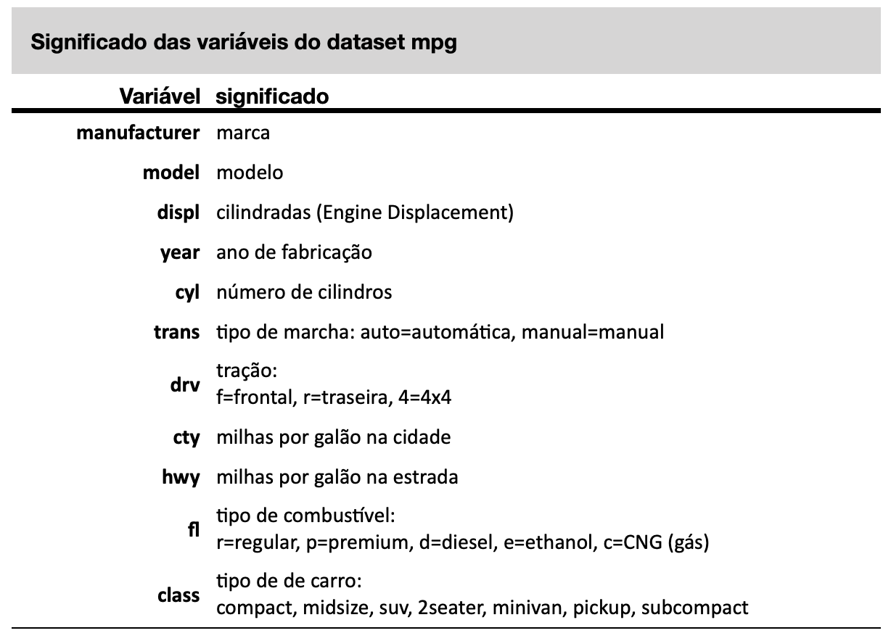
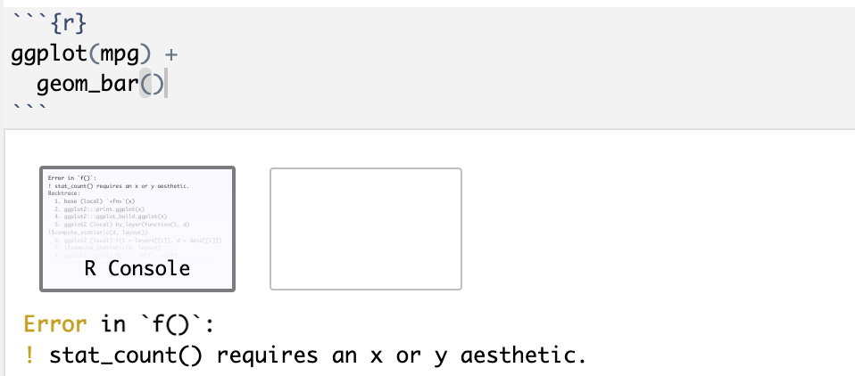

# Gráficos {#sec-ggplot}

Gráficos são uma linguagem sem palavras. E como toda linguagem, possui uma gramática para ordenar sua construção. Leland Wilkinson (2005) idealizou essa gramática em seu livro "The Grammar of Graphics", tentando responder à pergunta "o que é um gráfico?". De acordo com Wilkinson, um gráfico é estruturado por um conjunto de dados (data), um relacionamento/mapeamento estéticos (aesthetics) desses dados através de formas geométricas (geometrics) num sistema de coordenadas (coord). Essa gramática se tornou a base do pacote gráfico `ggplot2`, criado por Hadley Wickham. Devida a sua enorme flexibilidade, o uso do `ggplot2` se tornou um dos pacotes mais populares do R.

Apesar do R ter funções básicas para geração de gráficos, o pacote `ggplot2` possibilita a construção de gráficos mais elaborados, com maior facilidade de ajustes, maior integração com as outras funções do `tidyverse`.

No `ggplot2` cada tipo de gráfico é tem seu nome iniciado com o termo `geom_`, seguido da forma geométrica usada. Os gráficos mais comuns são os seguintes: `geom_bar()`, `geom_histogram()`, `geom_density()`, `geom_boxplot()`, `geom_point()`.

Um importante conceito desenvolvido por Wilkinson foi o de camadas (layers) de um gráfico. O conjunto formado por dados, mapeamento, formas geométricas e seus elementos estéticos formam uma camada. A grande flexibilidade do `ggplot2` é justamente permitir a inclusão de várias camadas com o simples sinal de `+`.

Os gráficos do ggplot são inegavelmente mais bonitos e mais fáceis de ajustar do que os gráficos padrão do R. No entanto, a curva de aprendizado é um pouco mais íngreme. Mas, com um pouco de prática, você verá que o `ggplot2` é uma ferramenta poderosa e flexível para a criação de gráficos. Nesse livro iremos seguir uma abordagem um pouco diferente, vamos primeiro ver como construir os gráficos como pacote ggplot e depois veremos como construir gráficos com o R base. A idéia é que você aprenda a usar o ggplot para suas análises, mas conheça também as funcionalidades gráficas do R base para que possa usá-las quando necessário.

Vamos inicialmente analisar as etapas genéricas da construção de gráficos com o ggplot e usando como exemplo a construção de um gráfico de barras, em seguida, veremos como construir os gráficos mais comuns: histograma, de densidade, box plot e de dispersão (scatter plot).

## Gráficos fom ggplot

### Etapas da construção de um gráfico no ggplot2

A primeira etapa da criação e um gráfico com o `ggplot2` é a definição do conjunto de dados. Em seguida são definidas as formas geométricas a serem plotadas (linhas, pontos, barras, etc.). Cada forma geométrica é plotada por uma função específica, cujo nome se inicia sempre com `geom_xxx`, onde xxx será o tipo de geometria usada (barras: geom_bar; pontos: geom_point; boxplot: geom_boxplot, etc). Em seguida podemos ajustar o sistema de coordenadas, os eixos, as legendas, as paletas de cores, e muitos outros ajustes. Finalmente, podemos também escolher temas pre-definidos para a estética de apresentação dos gráficos. Existem temas para tornar os gráficos no estilo de diversos jornais.

Uma observação importante: o `ggplot2` só cria gráficos a partir de dados armazenados em `data frames` ou `tibbles.` Portanto, se seus dados não estão num data frame ou `tibbles`, será necessário primeiro transformá-los nesse tipo de objeto, usando a função `data.frame()` ou `tibble()`. Os exemplos a seguir irão usar o dataset `mpg`, que já é um objeto do tipo data frame e faz parte do conjunto de datasets do próprio `ggplot2`.

Antes de usar o conjunto de dados do mpg, vamos ver primeiro lembrar o que existe nesse data frame. Podemos fazer isso usando o comando `?mpg` no console, o resultado será mostrado na aba Help, no canto inferior direito do RStudio.

```{r}
# carregando o pacote ggplot2, necessário para usar o dataset mpg
library(ggplot2)
```

```{r, eval=FALSE}
# use esse comando no console para abrir a documentação do dataset
?mpg
```

**Description** This dataset contains a subset of the fuel economy data that the EPA makes available on <https://fueleconomy.gov/>. It contains only models which had a new release every year between 1999 and 2008 - this was used as a proxy for the popularity of the car.

**Usage** mpg - A data frame with 234 rows and 11 variables:

**Variables** manufacturer - manufacturer name\
model - model name\
displ - engine displacement, in litres\
year - year of manufacture\
cyl - number of cylinders\
trans - type of transmission\
drv - the type of drive train,\
where f = front-wheel drive, r = rear wheel drive, 4 = 4wd\
cty - city miles per gallon\
hwy - highway miles per gallon\
fl - fuel type, r=regular, p=premium, d=diesel, e=ethanol, c=CNG (gas)\
class - "type" of car

```{r mpg2-dictionary, echo=FALSE, out.width='100%', fig.show='hold', fig.cap='mpg dictionary'}

```

#### Definindo os dados

Para isso definir qual data frame ou `tibble` vamos usar, basta usar a função `ggplot()`, inserindo como argumento o data frame ou `tibble` com os dados, como mostrado nos exemplos a seguir, usando o data frame `mpg`.

```{r}
# carregando o pacote ggplot2
library(ggplot2)

# começando a criar um gráfico
ggplot(data = mpg)
```

O resultado do código acima foi a geração de um plano em branco. O `ggplot` já sabe que queremos usar o data frame `mpg`, mas ainda não informamos quais variáveis queremos plotar, nem os eixos de cada variável e nem qual o tipo de gráfico desejamos.

#### Definindo o tipo de gráfico (mapeamento)

Já informamos ao `ggplot` que iremos trabalhar com o data frame `mpg` na primeira linha do código. As próximas linhas vão acrescentar as outras camadas. Vamos incluir aos poucos outras camada nesse plano. A primeira camada será a forma geométrica que queremos usar. O `ggplot2` denomina de `geom` as formas geométricas que podem ser usadas. Essas geometrias, ou geoms, são funções específicas para cada tipo de gráfico.

Por exemplo, para um gráfico de barras usamos a função `geom_bar()`, para um gráfico de pontos (scatter plot) usamos a função `geom_point()`, para um histograma usamos a função `geom_histogram()`, para um gráfico de densidade usamos a função `geom_density()`, para um boxplot usamos a função `geom_boxplot()`, para um gráfico de linhas usamos a função `geom_line()` e assim por diante.

Essas geometrias, todas bidimensionais, necessitam de dataframe ou tibble de onde os dados serão obtidos e um **mapeamento estético** (*aesthetics*) para indicar quais variáveis desse dataframe ou tibgle serão usadas para mapear as coordenadas `x` e `y`, que é feito com o argumento `aes()`.

Vamos construir um gráfico de barras com a função `geom_bar()`. O `ggplot` usa o sistema de acrescentar gradualmente camadas com o operador `+`. Se você se esquecer do mapeamento estético o RStudio irá gerar um erro.

```{r, eval=FALSE, message=FALSE, echo=FALSE, warning=FALSE}
ggplot(data = mpg) + 
  geom_bar()
```

```{r ggplot-error, echo=FALSE, out.width='100%', fig.show='hold', fig.cap='ggplot-error'}

```

O RStudio indicou um erro, faltou indicar qual a variável no eixo x. Vamos incluir essa variável com o argumento `aes(x=nome.da.variável)`. Lembre-se que um gráfico de barras exige que a variável seja categórica, pois irá plotar as frequencias absolutas de cada um dos elementos dessa categoria. Então, teremos de usar algumas das variáveis categóricas do data frame `mpg.`

Vamos informar ao R que a variável a ser plotada será `drv`, que é uma variável categórica, que indica o tipo de tração do carro.

f = front-wheel drive - tração dianteira\
r = rear wheel drive - tração traseira\
4 = 4wd - tração 4x4.

Veja que essa informação tem que vir dentro do argumento `aes` (aesthetics). É interessante inserir esse argumento logo na primeira linha do código, como mostrado abaixo, dentro da função `ggplot`, logo depois do nome do dataset a ser usado.

```{r}
ggplot(mpg, aes(x=drv)) + 
  geom_bar()
```

Se deserjamos plotar as frequencias de cada tipo de combustivel usado, basta usar a variável `fl` (r=regular, p=premium, d=diesel, e=ethanol, c=CNG (gas)).

```{r}
ggplot(mpg, aes(x=fl)) + 
  geom_bar()
```

#### Título, subtítulo e notas de rodapé

Podemos incluir título, subtitulo, notas de rodapé no gráfico do ggplot simplesmente adicionando uma camada a mais com o operador `+`. A função para incluir esses elementos é `labs()`.

```{r}
ggplot(mpg, aes(x=drv, fill=fl)) +
  geom_bar() +
  labs(title = "Tipo de tração e Tipo de combustível",
       subtitle = "234 Carros populares de 1998 a 2008",
       caption = "fonte: dataset mgp do ggplot2")
```

#### Legendas(nomes) dos eixos

A função `labs` permite também incluir no gráfico os nomes dos eixos. O argumento para isso deve ser inserido dentro da função labs, como mostrado abaixo.

```{r}
ggplot(mpg, aes(x=drv, fill=fl)) +
  geom_bar() +
  labs(title = "Tipo de tração e Tipo de combustível",
       subtitle = "234 Carros populares de 1998 a 2008",
       caption = "fonte: dataset mgp do ggplot2",
       x = "Tipo de tração", 
       y = "Número de carros") 
```

#### Temas

Com a função `theme` do ggplot é possível ajustar a fonte, o tamanho das fontes, as cores do fundo do gráfico. Todos esses elementos podem ser precisamente ajustados para adequar o gráfico ao estilo da revista onde será feita a publicação. Os detalhes precisos desses ajustes são um pouco mais complexos mas podem ser facilmente aprendidos na internet. O site do ggplot explica cada uma das diversas possibilidades. Para maiores detalhes consulte esse site: <https://ggplot2.tidyverse.org/reference/theme.html>

Para facilitar nos ajustes, existem uma série de temas pré-definidos que podem ser usados bastando incluir no código mais uma linha com o nome do tema desejado.

Temas disponíveis:

-   theme_grey()
-   theme_gray()
-   theme_bw()
-   theme_linedraw()
-   theme_light()
-   theme_dark()
-   theme_minimal()
-   theme_classic()
-   theme_void()
-   theme_test()

Eu gosto muito do tema clássico: `theme_classic()`. Para usar esse tema, basta incluir essa linha no código, como mostrado abaixo:

```{r}
ggplot(mpg, aes(x=drv, fill=fl)) +
  geom_bar() +
  labs(title = "Tipo de tração e Tipo de combustível",
       subtitle = "234 Carros populares de 1998 a 2008",
       caption = "fonte: dataset mgp do ggplot2",
       x = "Tipo de tração", 
       y = "Número de carros") +
  theme_classic()
```

O `theme_minimal()` inclui algumas linhas horizontais e verticais para facilitar a visualização.

```{r}
ggplot(mpg, aes(x=drv, fill=fl)) +
  geom_bar() +
  labs(title = "Tipo de tração e Tipo de combustível",
       subtitle = "234 Carros populares de 1998 a 2008",
       caption = "fonte: dataset mgp do ggplot2",
       x = "Tipo de tração", 
       y = "Número de carros") +
  theme_minimal()
```

O `theme_linedraw()` incluir linhas dentro do gráfico e uma caixa ao redor do gráfico.

```{r}
ggplot(mpg, aes(x=drv, fill=fl)) +
  geom_bar() +
  labs(title = "Tipo de tração e Tipo de combustível",
       subtitle = "234 Carros populares de 1998 a 2008",
       caption = "fonte: dataset mgp do ggplot2",
       x = "Tipo de tração", 
       y = "Número de carros") +
  theme_linedraw()
```

O `theme_void()` retira os eixos e os nomes dos eixos.

```{r}
ggplot(mpg, aes(x=drv, fill=fl)) +
  geom_bar() +
  labs(title = "Tipo de tração e Tipo de combustível",
       subtitle = "234 Carros populares de 1998 a 2008",
       caption = "fonte: dataset mgp do ggplot2",
       x = "Tipo de tração", 
       y = "Número de carros") +
  theme_void()
```

Existem pacotes com mais temas, por exemplo, o pacote `ggthemes` disponibiliza temas pre-definidos para gráficos do tipo do Wall Street Journal, The Economist, etc. Há pacotes também para deixar os gráficos no estilo do New York Times e vários outros jornais.

Agora que já estudamos as etapas genéricas de construção de gráficos com o ggplot, vamos ver os detalhes específicos de como construir cada um dos gráficos mais comuns: gráfico de barras, histograma, gráficos de densidade, box plot e diagrama de dispersão (scatter plot).

#### Rotacionando o gráfico

Com o ggplot é fácil rotacionar o gráfico: basta mapear a variável categórica em `y` em vez de `x`. (Nas versões antigas do ggplot2 era preciso acrescentar uma linha `coord_flip()` ao código; ela ainda funciona, mas já não é necessária.) Vejamos como rotacionar o gráfico de barras acima:

```{r}
ggplot(mpg, aes(y=drv, fill=fl)) +
  geom_bar() +
  labs(title = "Tipo de tração e Tipo de combustível",
       subtitle = "234 Carros populares de 1998 a 2008",
       caption = "fonte: dataset mgp do ggplot2",
       y = "Tipo de tração", 
       x = "Número de carros") +
  theme_classic()
```

#### Agrupando os gráficos

Uma técnica para facilitar a visualização de dados é criar gráficos separados para cada subgrupo. Isso é facilmente implementado no ggplot com uma linha a mais no código, através dos comandos `facet_wrap()` ou `facet_grid()`.

Como exemplo, vamos criar diversos desses gráficos de barras, de acordo com o número de cilindros dos carros, informação que está na variável `cyl`. Serão criados gráficos para os carros com 4 cilindros, 5 cilindros, 6 cilindros e 8 cilindros. Observe que o argumento da função `facet_wrap()` e `facet_grid()` é precedido pelo operador `~`.

```{r}
ggplot(mpg, aes(x=drv, fill=fl)) +
  geom_bar() +
  labs(title = "Tipo de tração e Tipo de combustível",
       subtitle = "234 Carros populares de 1998 a 2008",
       caption = "fonte: dataset mgp do ggplot2",
       x = "Tipo de tração", 
       y = "Número de carros") +
  theme_classic() + 
  facet_wrap(~cyl)
```

É possível também criar uma grade, estratificando o gráfico com duas variáveis. Nesse caso as variáveis serão inseridas com o operador `~` entre elas nos argumentos dessas funções. por exemplo: `facet_grid(cyl~yearl)`.

```{r}
ggplot(mpg, aes(x=drv, fill=fl)) +
  geom_bar() +
  labs(title = "Tipo de tração e Tipo de combustível",
       subtitle = "234 Carros populares de 1998 e 2008",
       caption = "fonte: dataset mgp do ggplot2",
       x = "Tipo de tração", 
       y = "Número de carros") +
  theme_classic() + 
  facet_grid(cyl~year)
```

#### Estratificando os dados

O ggplot permite também incluir duas variáveis categóricas num mesmo gráfico de barras. Podemos pedir ao ggplot que use cores diferentes para distinguir os elementos de uma variável dentro da barra.

Podemos por exemplo, fazer barras com a variável `drv` e usar cores para distinguir os tipos de combustível dentro de cada barra.

Veja como é simples incluir isso no código do ggplot, basta usar o argumento `fill`, que indica como preencher as barras, e indicar que esse preenchimento deve ser feito com base numa outra variável categórica, por exemplo, o tipo de combustível, que está na variável `fl`. As cores serão automaticamente escolhidas pelo R.

**Um detalhe importante aqui: o argumento `fill` funciona de forma diferente quando está dentro ou fora da estética (`aes`). Nesse caso, precisamos que o argumento fill esteja dentro da estética, ou seja, dentro do parenteses do argumento `aes`.**

```{r}
ggplot(mpg, aes(x=drv, fill=fl)) +
  geom_bar()
```

Se você não estiver satisfeito com as cores escolhidas, é possível ajustar isso. O R tem diversas paletas de cores e você pode indicar que deseja usar alguma outra. Além disso, há também vários pacotes com outras paletas de cores que podem ser carregados e usados. Uma rápida busca na internet será suficiente para conhecer sobre todas as possibilidades de cores no R. O R tem algumas paletas pré-definidas (rainbow, heat.colors, cm.colors). Alguns dos pacotes mais famosos com paletas de cores são:

-   Viridis color scales \[viridis package\].
-   Colorbrewer palettes \[RColorBrewer package\]
-   Grey color palettes \[ggplot2 package\]
-   Scientific journal color palettes \[ggsci package\]
-   Wes Anderson color palettes \[wesanderson package\]

#### Transparência

Podemos ajustar a transparência das cores usadas com o argumento `alpha`. Preste atenção no fato que esse argumento deve ficar fora da estética do gráfico, ou seja fora do parênteses do `aes()`.

```{r}
ggplot(mpg, aes(x=drv, fill=fl)) +
  geom_bar(alpha = 0.5)
```

Nos gráficos nos quais há uma superposição de elementos essa transparência pode ser muito útil para facilitar a visualização.

Veja no gráfico abaixo que há uma superposição entre as tres distribuições de densidade, o que atrapalha a análise. Podemos ajustar a transparência com o argumento alpha. Preste atenção no fato que esse argumento deve ficar fora da estética do gráfico, ou seja fora do parênteses do `aes()`.

```{r}
ggplot(mpg, aes(x=hwy)) +
  geom_density(aes(fill=drv), alpha = 0.5) +
  labs(title = "Milhas percorridas na estrada com um galão de combustível",
       subtitle = "de acordo com o tipo de tração do carro",
       caption = "fonte: dataset mgp do ggplot2",
       x = "Milhas", 
       y = "Número de carros") +
  theme_classic()
```

### Gráfico de Barras

Já vimos comos construir um gráfico de barras nas seções anteriores. Vamos ver agora apenas alguns ajustes que podem ser feitos nesse tipo de gráfico.

#### Alterando a ordenação das barras

Lembre-se, como discutido na seção dobre variáveis categóricas, que os gráficos ggplot por padrão usam uma sequencia alfabética para dispor os elementos. Se desejarmos mudar isso, basta usar a função `fct_infreq()` do pacote `forcats`. Depois basta plotar novamente o gráfico.

```{r}
# carregando os pacotes
library(ggplot2) # necessário para usar o dataset mpg
library(forcats) # necessário para usar a função fct_infreq
library(dplyr) # necessário para usar mutate

# indicando que a variável drv deverá ser plotada com de acordo com a frequencia
mpg <- mpg |> 
  mutate(drv = fct_infreq(drv))

# plotando novamente o gráfico
ggplot(mpg, aes(x=drv)) +
  geom_bar() +
  labs(title = "Tipo de tração e Tipo de combustível",
       subtitle = "234 Carros populares de 1998 a 2008",
       caption = "fonte: dataset mgp do ggplot2",
       x = "Tipo de tração", 
       y = "Número de carros") +
  theme_classic()
```

E, se desejar que as frequencias seja mostradas de forma crescente, basta incluir a função `fct_rev`.

```{r}
# indicando que a variável drv deverá ser plotada com de acordo com a frequencia crescente
mpg <- mpg |> 
  mutate(drv = fct_rev(fct_infreq(drv)))

# plotando novamente o gráfico
ggplot(mpg, aes(x=drv)) +
  geom_bar() +
  labs(title = "Tipo de tração e Tipo de combustível",
       subtitle = "234 Carros populares de 1998 a 2008",
       caption = "fonte: dataset mgp do ggplot2",
       x = "Tipo de tração", 
       y = "Número de carros") +
  theme_classic()
```

#### Alterando a largura das barras

O argumento width da função geom_bar() permite alterar a largura das barras do gráfico. Os valores desse argumento podem variar de 0 a 1.

```{r}
ggplot(mpg, aes(x=drv)) +
  geom_bar(width = 0.2) +
  labs(title = "Tipo de tração e Tipo de combustível",
       subtitle = "234 Carros populares de 1998 a 2008",
       caption = "fonte: dataset mgp do ggplot2",
       x = "Tipo de tração", 
       y = "Número de carros") +
  theme_classic()
```

#### Criando um eixo de percentual

Podemos também mudar o eixo vertical para percentual ao inves de números absolutos.

Para que o gráfico de barras use percentuais é preciso:\
1. calcular os percentuais.\
2. colocar esses percentuais num novo dataset. 3. usar esse dataset como argumento da função ggplot 4. incluir a variável com os percentuais nos argumentos do `ggplot`.\
5. finalmente, será preciso usar `geom_col()` em vez de `geom_bar()`, porque agora a altura das barras já vem calculada no dataset (o `geom_bar()` conta as linhas por conta própria), como mostrado abaixo:

```{r}
# criando uma dataset com os dados percentuais:
newdataset <-  mpg %>% 
                 count(drv) %>% 
                 mutate(perc = n / nrow(mpg)) 
newdataset
```

Veja que o novo dataset (`newdataset`) tem apenas 3 variáveis agora, drv, n e perc.

```{r}
# observe que os resultados foram colocados num outro dataset, chamado newdataset, para não alterar o dataset original.
# no código abaixo foi usado o novo dataset, newdataset, que contém a nova variável "perc".

ggplot(newdataset, aes(x=drv, y=perc)) +
  geom_col(width = 0.5) +
  labs(title = "Tipo de tração e Tipo de combustível",
       subtitle = "234 Carros populares de 1998 a 2008",
       caption = "fonte: dataset mgp do ggplot2",
       x = "Tipo de tração", 
       y = "Percentual de carros") +
  theme_classic()
```

### Histograma

Vamos agora ver como criar um histograma, um gráfico comum para analisar visualmente a distribuição de uma variável numérica, útil para visualizar a forma, centro e dispersão dos dados, além de identificar quaisquer valores discrepantes ou lacunas.

Um histograma representa a distribuição dos valores de dados dividindo a faixa de valores em intervalos ou **bins** de tamanho igual, exibindo a frequência ou contagem em cada intervalo, geralmente representada pela altura ou comprimento das barras. A largura dos bins pode afetar a aparência do histograma e a interpretação dos dados. Bins estreitos podem criar uma visão mais detalhada, enquanto bins mais largos podem suavizar a distribuição.

A função do ggplot para plotar um histograma é o `geom_histogram()`.

Como exemplo, vamos continuar usando o dataset `mpg`, analisando agora as variáveis `hwy` (quantidade de milhas percorridas com 1 galão de combustível quando rodando em estradas) e `cty` (quantidade de milhas percorridas com 1 galão de combustível quando rodando na cidade).

```{r, warning=FALSE, message=FALSE}
library(ggplot2)
ggplot(mpg, aes(x=hwy)) +
  geom_histogram() 
```

O R mostrou um aviso indicando que usou 30 barras (`bins=30`) e que você pode ajustar isso conforme achar melhor.

#### Número de barras

Podemos melhorar esse gráfico ajustando para 15 barras, e também inserindo o título, subtítulo, notas de rodapé e usando o tema clássico, como já discutimos anteriormente.

```{r}
ggplot(mpg, aes(x=hwy)) +
  geom_histogram(bins = 15) +
  labs(title = "Milhas percorridas na estrada com um galão de combustível",
       subtitle = "234 Carros populares de 1998 a 2008",
       caption = "fonte: dataset mgp do ggplot2",
       x = "Milhas", 
       y = "Número de carros") +
  theme_classic()
```

#### Cores das barras

Podemos mudar as cores usadas com os argumentos `col` e `fill`. O argumento `col` indica a cor do contorno das barras e o argumento `fill` indica a cor interna das barras. Vamos refazer o gráfico com barras azul escuras e contornos azul claros. Observe também que os nomes das cores vem entre aspas.

```{r}
ggplot(mpg, aes(x=hwy)) +
  geom_histogram(bins = 15, col="darkblue", fill="lightblue") +
  labs(title = "Milhas percorridas na estrada com um galão de combustível",
       subtitle = "234 Carros populares de 1998 a 2008",
       caption = "fonte: dataset mgp do ggplot2",
       x = "Milhas", 
       y = "Número de carros") +
  theme_classic()
```

#### Agrupando histogramas

Podemos, assim como fizemos com gráficos de barras, plotar diversos histogramas, um para cada grupo de carros, conforme desejarmos. Por exemplo, se desejarmos plotar histogramas separados para cada tipo de tração (variável `drv`) basta usarmos uma linha no código.

```{r}
ggplot(mpg, aes(x=hwy)) +
  geom_histogram(bins = 15, col="darkblue", fill="lightblue") +
  labs(title = "Milhas percorridas na estrada com um galão de combustível",
       subtitle = "234 Carros populares de 1998 a 2008",
       caption = "fonte: dataset mgp do ggplot2",
       x = "Milhas", 
       y = "Número de carros") +
  theme_classic() + 
  facet_grid(~drv)
```

### Gráfico de densidade

Vamos agora ver como criar um gráfico de densidade, um gráfico também comum para analisar visualmente a distribuição de uma variável numérica, útil para visualizar a forma, centro e dispersão dos dados, além de identificar quaisquer valores discrepantes ou lacunas.

Um gráfico de densidade, também conhecido como gráfico de densidade de kernel, representa a distribuição dos valores de dados criando uma curva suave que aproxima a função de densidade de probabilidade subjacente, mostrando a concentração ou densidade de pontos de dados em diferentes valores, em vez da frequência ou contagem como num histograma. Gráficos de densidade não utilizam bins fixos como os histogramas, mas estimam a densidade usando técnicas matemáticas, como a estimativa de densidade do kernel. Sua vantagem é que fornecem uma visualização contínua da distribuição, permitindo uma compreensão mais detalhada da forma, picos e vales dos dados.

Eles são especialmente úteis para visualizar padrões em dados contínuos, identificar modas ou agrupamentos e comparar distribuições entre diferentes grupos.

A função do ggplot para plotar um gráfico de densidade é o `geom_density()`.

Como exemplo, vamos continuar usando o dataset `mpg`, analisando agora as variáveis `hwy` (quantidade de galões o carro consome quando rodando em estradas) e `cty` (quantidade de galões o carro consome quando rodando na cidade).

```{r}
library(ggplot2)
ggplot(mpg, aes(x=hwy)) +
  geom_density() 
```

#### Estratificando com col e fill

Podemos estratificar o gráfico através do argumento `col` e `fill`. O argumento `col` indica a cor do contorno das linhas e o argumento `fill` indica a cor interna das linhas. Preste atenção que esses argumentos estão dentro da estética do `geom_density`, ou seja, dentro do argumento `aes()`.

Usando o argumento `col=drv`, para colorir as linhas de acordo com o tipo de tração.

```{r}
ggplot(mpg, aes(x=hwy)) +
  geom_density(aes(col=drv)) +
  labs(title = "Milhas percorridas na estrada com um galão de combustível",
       subtitle = "de acordo com o tipo de tração do carro",
       caption = "fonte: dataset mgp do ggplot2",
       x = "Milhas", 
       y = "Número de carros") +
  theme_classic()
```

Usando o argumento `fill=drv`, para colorir preencher a densidade de acordo com o tipo de tração.

```{r}
ggplot(mpg, aes(x=hwy)) +
  geom_density(aes(fill=drv), alpha=0.5) +
  labs(title = "Milhas percorridas na estrada com um galão de combustível",
       subtitle = "de acordo com o tipo de tração do carro",
       caption = "fonte: dataset mgp do ggplot2",
       x = "Milhas", 
       y = "Número de carros") +
  theme_classic()
```

#### Agrupando gráficos de densidade

Podemos, assim como fizemos com gráficos de barras e histogramas, plotar diversos gráficos de densidade um para cada grupo de carros, conforme desejarmos. Por exemplo, se desejarmos plotar separados para cada tipo de tração (variável `drv`) basta usarmos uma linha no código.

```{r}
ggplot(mpg, aes(x=c(hwy))) +
  geom_density(aes(fill=drv), alpha = 0.5) +
  labs(title = "Milhas percorridas na estrada com um galão de combustível",
       subtitle = "de acordo com o tipo de tração do carro",
       caption = "fonte: dataset mgp do ggplot2",
       x = "Milhas", 
       y = "Número de carros") +
  theme_classic() + 
  facet_grid(~drv)
```

### Boxplot ou diagrama de caixas

Um boxplot, também conhecido como diagrama de caixa, é uma maneira de visualizar a distribuição de dados numéricos e identificar medidas estatísticas importantes, numa representação gráfica simples e compacta [@Massart2005].

Um boxplot é composto por um retângulo, conhecido como "caixa", dividido em três partes: a mediana (valor que divide o conjunto de dados em duas partes iguais), o primeiro quartil (Q1) e o terceiro quartil (Q3). Além disso, o boxplot possui "hastes" que se estendem a partir da caixa. Essas hastes mostram a dispersão dos dados fora da faixa interquartil (Q1 a Q3). Elas são representadas por segmentos de linha que terminam em "pontos" ou "outliers", que são valores que estão significativamente distantes dos demais.

O boxplot permite identificar rapidamente informações estatísticas como a mediana, a amplitude interquartil, os valores mínimo e máximo e a presença de valores discrepantes. Ele também ajuda a entender a simetria ou assimetria da distribuição dos dados e se existem valores discrepantes que podem afetar a interpretação geral.

Um Boxplot também facilita a comparação entre diferentes conjuntos numéricos dada a simplicidade do gráfico.

A função do `ggplot` para construir um boxplot é o `geom_boxplot()`.

Como exemplo, vamos continuar usando o dataset `mpg`, analisando agora as variáveis `hwy` (quantidade de galões o carro consome quando rodando em estradas) e, em seguida, `cty` (quantidade de galões o carro consome quando rodando na cidade).

```{r}
library(ggplot2)
ggplot(mpg, aes(x=hwy)) +
  geom_boxplot() 
```

Da mesma forma que fizemos antes, podemos incluir facilmente o título, subtítulo, notas de rodapé e legendas dos eixos e indicar o tema clássico para o gráfico.

```{r}
ggplot(mpg, aes(x=hwy)) +
  geom_boxplot() +
   labs(title = "Milhas percorridas na estrada com um galão de combustível",
       subtitle = "234 Carros populares de 1998 a 2008",
       caption = "fonte: dataset mgp do ggplot2",
       x = "Milhas") +
  theme_classic() 
```

#### Colorindo um boxplot

Podemos definir a cor de um boxplot com os argumentos col e fill, como mostrado abaixo. Observe que os argumentos `col` e `fill` no exemplo abaixo não estão dentro da estética do boxplot, ou seja, não estão dentro do parenteses do `aes()`. Observe também que os nomes das cores vem entre aspas.

```{r}
ggplot(mpg, aes(x=hwy)) +
  geom_boxplot(col="darkblue", fill="lightblue") +
   labs(title = "Milhas percorridas na estrada com um galão de combustível",
       subtitle = "234 Carros populares de 1998 a 2008",
       caption = "fonte: dataset mgp do ggplot2",
       x = "Milhas") +
  theme_classic() 
```

#### Estratificando um boxplot

Podemos estratificar o boxplot através de duas formas:

1.  Indicando uma variável categórica para o eixo y.
2.  Com os argumentos `col` e `fill` dentro da estética do boxplot.

No exemplo abaixo, foi acrescentado o eixo y sendo o tipo de tração do carro: `y=drv`. Veja o código e o resultado.

```{r}
ggplot(mpg, aes(x=hwy, y=drv)) +
  geom_boxplot() +
   labs(title = "Milhas percorridas na estrada com um galão de combustível",
       subtitle = "de acordo com o tipo de tração do carro",
       caption = "fonte: dataset mgp do ggplot2",
       x = "Milhas") +
  theme_classic() 
```

Podemos estratificar o boxplot através do argumento `col` e `fill` dentro da estética do boxplot. O argumento `col` indica a cor do contorno das linhas e o argumento `fill` indica a cor interna das linhas. Preste atenção que esses argumentos estão dentro da estética do `geom_boxplot`, ou seja, dentro do argumento `aes()`.

```{r}
ggplot(mpg, aes(x=hwy)) +
  geom_boxplot(aes(fill=drv)) +
   labs(title = "Milhas percorridas na estrada com um galão de combustível",
       subtitle = "de acordo com o tipo de tração do carro",
       caption = "fonte: dataset mgp do ggplot2",
       x = "Milhas") +
  theme_classic() 
```

### Gráfico de dispersão ou Scatter Plot

Um scatter plot, também conhecido como gráfico de dispersão ou gráfico de pontos, é uma representação visual que mostra a relação entre duas variáveis numéricas, plotando pontos em um gráfico cartesiano, onde cada ponto representa uma observação das duas variáveis.

No eixo horizontal do scatter plot, geralmente é representada a variável independente, também chamada de variável explicativa ou preditora. No eixo vertical, é representada a variável dependente, também conhecida como variável resposta ou resultado.

Cada ponto no scatter plot representa um par de valores das duas variáveis. A posição do ponto no gráfico é determinada pelos valores correspondentes das variáveis nos eixos horizontal e vertical. Dessa forma, é possível visualizar a relação entre as variáveis e identificar padrões ou tendências.

É possível também acrescentar uma linha que melhor se ajusta aos pontos, para facilitar a leitura da tendência dos dados.

a função para esse tipo de gráfico e `geom_point()`.

Vamos mudar um pouco o conjunto de dados e analisar o dataset `diamonds` do ggplot.

O dataset `diamonds` é um conjunto de dados da biblioteca `ggplot2`, contendo informações sobre características e preços de quase 54.000 diamantes. Esse dataset é frequentemente utilizado para demonstrar e exemplificar técnicas de visualização de dados, como a criação de scatter plots, boxplots e outras representações gráficas. Ele permite explorar relações entre as características dos diamantes, como seu peso, qualidade do corte, cor, clareza e preço.

As variáveis desse dataset são:

**carat**: Peso do diamante em quilates.

**cut**: Qualidade do corte do diamante, representada por categorias como:\
"Fair" (ruim), "Good" (bom), "Very Good" (muito bom), "Premium" (premium) e "Ideal" (ideal).

**color**: Cor do diamante, representada por letras de "D" (incolor) a "J" (ligeiramente amarelado).

**clarity**: Clareza do diamante, representada por categorias como:\
"I1" (inclusões visíveis)\
"SI2" (inclusões pequenas visíveis)\
"SI1" (inclusões pequenas)\
"VS2" (inclusões muito pequenas)\
"VS1" (inclusões muito pequenas difíceis de ver)\
"VVS2" (inclusões muito, muito pequenas difíceis de ver) e\
"VVS1" (inclusões muito, muito pequenas quase impossíveis de ver)\
"IF" (sem inclusões visíveis).

**depth**: Profundidade total do diamante, calculada como a divisão da altura pelo diâmetro médio.

**table**: Largura da parte superior do diamante em relação à parte mais larga.

**price**: Preço do diamante em dólares.

**x, y, z**: Dimensões do diamante em milímetros.

Vamos criar um gráfico de dispersão para analisar as relação entre o peso do diamante (variável `carat`) e seu preço (variável `price`).

```{r}
library(ggplot2)
ggplot(diamonds, aes(x=price, y=carat)) +
  geom_point()
```

Podemos inserir a reta de regressão num scatter plot com o seguinte comando

```{r}
library(ggplot2)
ggplot(diamonds, aes(x=price, y=carat)) +
  geom_point() +
  geom_smooth(method='lm', formula= y~x)
```

### Conclusão

Neste capítulo, exploramos a poderosa funcionalidade do pacote `ggplot2` para a criação de gráficos no R. Aprendemos sobre a gramática dos gráficos proposta por Leland Wilkinson e como essa gramática é implementada no `ggplot2` para permitir a construção de visualizações complexas e customizáveis.

Vimos como definir um conjunto de dados, mapear variáveis estéticas e adicionar diferentes camadas geométricas para criar uma variedade de gráficos, incluindo gráficos de barras, histogramas, gráficos de densidade, boxplots e scatter plots. Também abordamos como personalizar esses gráficos, ajustando cores, títulos, legendas e temas, para que eles possam ser adaptados às necessidades específicas de análise e apresentação.

A flexibilidade do `ggplot2` e sua integração com o `tidyverse` tornam-no uma ferramenta indispensável para qualquer cientista de dados ou estatístico que trabalhe com o R. Espero que os exemplos e explicações fornecidos aqui tenham proporcionado uma base sólida para você explorar ainda mais as capacidades deste pacote e criar visualizações informativas e visualmente agradáveis para os seus dados.

Com a compreensão dos conceitos e práticas abordadas, você estará bem equipado para utilizar o `ggplot2` em suas análises e comunicações de dados, contribuindo para uma interpretação mais clara e eficaz dos seus resultados.

## Gráficos do R Base

O R base é um sistema de gráficos mais simples com diversas funções para criar visualizações de forma simples e rápida, sendo uma alternativa ao `ggplot2` para a criação de gráficos, especialmente para usuários que preferem uma abordagem mais direta e menos detalhada.

As principais funções do R base para a criação de gráficos são:\
- `plot()` - uma função genérica e versátil para criar uma variedade de gráficos, incluindo scatter plots, line plots, bar plots, box plots e outros tipos de gráficos.\
- `hist()` - para criar histogramas.\
- `boxplot()` - para criar boxplots.\
- `barplot()` - para criar gráficos de barras.\
- `pie()` - para criar gráficos de pizza (também chamado de gráfico de setores ou de torta).\

Vamos ver como criar gráficos com essas funções.

### Gráficos com `plot()`

A função `plot()` é uma função genérica que pode ser usada para criar uma variedade de gráficos, dependendo dos argumentos fornecidos. Ela é uma das funções mais versáteis do R base e pode ser usada para criar bar plots, density plots, scatter plots, boxplots e line plots. Vamos ver como plot funciona dependendo do tipo de argumentos fornecidos. Para exemplificar o uso de `plot()` vamos usar o dataset `diamonds` do pacote `ggplot2`.

Digite `?diamonds` no console para ter informações sobrbe esse dataset

#### Gráfico de barras com `plot()`

Para construir um gráfico de barras com a função `plot()`, basta fornecer um vetor categórico como argumento. Por exemplo, vamos criar um gráfico de barras para analisar a distribuição das cores dos diamantes (variável `color`). As cores dos diamentes variam de D (melhores) to J (piores).

```{r}
# Carrregando o pacote ggplot2
library(ggplot2)
# Criando um gráfico de barras
plot(diamonds$color)
```

#### Gráfico de Densidade com `plot()`

Para criar um gráfico de densidade com a função `plot()`, precisamos primeiro calcular a densidade dos dados usando a função `density()`. Em seguida, podemos plotar a densidade dos dados usando a função `plot()`. Ao fornecer como argumento a densidade dos pontos, a função plot automaticamente irá gerar um gráfico de densidade. Por exemplo, vamos criar um gráfico de densidade para analisar a distribuição dos preços dos diamantes (variável `price`).

```{r}
# Carrregando o pacote ggplot2
library(ggplot2)

# Calculando a densidade dos preços dos diamantes
d <- density(diamonds$price)

# Criando um gráfico de densidade
plot(d)
```

#### Scatter plot com `plot()`

Para criar um scatter plot com a função `plot()`, basta fornecer **duas** variáveis numéricas como argumentos para os eixos `x` e `y`. Por exemplo, vamos criar um scatter plot para analisar a relação entre o preço do diamante (variável `price`) e seu peso em quilates (variável `carat`).

```{r}
# Carrregando o pacote ggplot2
library(ggplot2)
# Criando um scatter plot
plot(diamonds$price, diamonds$carat)
```

#### Boxplot com `plot()`

Para criar um boxplot com a função `plot()`, basta fornecer uma variável numérica e uma categórica como argumento. Podemos usar o operador de fórmula `~` ou então inserir as duas variáveis separadamente. Por exemplo, vamos criar um boxplot para analisar a distribuição dos preços dos diamantes (variável `price`) em cada grupo tipo de corte do diamante (variável `cut`).

```{r}
# boxplot usando inserindo os argumentos separadamente para cada eixo.
# eixo x com variáveis categórica cut
# eixo y com variável numérica price
plot(y=diamonds$price,x=diamonds$cut)
```

```{r}
# boxplot usando plot() usando a notação de formula ~
# pode ser lido como "price" em função de "cut"
plot(price ~ cut, data = diamonds)
```

#### Line plot com `plot()`

Para criar um line plot com a função `plot()`, basta fornecer dois vetores numéricos como argumentos para os eixos x e y. Para exemplo, vamos criar uma função $y=x^2$ e criar um conjunto de valores numéricos para x e y. Podemos então criar um line plot para visualizar a relação entre x e y usando o operador de função `~` com a sintaxe `y ~ x`, ou seja, `y` em função de `x`.

```{r}
# Criando um vetor de valores para x
x <- seq(1, 100, by = 0.1)
# Criando um vetor de valores para y
y <- x^2
# Criando um line plot
plot(y ~ x, type = "l")
```

### Histograma com `hist()`

A função `hist()` é usada para criar histogramas no R, que são gráficos que mostram a distribuição de uma variável numérica em intervalos ou bins. A função `hist()` divide os valores da variável em intervalos e conta o número de observações em cada intervalo, criando barras que representam a frequência ou contagem de observações em cada intervalo.

Vamos ver como criar um histograma para analisar a distribuição dos preços dos diamantes (variável `price`).

```{r}
# Carrregando o pacote ggplot2
library(ggplot2)
# Criando um histograma
hist(diamonds$price)
```

### Boxplot com `boxplot()`

A função `boxplot()` é usada para criar boxplots no R, que são gráficos que mostram a distribuição de uma variável numérica em relação a uma variável categórica. Os boxplots são úteis para visualizar a mediana, quartis, valores mínimos e máximos, e identificar valores discrepantes ou outliers.

Vamos ver como criar um boxplot para analisar a distribuição dos preços dos diamantes (variável `price`) em cada grupo tipo de corte do diamante (variável `cut`). Vamos usar a mesma notação de fórmula `~` para indicar a relação entre as variáveis.

```{r}
# Carrregando o pacote ggplot2
library(ggplot2)
# Criando um boxplot
boxplot(price ~ cut, data = diamonds)
```

### Gráfico de barras com `barplot()`

A função `barplot()` é usada para criar gráficos de barras no R, que são gráficos que mostram a distribuição de uma variável categórica em relação a uma variável numérica. Os gráficos de barras são úteis para visualizar a frequência ou contagem de observações em cada categoria da variável categórica. Vamos ver como estão distribuídas os diamantes de acoerd com a cor. Lembre-se que as cores dos diamentes variam de D (melhores) to J (piores). Observe que ao usar `barplot()` e necessário inserir como argumento a função `table()` para contar a frequência de cada cor, o R automaticamente ordena as cores em ordem alfabética. Compare com o gráfico de barras criado com `plot()` e veja como foi mais simples usar `plot()`, pois nõa foi preciso usar a função `table()`.

```{r}
# Carrregando o pacote ggplot2
library(ggplot2)
# Criando um gráfico de barras
barplot(table(diamonds$color))
```

### Gráfico de pizza com `pie()`

A função `pie()` é usada para criar gráficos de pizza no R, que são gráficos circulares que mostram a distribuição de uma variável categórica em relação ao todo. Os gráficos de pizza são úteis para visualizar a proporção de cada categoria em relação ao total. Vamos ver como criar um gráfico de pizza para analisar a distribuição das cores dos diamantes (variável `color`). Lembre-se que as cores dos diamentes variam de D (melhores) to J (piores).

```{r}
# Carrregando o pacote ggplot2
library(ggplot2)

# Criando um gráfico de pizza
pie(table(diamonds$color))
```

### Customizando Gráficos do R Base

Os gráficos do R base são altamente customizáveis e permitem ajustar diversos aspectos visuais, como cores, títulos, legendas, eixos, margens, fontes e muito mais. Para ajustar um gráfico do R base, é necessário usar uma combinação de funções para alterar diferentes aspectos do gráfico. Isso geralmente é realizado de forma muito mais intuitiva com o ggplot2. Ou seja, se você pretende customizar seus gráfico, sugiro usar o pacote ggplot2.

Entretanto, se você desejar usar o R base, é possível customizar os gráficos de várias maneiras, como mostrado abaixo.

#### Cores

Para alterar as cores de um gráfico do R base, você pode usar o argumento `col` ou `col.axis` para alterar a cor dos pontos, linhas, eixos, rótulos e outros elementos do gráfico. Por exemplo, vamos alterar a cor dos pontos de um scatter plot para vermelho. Digite `colors()` no console para ver a lista das 667 cores disponíveis no R.

```{r}
# Criando um scatter plot
plot(diamonds$price, diamonds$carat, col = "red")
```

Além dessas cores, é possível instalar pacotes de paletas de cores no R. Existem vários pacotes disponíveis no CRAN que fornecem paletas de cores adicionais para uso em gráficos. Alguns exemplos populares incluem os pacotes `RColorBrewer`, `viridis`, `ggsci` e `ggthemes`. Para instalar um pacote de paletas de cores, você pode usar a função `install.packages()` e depois carregar o pacote com a função `library()`.

#### Títulos e rótulos dos eixos

Para adicionar títulos e legendas a um gráfico do R base, usamos as funções `main()`, `sub()`, `xlab()` e `ylab()` para adicionar títulos, subtítulos e rótulos aos eixos x e y. Por exemplo, vamos adicionar um título e rótulos aos eixos x e y de um scatter plot.

```{r}
# Criando um scatter plot
plot(diamonds$price, diamonds$carat, 
     main = "Relação entre preço e peso do diamante", # adiciona um título
     sub = "usando dataset diamond do ggpplot2",      # adiciona um subtítulo
     xlab="Preço do diamante",                        # adiciona um nome ao eixo x
     ylab="Peso do diamante")                         # adiciona um nome ao eixo y
```

#### Tamanho, forma e cores dos pontos

Para ajustar o tamanho, forma e cores dos pontos de um gráfico do R base, podemos usar os argumentos `cex`, `pch` e `col`. Por exemplo, vamos alterar o tipo de ponto para um círculo preenchido (`pch=20`), reduzir o tamanho dos pontos para 50% (`cex = 0.5`) e definir a cor dos pontos para azul (`col = "blue"`) em um scatter plot.

```{r}
# Criando um scatter plot
plot(diamonds$price, diamonds$carat, 
     pch=20,                                          # altera o tipo de ponto
     cex = 0.5,                                       # ajusta o tamanho dos pontos
     col = "blue",                                    # altera a cor dos pontos para azul
     main = "Relação entre preço e peso do diamante", # adiciona um título
     sub = "usando dataset diamond do ggpplot2",      # adiciona um subtítulo
     xlab="Preço do diamante",                        # adiciona um nome ao eixo x
     ylab="Peso do diamante")                         # adiciona um nome ao eixo y
```

O argumento `pch` é usado para alterar o tipo de ponto, onde `pch=20` representa um círculo preenchido. A tabela abaixo mostra os tipos possíveis e os valores correspondentes para `pch`. Experimente alterar os valores entre 1 e 25 para ver os diferentes tipos de pontos.

#### Espessura e tipo de linha

Para alterar a espessura e o tipo de linha de um gráfico do R base, podemos usar os argumentos `lwd` e `lty`. O argumento `lwd` é usado para alterar a largura da linha, enquanto o argumento `lty` é usado para alterar o tipo de linha. Por exemplo, vamos alterar a espessura da linha para 2 e o tipo de linha para tracejado (`lty=2`). VAmos usar o gráfico de linhas que tínhamos feito anteriormente. Experimente alterar os valores de `lwd` e `lty` para ver os diferentes tipos de linhas.

```{r}

# Criando um vetor de valores para x
x <- seq(1, 100, by = 0.1)
# Criando um vetor de valores para y
y <- x^2
# Criando um line plot
plot(y ~ x, 
     type = "l",    # cria um gráfico de linhas   
     col = "blue",  # altera a cor da linha para azul
     lwd = 2,       # altera a espessura da linha
     lty = 2)       # altera o tipo de linha para tracejado)
```

#### Legendas e margens

Para adicionar legendas e ajustar as margens de um gráfico do R base, podemos usar as funções `legend()` e `par()`. A função `legend()` é usada para adicionar uma legenda ao gráfico, enquanto a função `par()` é usada para ajustar os parâmetros gráficos, como as margens internas e externas do gráfico. Por exemplo, vamos adicionar uma legenda ao canto superior direito de um scatter plot e ajustar as margens do gráfico.

```{r}
# Ajustando as margens do gráfico (precisa vir ANTES do plot)
par(mar = c(5, 5, 4, 2) + 0.1)

# Criando um scatter plot
plot(diamonds$price, diamonds$carat, 
     pch=20,                                          # altera o tipo de ponto
     cex = 0.5,                                       # ajusta o tamanho dos pontos
     col = "blue",                                    # altera a cor dos pontos para azul
     main = "Relação entre preço e peso do diamante", # adiciona um título
     sub = "usando dataset diamonds do ggplot2",      # adiciona um subtítulo
     xlab="Preço do diamante",                        # adiciona um nome ao eixo x
     ylab="Peso do diamante")                         # adiciona um nome ao eixo y

# Adicionando uma legenda ao canto superior direito
legend("topright", legend = "Diamantes", col = "blue", pch = 20)
```

#### Estratificando os dados de acordo com uma variável categórica

Para estratificar os dados de acordo com uma variável categórica em um gráfico do R base, podemos especificar as cores ou tipos de pontos de acordo com a variável categórica. Por exemplo, vamos criar um scatter plot para analisar a relação entre o preço do diamante (variável `price`) e seu peso em quilates (variável `carat`), estratificando os dados de acordo com a qualidade do corte do diamante (variável `cut`). Para isso precisamos definir o argumento `col` como a variável `cut`. Será preciso usar `diamonds$cut` para que o R entenda que `cut` é uma variável do dataset diamonds.

```{r}
plot(diamonds$price, diamonds$carat, 
     pch=20,                                          # altera o tipo de ponto
     cex = 0.5,                                       # ajusta o tamanho dos pontos
     col = diamonds$cut,                              # altera a cor dos pontos para azul
     main = "Relação entre preço e peso do diamante", # adiciona um título
     sub = "usando dataset diamond do ggpplot2",      # adiciona um subtítulo
     xlab="Preço do diamante",                        # adiciona um nome ao eixo x
     ylab="Peso do diamante")                         # adiciona um nome ao eixo y

```

#### Agrupando gráficos

O R permite agrupar diversos gráficos numa única janela, facilitando a comparação entre diferentes visualizações. O comando `par()` define parâmetros gerais do agrupamento. O argumento `mfrow=c(2,2)` define como serão exibidos os gráficos. Nesse caso, serão 2 linhas e 2 colunas. Vamos criar um boxplot, um histograma, um scatter plot e um gráfico de pizza para analisar diferentes aspectos dos dados dos diamantes e agrupá-los em um único gráfico emparelhado numa matrix 2x2.

```{r}
# Carrregando o pacote ggplot2
library(ggplot2)
# usado par para que os gráficos sejam exibidos emparelhados, 2 linhas, 2 colunas
par(mfrow=c(2,2))
# Criando um boxplot
boxplot(price ~ cut, data = diamonds)
# Criando um histograma
hist(diamonds$price)
# Criando um scatter plot
plot(diamonds$price, diamonds$carat)  
# Criando um gráfico de pizza
pie(table(diamonds$color))
```

### Conclusão

Como vimos o R possui dois grandes sistemas de gráficos: o R base e o ggplot2. O R base é um sistema de gráficos mais simples e direto, com funções simples para gerar gráficos de forma rápida com o R base. Entretanto, essas as funções básicas são menos customizáveis e menos flexíveis do que os gráficos gerados com o pacote `ggplot2`. O `ggplot2` é um sistema bastante sofisticado, possibilitando a criação de gráficos complexos e customizáveis, sendo baseado numa gramática de gráficos que permite a construção de camadas de visualizações, detalhadas e informativas.

A forma de construir gráficos com o `ggplot2` é bastante intuitiva e, com pouco de prática, você certamente irá preferir o `ggplot2` para a criação de seus gráficos.
