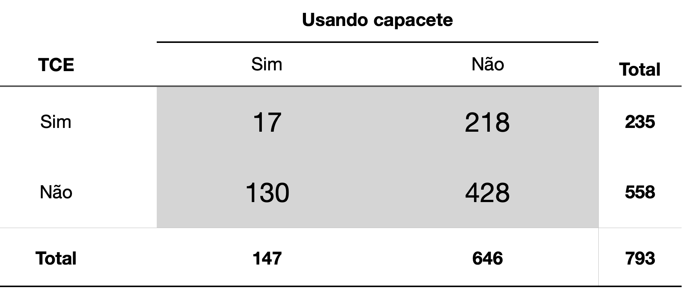

```{r, echo=FALSE, warning=FALSE, message=FALSE}
library(tidyverse)
```

## Teste do Chi Quadrado

O teste do chi-quadrado compara as frequências observadas em tabelas de contingência com as frequências esperadas se a hipótese nula fosse verdadeira.

O argumento para a realização desse teste no R é, portanto, uma tabela de contingência.

Vamos usar os dados de uma pesquisa sobre a efetividade dos capacetes de bicicleta na prevenção de trauma crânio-encefálico (TCE), tal como exemplificado por Pagano e Gauvreau [@Pagano2022]. O objetivo aqui é avaliar, num estudo de caso controle, se o uso de capacetes reduz o risco de Trauma Crânio Encefálico.

```{r chi_quadrado, echo=FALSE, out.width='100%', fig.show='hold', fig.cap='mtabela chi quadrado'}

```

O testo do chi-quadrado pode ser usado para avaliar se o uso do capacete reduziu o nº de casos de TCE entre os ciclistas. Precisamos apenas construir uma tabela com esses dados no R, o que pode ser feito através da função `matrix()`, ou com as funções `data.frame()` ou `tibble()`. Veremos como fazer das duas formas.

Usando a função `matrix()`:

```{r}
tab1 <- matrix(c(17,218,130,428), 
               nrow=2, 
               byrow = TRUE)
tab1
```

O argumento `nrow=2` indica que a tabela terá 2 linhas e o argumento `byrow = TRUE` indica que as células da tabela serão preenchidas linha a linha.

Usando a função `data.frame()` ou `tibble()`

De forma simples, sem legendas. Observe que a função `data.frame()` cria colunas com cada vetor. Assim a primeira coluna conterá os valores 17 e 130, e a segunda coluna os valores 218 e 428.

```{r}
dat1 <- data.frame(c(17,130), c(218,428))
dat1
```

Podemos melhorar o data frame dicionando legendas:

```{r}
dat2 <- data.frame(comCapacete  = c(17,130), 
                   semCapacete  = c(218,428), 
                   row.names = c("comTCE", "semTCE"))
dat2
```

Vamos agora fazer os testes usando essas tabelas criadas, para verificarmos que o resultado é o mesmo.

```{r}
chisq.test(tab1)
```

```{r}
chisq.test(dat1)
```

```{r}
chisq.test(dat2)
```

Observe que em todos os casos o resultado foi idêntico. Observe também que o teste fez a correção de Yates automaticamente. É possível alterar esse comportamento padrão com o argumento `correct = FALSE`.

```{r}
chisq.test(dat2, correct = FALSE)
```

Para aplicar o teste do chi quadrado em dados armazenados em data frames precisamos, da mesma forma, primeiro tabular os dados para depois fazer o teste.

Como exemplo vamos usar o dataset "Arthritis" disponível no pacote vcd (visualizing categorical data). Esse dataset contém informações de 84 pacientes, 41 dos quais usaram um medicamento e 43 usaram um placebo. O uso do medicamento ou placebo está registrado numa variável categórica (Treatment) de dois níveis (treated, placebo). O resultado está registrado em uma variável categórica ordinal (Improved) de 3 níveis (None \< Some \< Marked).

Para instalar o pacote vcd use o comando install.packages no console.

> install.packages("vcd")

Para usar esse pacote é necessário carregá-lo com o comando `library()` no início do código:

```{r}
library(vcd)
```

Carregando o dataset Arthritis

```{r}
data("Arthritis")
```

Verificando o dataset Arthritis com o comando `str()`.

```{r}
str(Arthritis)
```

A primeira etapa para verificar a associação entre o tratamento e a melhora é criar uma tabela com as variáveis (categóricas) de interesse: Treatment e Improved.

```{r}
tab5 <- table(Arthritis$Treatment, Arthritis$Improved)
tab5
```

Agora que já construímos a tabela a partir das duas variáveis de interesse do data frame, podemos então usar o teste do chi quadrado para verificar a associação entre o tratamento e o resultado. Basta aplicar o teste na tabela criada.

```{r}
chisq.test(tab5)
```

O resultado indica haver uma associação entre o tipo de tratamento realizado e o resultado, ou seja, o uso do medicamento parece ter sido melhor que o placebo.

Podemos também inserir as variáveis de interesse diretamente na função `chisq.test()`, tal como no exemplo abaixo:

```{r}
chisq.test(Arthritis$Treatment, Arthritis$Improved)
```

Podemos da mesma forma extrair os resultados do teste armazenando os resultado do teste num objeto.

```{r}
result_chi <- chisq.test(tab5)
str(result_chi)
```

O valor de p pode ser extraido com o comando `result_chi$pvalue`, como feito abaixo:

```{r}
result_chi$p.value
```

## Teste exato de Fisher

O teste exato de Fisher é utilizado na análise de tabelas de contingência quando a amostra é pequena, embora seja válido para todo tamanho de amostra. Foi desenvolvido por Ronald Fisher. Fisher disse ter concebido o teste depois de um comentário da Dra. Muriel Bristol, que afirmou ser capaz de detectar se o chá ou o leite foi adicionado primeiro em sua xícara. Ele testou seu pedido no experimento "dama apreciadora de chá", contado em diversos livros de história da estatística, inclusive num livro com esse mesmo título: "The Lady Tasting Tea" de David Salsburg [@Salsburg2001].

Fisher projetou um experimento em que a senhora recebia 8 xícaras de chá, 4 com leite primeiro, 4 com chá primeiro, em ordem aleatória. Ela então provou cada xícara e relatou quais quatro ela achava que tinham leite adicionado primeiro. **Ela acertou todas as 8 chícaras**.

A pergunta que Fisher fez foi: "como testamos se ela realmente é habilidosa nisso ou se está apenas adivinhando?"

Vamos construir uma tabela de contingência, com os valores VERDADEIROS nas colunas e as resultados nas linhas.

```{r}
tea_tasting <- data.frame(Leite_Primeiro  = c(4,0), 
                          Cha_Primeiro    = c(0,4), 
                          row.names = c("Respondeu que era Leite Primeiro", "Respondeu que era Chá Primeiro"))
tea_tasting
```

Para usar o teste de Fisher no R basta inserirmos a tabela de contingência como argumento da função `fisher.test()`.

Entretanto, há mais um detalhe a ser analisado. Um dos parâmetros do teste é se ele é bicaudal ou unicaldal. O padrão é que o R realize um teste bicaudal (`two.sided`). Entretanto, Fisher testou se a senhora Muriel era **melhor** do que o acaso e não se sua habilidade era **diferente** do acaso e, portanto, ele usou um teste unilateral.

Para encontrarmos o mesmo resultado, precisamos ajustar esse argumento, inserindo `alternative = "greater"`.

```{r}
fisher.test(tea_tasting, alternative = "greater")
```

É possível fazer o teste de Fisher diretamente com os dados de um data frame, sem necessidade de tabulação previa dos dados. Vamos usar novamente o data frame `Arthritis`, do pacote `vcd`.

```{r}
fisher.test(tab5)
```
