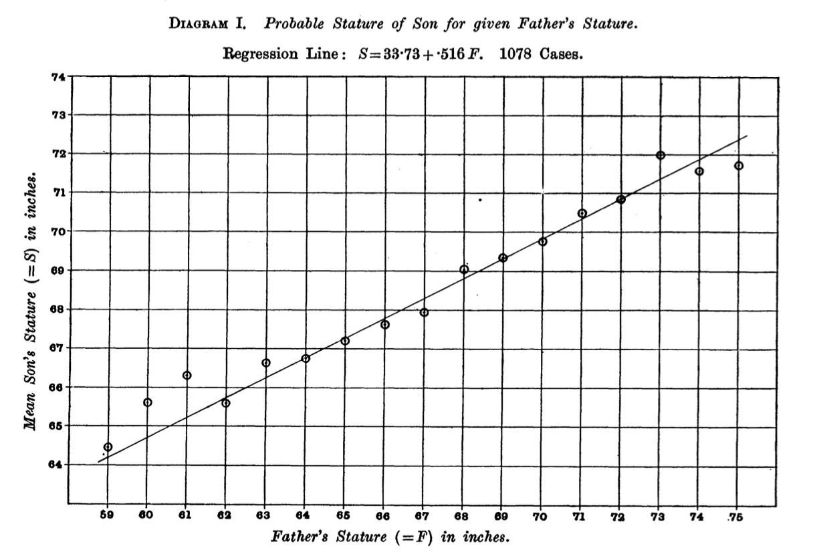

## Regressão Linear

```{r, echo=FALSE, message=FALSE, warning=FALSE}
# Configurando o ambiente
library(ggplot2)
library(gridExtra)
```

A análise de regressão é uma ferramenta estatística fundamental para investigar e modelar a relação entre variáveis. Ela é amplamente utilizada em várias áreas do conhecimento, incluindo as ciências da saúde, para entender como uma ou mais variáveis independentes (ou preditoras) influenciam uma variável dependente (ou resposta). Em sua essência, a regressão busca encontrar uma função que descreva, de forma aproximada, a relação entre essas variáveis, permitindo previsões e interpretações relevantes.

Para tornar mais clara a importância da análise de regressão, imagine uma situação prática: um estudo de saúde pública onde queremos entender o impacto de diferentes fatores no risco de desenvolvimento de doenças cardíacas. Ao investigar variáveis como nível de atividade física, consumo de gordura na dieta e histórico familiar, a análise de regressão pode ajudar a quantificar o impacto de cada um desses fatores, fornecendo insights que são essenciais para orientar recomendações de saúde e intervenções preventivas.

A abordagem de regressão linear, um dos tipos mais comuns, parte do pressuposto de que a relação entre as variáveis é linear, ou seja, que mudanças em uma variável preditora resultarão em mudanças proporcionais na variável dependente. Ao ajustar um modelo linear, podemos quantificar o impacto de cada variável preditora, identificar padrões e avaliar a força da associação entre variáveis. Isso é particularmente útil quando queremos entender como diferentes fatores contribuem para um resultado específico, ajudando a embasar decisões clínicas ou políticas de saúde.

A análise de correlação está intimamente relacionada à análise de regressão e, muitas vezes, é um ponto de partida para ela. A correlação mede a força e a direção da associação linear entre duas variáveis, fornecendo um valor entre -1 e 1 que indica o grau de relacionamento. Quando observamos uma correlação forte entre duas variáveis, isso pode sugerir que uma análise de regressão seja adequada para explorar mais profundamente essa relação e modelar como uma variável pode prever a outra. Por exemplo, se há uma alta correlação entre o consumo de sal e a pressão arterial, isso sugere que a regressão pode ser utilizada para quantificar o impacto do consumo de sal na pressão arterial, ao mesmo tempo em que se controla outros fatores, como idade e nível de atividade física. No entanto, é importante lembrar que a correlação não implica causalidade; ela apenas indica que as variáveis tendem a variar juntas. A análise de regressão, por sua vez, vai além da correlação ao quantificar a magnitude do efeito de uma ou mais variáveis preditoras sobre a variável dependente, controlando outras variáveis envolvidas no processo.

Para ilustrar, imagine que estamos estudando o efeito do consumo de álcool e do tabagismo nos níveis de uma enzima hepática chamada GGT, um marcador usado em exames de saúde. Podemos usar a análise de regressão para verificar como o consumo semanal de bebidas alcoólicas (variável preditora 1) e o número de cigarros fumados por dia (variável preditora 2) estão relacionados com os níveis de GGT (variável dependente). Um modelo de regressão linear múltipla permitiria quantificar o impacto de cada fator, ao mesmo tempo controlando os efeitos do outro, ajudando a determinar qual desses hábitos é mais prejudicial ao fígado. Além disso, esse tipo de análise pode ajudar a prever riscos futuros, como o desenvolvimento de doenças hepáticas, com base nos padrões de consumo de álcool e tabaco.

Outro exemplo relevante envolve a predição do peso de recém-nascidos a partir de variáveis maternas como idade, ganho de peso durante a gestação e níveis de estresse. Utilizando a análise de regressão, é possível não apenas prever o peso do bebê, mas também identificar quais fatores têm maior impacto no desenvolvimento fetal, permitindo intervenções específicas para reduzir riscos e promover a saúde materno-infantil. Por exemplo, se a análise mostrar que o ganho de peso durante a gestação tem um impacto significativo no peso do recém-nascido, isso pode levar a recomendações mais específicas para gestantes, ajudando a garantir melhores resultados de saúde tanto para a mãe quanto para o bebê.

A análise de regressão também pode ser aplicada em contextos epidemiológicos, como no estudo da relação entre fatores socioeconômicos e a incidência de doenças crônicas. Por exemplo, ao investigar como renda, nível de escolaridade e acesso a serviços de saúde influenciam a prevalência de hipertensão, a regressão permite identificar quais desses fatores têm maior contribuição para o desenvolvimento da condição. Esses insights são essenciais para o planejamento de políticas públicas de saúde que visem reduzir desigualdades e melhorar a qualidade de vida da população.

A utilidade da regressão vai além da simples previsão: ela oferece insights sobre as relações entre variáveis e permite o controle estatístico de variáveis de confusão, o que é particularmente importante em estudos observacionais nas áreas da saúde e medicina. Compreender os fundamentos da análise de regressão ajuda a fortalecer a interpretação de dados, a tomada de decisões baseada em evidências e o planejamento de intervenções eficazes. Além disso, ao incluir múltiplas variáveis em um modelo, podemos isolar o efeito específico de cada uma delas, o que é crucial para evitar interpretações equivocadas causadas por fatores de confusão.

Além da regressão linear, existem também modelos de regressão múltipla não linear, que permitem capturar relações mais complexas entre as variáveis. Esses modelos são úteis quando a relação entre as variáveis não pode ser bem representada por uma linha reta, como em situações onde os efeitos são exponenciais ou curvilíneos. Por exemplo, o crescimento de certos tipos de tumores pode ser mais bem modelado por uma regressão não linear, que consegue capturar padrões de crescimento acelerado ou desacelerado. Assim, enquanto a regressão linear é uma ferramenta poderosa para muitas situações, a regressão não linear expande as possibilidades de modelagem para relações mais complexas.

Um outro tipo de regressão, denominada de regressão logística (ou regressão logit ou modelo logit), é utilizada quando a variável de resposta é categórica, mais especificamente, binária (dicotômica). Por exemplo, para prever o óbito (sim ou não), um diagnóstico (diabético ou não diabético), ou se um tumor é maligno ou benigno, a partir de uma ou mais variáveis preditoras..

Existem vários tipos de regressão regressão, tais como regressão de Poisson, regressão Probit, regressão ordinal, regressão quantílica, regressão Elastic Net, regressão polinomial, regressão Splines, regressão de Cox, regressão Stepwise, regressão hierárquica, regressão de mínimos quadrados parciais (PLS), regressão log-log, regressão suavizada (Loess/Lowess) e regressão Bayesiana. Entretanto, esses tipos estão fora do escopo desse texto.

O diagrama abaixo mostra os tipos de regressão mais simples e usuais

```{mermaid}
graph TD
    A[Tipos de Regressão] --> B[Desfecho Numérico]
    A --> C[Desfecho Categórico]
    B --> D[Regressão Linear]
    B --> E[Regressão Não Linear]
    D --> F[Univariada]
    D --> G[Multivariada]
    E --> H[Univariada]
    E --> I[Multivariada]
    C --> J[Regressão Logística]
    J --> K[Binária]
    J --> L[Multinomial]

```

Embora a análise de regressão seja uma ferramenta poderosa, é importante também entender suas limitações. Por exemplo, a regressão linear assume que a relação entre as variáveis é sempre linear, o que pode não ser verdadeiro em todos os casos. Além disso, ela é sensível a outliers, que podem distorcer os resultados e levar a conclusões equivocadas. Essas limitações devem ser consideradas ao interpretar os resultados e planejar estudos futuros.

Por fim, a análise de regressão também facilita a comunicação de resultados complexos de forma acessível. Ao utilizar modelos de regressão, é possível traduzir dados estatísticos em informações práticas, que podem ser facilmente compreendidas por profissionais de saúde, gestores e até mesmo pacientes. Isso faz da regressão uma ferramenta poderosa não apenas para análise e pesquisa, mas também para a implementação de práticas e políticas de saúde baseadas em evidências sólidas. A clareza e a objetividade proporcionadas pelos modelos de regressão tornam possível transformar dados em ações, ajudando a promover melhores resultados de saúde e bem-estar para a população.

### Aspectos Históricos

A ideia de correlação entre duas variáveis numéricas surgiu pela primeira vez no século XIX com os trabalhos de Francis Galton sobre hereditariedade. Motivado pelas teorias evolucionárias de Darwin, Galton acreditava que a hereditariedade desempenhava um papel crucial na formação das habilidades e traços humanos. Para testar suas hipóteses, Galton coletou extensos dados sobre características físicas, como a altura, em famílias. Em um de seus estudos mais famosos, Galton analisou a relação entre as alturas dos pais e dos filhos, desenvolvendo métodos estatísticos inovadores para a época. Ele criou pela primeira vez um gráfico de dispersão (scatter plot) representando os pares de medidas de altura em um plano cartesiano, permitindo visualizar a associação entre as duas variáveis e medir numericamente o grau de relacionamento entre elas.

Dando continuidade ao trabalho de Galton, foi Karl Pearson quem desenvolveu a formulação matemática precisa para medir a força e a direção dessa relação. Além disso, Pearson estabeleceu a equação da reta que melhor se ajusta aos pontos, chamada de reta de regressão, permitindo a previsão dos valores de uma variável com base em outra. A equação é expressa como $y = ax + b$, onde $b$ é o intercepto e $a$ é a inclinação da reta, ou coeficiente de regressão, representando a variação esperada na altura dos filhos para cada unidade de variação na altura dos pais.

[](https://www.jstor.org/stable/2331507)

```{r, echo=FALSE, warning=FALSE, message=FALSE}
# o pacote UsingR é necessário para acessar o dataset father.son
library(UsingR)
data(father.son)

# criando o gráfico
ggplot(data=father.son, aes(x=fheight, y=sheight)) + 
  geom_jitter() + 
  labs(title = "Dados Originais de Karl Pearson",
       subtitle="Correlacionando altura de pais e filhos",
       caption= "Dataset father.son do pacote UsingR",
       x="Altura dos pais (polegadas)",
       y="Altura dos filhos (polegadas)") +
  geom_smooth(se = FALSE, col="red", method = "lm") +
  theme_classic()
```

### Regressão linear (modelos Lineares)

A correlação entre duas variáveis numéricas analisa se há alguma associação entre elas, bem como a força e a direção dessa associação, mas não descreve relações de causalidade. É um ditado comum na ciência dizer que **correlação não implica causalidade**. A análise de regressão vai além, pois o interesse não está apenas na intensidade ou direção da correlação, mas também na natureza dessa relação. Na análise de regressão, o pesquisador estabelece quais são as variáveis independentes (preditoras) e qual é a variável dependente (de desfecho). O objetivo é construir um modelo matemático que possa prever o desfecho a partir das variáveis preditoras. Na regressão linear, o modelo criado é simplesmente uma reta. O modelo gerado pela regressão linear é a equação da reta que mais se ajusta aos dados (*best fit line*), ou seja, o modelo calcula os parâmetros da inclinação ($a$) e intercepto ($b$) da reta $y = ax + b$.

O objetivo da análise de regressão é encontrar os coeficientes ($a$ e $b$) dessa reta. Com isso poderemos saber o valor da variável de desfecho, dado um valor qualquer da variável preditora.

Podemos inserir nesse modelo mais de uma variável preditora, transformando uma regressão univariada em uma regressão multivariada, e nesse caso nossa equação teria mais de um parâmetro de inclinação: $\color{blue}{y = a_1x_1 + a_2x_2 + a_3x_3 + a_4x_4 + b}$. Aqui, cada variável preditora ($\color{blue} {x_1, x_2, x_3, x_4}$) tem seu próprio coeficiente ($\color{blue}{a_1, a_2, a_3, a_4}$). A regressão multivariada envolve descobrir os melhores valores desses coeficientes.

A análise de regressão linear é usada quando a variável de resposta é numérica, ou seja, quando pretendemos criar um modelo matemático para prever um valor numérico a partir de uma ou mais variáveis. Por exemplo, podemos criar um modelo linear para prever o quanto a glicemia aumenta de acordo com a quantidade calórica ingerida, ou podemos criar modelos lineares complexos, com mais de uma variável preditora, tal como para analisar o quanto a pressão arterial depende do peso, do sexo e da idade.

#### Pressupostos do Modelo de Regressão Linear

Para que o modelo de regressão linear seja válido e forneça resultados confiáveis, é importante que alguns pressupostos sejam atendidos.

1.  **Linearidade**: A relação entre a variável dependente (resposta) e as variáveis independentes (preditoras) deve ser linear. Isso significa que as mudanças na variável dependente são proporcionais às mudanças nas variáveis preditoras.

2.  **Independência dos Erros**: Os erros (ou resíduos) devem ser independentes entre si. Isso significa que o erro de uma observação não deve estar relacionado ao erro de outra observação, evitando a presença de autocorrelação.

3.  **Homocedasticidade dos Erros**: A variância dos erros deve ser constante para todos os valores das variáveis independentes. A variância dos resíduos deve ser uniforme ao longo da linha de regressão, o que significa que os resíduos não devem se tornar mais dispersos ou menos dispersos à medida que os valores das variáveis preditoras mudam.

4.  **Normalidade dos Erros**: Os erros devem seguir uma distribuição normal com média zero. Esse pressuposto é importante para garantir a validade dos testes estatísticos (como o teste t) e dos intervalos de confiança.

5.  **Ausência de Multicolinearidade**: No caso da regressão múltipla, as variáveis preditoras não devem estar altamente correlacionadas entre si. A multicolinearidade pode dificultar a interpretação dos efeitos individuais de cada variável e tornar os coeficientes do modelo instáveis.

6.  **Exatidão no Modelo**: Não devem existir variáveis relevantes ausentes no modelo, e as variáveis incluídas devem ser apropriadas para o problema em estudo. A ausência de variáveis importantes pode resultar em uma especificação incorreta do modelo.

7.  **Linearidade nos Parâmetros**: O modelo deve ser linear nos parâmetros, ou seja, os coeficientes devem ser estimados como combinações lineares das variáveis preditoras.

Verificar a satisfação desses pressupostos é fundamental para garantir que o modelo de regressão linear seja apropriado e que suas previsões e inferências sejam válidas. Caso algum desses pressupostos seja violado, ajustes no modelo ou transformações nos dados podem ser necessários.

#### Os Resíduos da Regressão Linear

Os **resíduos** em um modelo de regressão linear representam a diferença entre os valores observados e os valores preditos pela reta de regressão. Em outras palavras, cada ponto de dados tem um valor real (observado) e um valor estimado pela equação da reta. A diferença entre esses dois valores é o que chamamos de **resíduo**. Os resíduos indicam o quão bem o modelo está se ajustando aos dados: quanto menores forem os resíduos, melhor será o ajuste do modelo.

Matematicamente, o resíduo é dado por:

$$
e_i = y_i - \hat{y}_i
$$

Onde $e_i$ é o resíduo, $y_i$é o valor observado e $\hat{y}_i$ é o valor predito pelo modelo. O objetivo da regressão linear é minimizar esses resíduos, de forma que a reta de regressão seja a melhor possível em termos de ajuste aos dados.

No gráfico, os resíduos são representados por linhas verticais que ligam cada ponto da amostra à reta de regressão. Essas linhas mostram visualmente o erro de predição para cada ponto.

```{r, echo=FALSE, message=FALSE, warning=FALSE}
library(ggplot2)

# Gerar dados aleatórios
set.seed(1) # Para reprodutibilidade
n <- 10
x <- round(rnorm(n, mean = 15, sd = 30),0)
y <- round(3 * x + rnorm(n, mean = 0, sd = 30),1)

# Ajustar modelo de regressão linear
modelo <- lm(y ~ x)

# Prever valores usando o modelo ajustado
y_pred <- predict(modelo)
y_pred <- as.numeric(y_pred)

# Calcular resíduos
residuos <- y - y_pred

# Extrair os coeficientes da reta
coef      <- coef(modelo)
intercept <- coef[1]
slope     <- coef[2]


# Criar um data frame com os dados
dados <- data.frame(x = x, y = y, y_pred = y_pred, residuos = residuos)

# Plotar os dados, a reta ajustada e os resíduos
ggplot(dados, aes(x = x, y = y)) +
  geom_point(color = 'black', size = 2) +
  geom_smooth(formula = y~x, method = "lm", color = 'blue', se = FALSE, fullrange = TRUE) +
  geom_segment(aes(xend = x, yend = y_pred), color = 'red', linetype = "dashed") +
  geom_vline(xintercept = 0, color = 'black', linetype = "dotted") +
  geom_hline(yintercept = 0, color = 'black', linetype = "dotted") +
  annotate("text", x = 2, y = 160, 
           label = paste("Equação da reta que melhor se ajusta aos dados:\n y =", 
                         round(slope, 2), "* x +", round(intercept, 2)), 
           color = "black", 
           hjust = 0, 
           vjust = 0, 
           size = 4 ) +
  annotate("text", x = 2, y = 145, 
           label = paste("Slope (m) =", round(slope, 2)), 
           color = "black", 
           hjust = 0, 
           vjust = 0, 
           size = 4 ) +
    annotate("text", x = 2, y = 135, 
           label = paste("Intercept (b) =", round(intercept, 2)), 
           color = "black", 
           hjust = 0, 
           vjust = 0, 
           size = 4 ) +
 
  labs(title = "Regressão Linear Univariada",
       subtitle = "Método dos Quadrados Mínimos",
       x = "x",
       y = "y") +
  theme_classic() +
  theme(plot.title = element_text(hjust = 0.5),
        plot.subtitle = element_text(hjust = 0.5))

```

Observe no gráfico acima as linhas vermelhas verticais entre os pontos dos dados reais e a reta de regressão. Essas distâncias representam os erros do modelo. A fórmula para computar esses cada um desses erros é $e_i = y_i - \hat{y}_i$.

O que o algoritmo da função `lm()` faz é tentar reduzir a soma desses erros através de uma técnica conhecida como **Método dos Quadrados Mínimos**.

#### O Método dos Quadrados Mínimos

O **método dos quadrados mínimos** é uma técnica matemática usada para determinar a melhor linha de ajuste para um conjunto de dados. Foi inicialmente desenvolvido por Adrien-Marie Legendre. Legendre desenvolveu essa técnica para resolver problemas relacionados à determinação das órbitas de cometas, buscando um meio de ajustar as observações astronômicas às previsões teóricas com a maior precisão possível. O método dos mínimos quadrados tornou-se rapidamente uma ferramenta essencial para cientistas que lidavam com dados experimentais sujeitos a erros. A técnica permite encontrar os parâmetros de um modelo que melhor se ajustam aos dados, garantindo que a soma dos quadrados dos resíduos (as diferenças entre os valores observados e os estimados - RSS, do inglês *Residual Sum of Squares*) seja a menor possível. No final do século XIX, Karl Pearson aplicou o método dos mínimos quadrados ao estudo das relações entre variáveis biológicas, especialmente na análise da hereditariedade de características físicas como a altura. Pearson conseguiu estimar a reta que melhor se ajustava aos dados observacionais, permitindo não apenas descrever a relação entre as alturas de pais e filhos, mas também prever a altura esperada de um filho com base na altura dos pais.

$$
RSS = \sum_{i=1}^n (y_i - \hat{y}_i)^2
$$

Como os resíduos podem ser positivos ou negativos, elevá-los ao quadrado evita que valores positivos e negativos se anulem. O objetivo do método dos quadrados mínimos é encontrar os coeficientes da reta de regressão (inclinação e intercepto) que minimizem o valor do RSS, ou seja, a soma dos quadrados dos erros.

Isso significa que, ao usar o método dos quadrados mínimos, o modelo está tentando encontrar a reta que passe "o mais próximo possível" dos pontos de dados, de maneira a minimizar o erro de predição. É essa técnica que permite calcular os coeficientes da reta da forma mais precisa possível.

#### Exemplo Visual

Veja no exemplo abaixo a equação de uma reta que melhor se ajusta aos pontos do gráfico. O que o algoritmo da regressão linear fez foi encontrar os parâmetros $a$ e $b$ que minimizam a RSS para criar a equação da reta.No gráfico gerado pelo código, podemos observar os pontos de dados reais, a reta de regressão ajustada e as linhas vermelhas verticais que representam os resíduos. O método dos quadrados mínimos ajusta essa reta de modo que a soma dos quadrados das distâncias entre os pontos e a reta (os resíduos) seja a menor possível.

Veja na tabela abaixo, na última linha, que a soma dos erros é zero, mas o RSS é um número positivo.

```{r, echo=FALSE, message=FALSE, warning=FALSE}
library(dplyr)
library(kableExtra)
tabela1 <- data.frame(x, y, y_pred)
tabela1 <- tabela1 |> mutate(erro  = y-y_pred, erro2 = erro^2)

# inserindo a linha com os totais
tabela2 <- tabela1 |>
            summarise_at(c("erro", "erro2"), sum)

tabela3 <- bind_rows(tabela1, tabela2) 

tabela3[is.na(tabela3)] <- ""

tabela3$y_pred <- as.numeric(tabela3$y_pred)

tabela3 |> 
  kbl(caption = "Calculando os erros do modelo",
      booktabs = TRUE, 
      row.names = FALSE, 
      digits=2) |>
  kable_classic(full_width = F, html_font = "Cambria") |>
  row_spec(row = 0, color = "white", background = "#FF5733", font_size = 20)


```

Veja nos gráficos abaixo como o valor do RSS vai se reduzindo à medida que a reta vai se adequando melhor aos dados. O menor valor de RSS encontrado foi $7925.70$.

```{r, echo=FALSE, message=FALSE, warning=FALSE}
# Carregar pacotes necessários
library(ggplot2)
library(gridExtra)

# Gerar dados
set.seed(1) # Para reprodutibilidade
n <- 10
x <- round(rnorm(n, mean = 15, sd = 30),0)
y <- round(3 * x + rnorm(n, mean = 0, sd = 30),1)

# Dataframe com os dados
df <- data.frame(x = x, y = y)

# Criar o modelo de regressão baseados nos dados 
fit <- lm(y ~ x, data = df)

# Extrair os coeficientes do modelo
fit_coef <- coef(fit)

# Extrair os resíduos do modelo e sua soma residual sum of squares (RSS)
residuos <- residuals(fit)
rss <- sum(residuos^2)

# Dados das curvas ajustadas manualmente
m1 <- 10;  b1 <- 20
m2 <- 7;   b2 <- 15
m3 <- 5;   b3 <- 10

# Definir as linhas ajustadas manualmente e a linha de regressão
manual_line1 <- function(x) { m1 * x + b1 }
manual_line2 <- function(x) { m2 * x + b2 }
manual_line3 <- function(x) { m3 * x + b3 }

# Função para calcular a soma dos quadrados dos resíduos
calc_rss <- function(y, y_pred) {
  sum((y - y_pred)^2)
}

# Calcular RSS para as linhas ajustadas manualmente
rss1 <- calc_rss(y, manual_line1(x))
rss2 <- calc_rss(y, manual_line2(x))
rss3 <- calc_rss(y, manual_line3(x))
rss4 <- sum(residuos^2)

# Configuração de limites dos eixos
x_lim <- range(x)
y_lim <- range(c(y, manual_line1(x), manual_line2(x), manual_line3(x), predict(fit)))

# Adicionar as anotações de intercepto, inclinação e RSS
annotate_text <- function(intercept, slope, rss) {
  paste0("Intercept (b): ", round(intercept, 2), "\nSlope (m): ", round(slope, 2), "\nRSS: ", round(rss, 2))
}

# Gráfico 1: Reta ajustada manualmente 
p1 <- ggplot(df, aes(x = x, y = y)) +
        geom_point() +
        geom_abline(intercept = b1, slope = m1, color = "blue") +
        geom_segment(aes(x = x, y = y, xend = x, yend = manual_line1(x)), color = "red") +
        ggtitle("Reta ajustada manualmente") +
        xlim(x_lim) +
        ylim(y_lim) +
        annotate("text", x = 1, y = max(y_lim), label = annotate_text(b1, m1, rss1), hjust = 0, vjust = 1, size = 4) + 
        theme_classic()

# Gráfico 2: Reta ajustada manualmente  
p2 <- ggplot(df, aes(x = x, y = y)) +
        geom_point() +
        geom_abline(intercept = b2, slope = m2, color = "blue") +
        geom_segment(aes(x = x, y = y, xend = x, yend = manual_line2(x)), color = "red") +
        ggtitle("Reta ajustada manualmente") +
        xlim(x_lim) +
        ylim(y_lim) +
        annotate("text", x = 1, y = max(y_lim), label = annotate_text(b2, m2, rss2), hjust = 0, vjust = 1, size = 4) +
        theme_classic()

# Gráfico 3: Reta ajustada manualmente  
p3 <- ggplot(df, aes(x = x, y = y)) +
        geom_point() +
        geom_abline(intercept = b3, slope = m3, color = "blue") +
        geom_segment(aes(x = x, y = y, xend = x, yend = manual_line3(x)), color = "red") +
        ggtitle("Reta ajustada manualmente") +
        xlim(x_lim) +
        ylim(y_lim) +
        annotate("text", x = 1, y = max(y_lim), label = annotate_text(b3, m3, rss3), hjust = 0, vjust = 1, size = 4) +
        theme_classic()

# Gráfico 4: Linha de Regressão (Quadrados Mínimos)
p4 <- ggplot(df, aes(x = x, y = y)) +
        geom_point() +
        geom_smooth(formula = y ~ x, method = "lm", se = FALSE, color = "blue") +
        geom_segment(aes(x = x, y = y, xend = x, yend = predict(fit)), color = "red") +
        ggtitle("Reta de Regressão") +
        xlim(x_lim) +
        ylim(y_lim) +
        annotate("text", x = 1, y = max(y_lim), label = annotate_text(fit_coef[1], fit_coef[2], rss4), hjust = 0, vjust = 1, size = 4) + 
        theme_classic()

grid.arrange(p1, p2, p3, p4, nrow = 2)

```

### Regressão linear no R

Vamos agora praticar a análise de regresão linear univariada (uma variável) no R passo a passo. Lembre-se que o objetivo da regressão linear é encontrar os coeficientes da equação que servirá de modelo para podermos fazer predições. No caso da regressão linear univariada, na qual temos apenas uma variável preditora, nosso modelo será uma reta $y=ax+b$. O objetivo da regressão será então encontrar os melhores valores dos parâmetros $a$ e $b$.

O **primeiro passo** é ter um dataframe com os valores de x e y, ou seja, com os dados que temos das variáveis de interesse. Vamos usar dados fictícios de número de drinks por semana (`drinks`) e consumo de tabaco (`tobacco`) como variável preditoras e níveis séricos de GGT como variável de desfecho (`y=ggt`). Para fins de uma análise univariada vamos utilizar apenas a variável `drinks` como preditora.

```{r}
# dados fictícios 
drinks  <- c( 5, 6, 7,10,11,12,14,18,19,20,22,23,25,28,30) # drinks por dia
tobacco <- c( 3, 7,10,15,14,16,20,22,22,25,27,26,26,29,30) # cigarros por dia
ggt     <- c(13,14,12,23,20,29,30,39,36,48,40,45,48,65,75)

# Criando o dataframe com os dados
df <- data.frame(drinks, ggt, tobacco)
```

```{r, echo=FALSE, warning=FALSE, message=FALSE}
ggplot(data=df, aes(x=drinks, y=ggt)) + 
  geom_jitter() + 
  labs(title = "Correlação entre Nº de Drinks e GGT",
       caption= "dados fictícios",
       x="Drinks",
       y="GGT") +
  geom_smooth(se = FALSE, col="red", method = "lm") +
  theme_linedraw()
```

O **segundo passo** é criar um objeto para armazenar o modelo (podemos usar um nome que indique isso, ex. modelo, fit, etc), depois atribuir (`<-`) o modelo linear a esse objeto usando a função `lm()`.

Os argumentos da função `lm()` são a variável preditora `x` e a variável de desfecho `y`. Para criar a relação entre as variáveis iremos usar também o operador `~` (til), já descrito anteriormente. Esse operador irá servir para indicar a relação entre variável de desfecho e preditora e é usado na seguinte sequência:

O código vai ficar assim:

`model <- lm(ggt~drinks, data=df)`

Com isso, a função `lm()` irá encontrar os melhores valores para os parâmetros $a$ e $b$ da reta de regressão.

```{r}
# Usando a função lm() para criar o modelo de regressão linear e armazendo esse modelo no objeto chamado model
model <- lm(ggt~drinks, data=df)
```

Veja como implementar isso tudo de uma vez no código abaixo:

```{r}
# dados fictícios 
drinks  <- c( 5, 6, 7,10,11,12,14,18,19,20,22,23,25,28,30) # drinks por semana
tobacco <- c( 3, 7,10,15,14,16,20,22,22,25,27,26,26,29,30) # cigarros por dia
ggt     <- c(13,14,12,23,20,29,30,39,36,48,40,45,48,65,75)


# Criando o dataframe com os dados
df <- data.frame(drinks, ggt, tobacco)

# Usando a função lm() para criar o modelo de regressão linear e armazendo esse modelo no objeto chamado model
model1 <- lm(ggt~drinks, data=df)
model2 <- lm(ggt~tobacco, data=df)

# Extraindo os coeficientes do modelo gerado para GGT e alcool
a1<-coef(model1)[1]
b1<-coef(model1)[2]

# Extraindo os coeficientes do modelo gerado para GGT e cigarro
a2<-coef(model2)[1]
b2<-coef(model2)[2]
```

```{r, echo=FALSE}
ggplot(df, aes(x = drinks, y = ggt)) +
        geom_point() +
        geom_smooth(formula = y ~ x, method = "lm", se = TRUE, color = "blue") +
        geom_segment(aes(x = drinks, y = ggt, xend = drinks, yend = predict(model1)), color = "red") +
        labs(title= "Relação entre consumo de álcool e GGT",
             subtitle = "Reta de Regressão Calculada com a função lm()") +
        annotate("text", x = 5, y = 70, label = paste0("Intercept (a): ", round(a1, 6), "\nSlope (b): ", round(b1, 4)), hjust = 0, vjust = 1, size = 4) +
        scale_x_continuous(expand = c(0, 0), limits = c(0, NA)) + 
        scale_y_continuous(expand = c(0, 0), limits = c(0, NA)) +
        theme_classic()

```

Os dados completos de cada modelo linear podem ser obtidos com a função `summary()`.

```{r}
summary(model1)
```

Os resultados da análise de regressão indicam uma forte relação positiva entre o número de drinks consumidos por semana e os níveis séricos de GGT. No resultado do modelo, isso é representado pelo coeficiente associado à variável `drinks`, que é **2.2297** (veja em "Coefficients" na linha de `drinks` sob "Estimate"). Isso significa que, em média, para cada drink adicional consumido por semana, os níveis de GGT aumentam em aproximadamente **2,23 unidades**.

A significância estatística dessa relação é confirmada pelo valor de **p** muito pequeno, **5.07e-09**, encontrado na coluna "Pr(\>\|t\|)" na mesma linha de `drinks`. Este valor é menor que 0,001 e é destacado com três asteriscos `***`, indicando uma significância estatística muito alta.

O **R-quadrado ajustado** (Adjusted R-squared), localizado abaixo dos coeficientes, é de **92,82%**. Isso indica que o modelo explica aproximadamente 92,8% da variação nos níveis séricos de GGT, demonstrando que o número de drinks por semana é um forte preditor desses níveis.

Em resumo, os dados apresentados no modelo de regressão mostram claramente que, conforme aumenta o consumo semanal de drinks, há um aumento significativo nos níveis séricos de GGT. Essa relação é estatisticamente significativa e está evidenciada nos coeficientes e nos indicadores de ajuste do modelo fornecidos no resultado.

### Regressão Linear multivariada no R

Frequentemente uma única variável preditora não será capaz de explicar toda variação da variável de desfecho. Na verdade, na medicina é raro que uma resposta dependa de apenas uma única variável. Com o R podemos facilmente inserir mais de uma variável preditora em nosso modelo de regressão linear.

Com duas variáveis nossa reta de regressão se transforma num plano, e nosso modelo que antes era uma simples equação da reta se transforma numa equação de um plano. Assim como a regressão linear simples define uma linha no plano (x,y), o modelo de regressão linear múltipla com duas variáveis $Y = a_1x_1 + a_2x_2 + b$ é a equação de um plano no espaço $x_1, x_2, Y$. Neste modelo, $a_1$ representa a inclinação do plano em relação ao eixo $x_1$ e $a_2$ representa a inclinação do plano em relação ao eixo $x_2$.

```{r, echo=FALSE, eval=FALSE}
# Instalar e carregar os pacotes necessários
if (!require(plotly)) install.packages("plotly")
library(plotly)

# Definir o número de pontos
n <- 100

# Gerar valores para x1 e x2
x1 <- seq(-10, 10, length.out = n)
x2 <- seq(-10, 10, length.out = n)

# Criar uma grade de valores para x1 e x2
grid <- expand.grid(x1 = x1, x2 = x2)

# Definir os coeficientes do plano
b <- 5
a1 <- 2
a2 <- 3

# Calcular os valores de Y com base na equação do plano
grid$Y <- b + a1 * grid$x1 + a2 * grid$x2

# Criar o dataframe para o plano
df_plane <- data.frame(x1 = grid$x1, x2 = grid$x2, Y = grid$Y)

# Plotar o plano com plotly
p <- plot_ly() %>%
  add_trace(
    x = df_plane$x1, y = df_plane$x2, z = df_plane$Y,
    type = 'mesh3d', opacity = 0.5, color = I('gray')
  ) %>%
  add_trace(
    x = c(0, 5), y = c(0, 0), z = c(b, b + 5 * a1),
    type = 'scatter3d', mode = 'lines', line = list(color = 'red', width = 6), name = 'a1'
  ) %>%
  add_trace(
    x = c(0, 0), y = c(0, 5), z = c(b, b + 5 * a2),
    type = 'scatter3d', mode = 'lines', line = list(color = 'blue', width = 6), name = 'a2'
  ) %>%
  layout(
    scene = list(
      xaxis = list(title = "x1"),
      yaxis = list(title = "x2"),
      zaxis = list(title = "Y"),
      title = "Plano de Regressão Linear Múltipla"
    )
  )

# Exibir o gráfico
p
```

Com mais de 3 variáveis preditoras não há mais uma visualização possível, mas isso não impede que sejam usadas quantas variáveis forem necessárias. O formato básico do modelo é bastante simples, tal como no modelo simples, usando o operador `~` para separar a variável de desfecho das preditoras e usando o operador `+` para somar as variáveis preditoras.

Vamos continuar analisando os níveis de GGT, mas agora incorporando ao nosso modelo tanto o consumo de álcool como de cigarros.

```{r, echo=FALSE}
library(gridExtra)
library(grid)

r1 <- cor(df$drinks, df$ggt) 
r2 <- cor(df$tobacco, df$ggt)


p1 <- ggplot(df, aes(x = drinks, y = ggt)) +
        geom_point() +
        geom_smooth(formula = y ~ x, method = "lm", se = TRUE, color = "blue") +
        geom_segment(aes(x = drinks, y = ggt, xend = drinks, yend = predict(model1)), color = "red") +
        labs(title= "Álcool e GGT",
             subtitle = "Reta de Regressão Calculada com a função lm()") +
        annotate("text", x = 5, y = 70, label = paste0("Intercept (a): ", round(a1, 6), 
                                                       "\nSlope (b): ", round(b1, 4)), hjust = 0, vjust = 1, size = 4) +
        annotate("text", x = 5, y = 60, label = paste0("r: ", round(r1, 2)), hjust = 0, vjust = 1, size = 4) + 
        scale_x_continuous(expand = c(0, 0), limits = c(0, NA)) + 
        scale_y_continuous(expand = c(0, 0), limits = c(0, NA)) +
        theme_classic()

p2 <- ggplot(df, aes(x = tobacco, y = ggt)) +
        geom_point() +
        geom_smooth(formula = y ~ x, method = "lm", se = TRUE, color = "blue") +
        geom_segment(aes(x = tobacco, y = ggt, xend = tobacco, yend = predict(model2)), color = "red") +
        labs(title= "Cigarro e GGT",
             subtitle = "Reta de Regressão Calculada com a função lm()") +
        annotate("text", x = 5, y = 70, label = paste0("Intercept (a): ", round(a2, 6), 
                                                       "\nSlope (b): ", round(b2, 4)), hjust = 0, vjust = 1, size = 4) + 
        annotate("text", x = 5, y = 60, label = paste0("r: ", round(r2, 2)), hjust = 0, vjust = 1, size = 4) + 
        scale_x_continuous(expand = c(0, 0), limits = c(0, NA)) + 
        scale_y_continuous(expand = c(0, 0), limits = c(0, NA)) +
        theme_classic()

grid.arrange(p1,p2, nrow=1,
             top = textGrob("Correlações isoladas: alcool x GGT e Cigarro x GGT",gp=gpar(fontsize=14,font=3)))
```

```{r}
model3 <- lm(ggt ~ drinks + tobacco , data = df)
```

```{r}
ms3 <- summary(model3)
ms3
```

Os resultados da análise de regressão múltipla, que agora incluem tanto o número de drinks consumidos por semana quanto o consumo de tabaco como preditores dos níveis séricos de GGT, oferecem uma compreensão mais detalhada dos fatores que influenciam esses níveis. Observamos que o coeficiente associado à variável `drinks` é **2,8249**, indicando que, mantendo constante o consumo de tabaco, cada drink adicional por semana está associado a um aumento médio de aproximadamente **2,82 unidades** nos níveis de GGT. Este resultado é altamente significativo estatisticamente, com um valor de **p** de **0,000673**, destacado pelos três asteriscos `***`.

Por outro lado, o coeficiente para `tobacco` é **-0,5998**, sugerindo que, mantendo constante o consumo de drinks, cada unidade adicional de consumo de tabaco está associada a uma **redução média de 0,60 unidades** nos níveis de GGT. No entanto, o valor de **p** para `tobacco` é **0,340202**, indicando que este resultado **não é estatisticamente significativo**.

A falta de significância estatística para a variável `tobacco` no modelo múltiplo, apesar de poder ser significativa quando analisada isoladamente, é provavelmente causada pela **multicolinearidade** — uma situação em que `tobacco` e `drinks` estão correlacionados entre si. Isso significa que ambos os preditores compartilham informações semelhantes sobre a variação nos níveis de GGT. Veja no gráfico abaixo como há uma forte correlação linear entre o consumo de alcool e cigarro nesse dataset.

```{r}
cor_tobacco_alcool <- cor(df$drinks, df$tobacco)

ggplot(df, aes(x = drinks, y = tobacco)) +
        geom_point() +
        geom_smooth(formula = y ~ x, method = "lm", se = TRUE, color = "blue") +
        labs(title= "Correlação entre Cigarro e Álcool",
             subtitle = "O coeficiente de correlação foi muito alto") +
        annotate("text", 
                 x = 5, 
                 y = 25, 
                 label = paste0("r = ", round(cor_tobacco_alcool, 3)), 
                 hjust = 0, 
                 vjust = 1, 
                 size = 8) +
  theme_classic()
```

Quando `drinks` é incluído no modelo, `tobacco` pode não adicionar valor preditivo único significativo, resultando em um p-valor mais alto para `tobacco`. Além disso, a multicolinearidade aumenta os erros padrão dos coeficientes de regressão, afetando os valores de **p**. Embora `tobacco` possa mostrar uma relação forte com GGT de forma isolada, essa relação é reduzida no contexto do modelo múltiplo devido à sobreposição com `drinks`.

O modelo como um todo apresenta um **R-quadrado ajustado** de **92,81%**, indicando que aproximadamente 92,8% da variação nos níveis séricos de GGT podem ser explicados pelo consumo de drinks e tabaco. No entanto, este alto valor deve-se principalmente ao impacto significativo do consumo de drinks. A estatística **F** é **91,39** com um valor de **p** de **5,467e-08**, reforçando que o modelo é estatisticamente significativo no geral.

Em resumo, ao incorporar o consumo de tabaco no modelo, constatamos que o consumo de álcool permanece como o fator mais significativo associado aos níveis séricos de GGT. A influência do tabaco não é estatisticamente significativa no modelo múltiplo, possivelmente devido à sua correlação com o consumo de álcool. Para lidar com a multicolinearidade, poderia-se examinar o Fator de Inflação de Variância (VIF) ou considerar modelos alternativos que tratem da variância compartilhada entre `tobacco` e `drinks`. Dessa forma, para entender e prever os níveis de GGT, o foco deve ser mantido no consumo de bebidas alcoólicas, já que é o preditor mais forte e significativo no modelo.

### Regressão Linear com o pacote broom

Como vimos acima, as informações de um modelo estatístico criado com a função `lm()` podem ser acessadas criando um objeto com a função `summary()`. Entretanto, essas informações não estão organizadas num data frame e é difícil manipular e comparar resultados de diversos modelos. É também muito difícil combinar resultados de diversos modelos. O pacote `broom` resume as principais informações sobre estatísticas de objetos em data frames organizados facilitando sua análise, comparação e visualização.

Este pacote fornece três métodos que organizam as informações de um modelo estatístico.

`tidy()`: constrói um quadro de dados que resume as estatísticas do modelo. Isso inclui coeficientes e valores p para cada termo em uma regressão, informações por cluster em aplicativos de armazenamento em cluster ou informações por teste para funções de teste múltiplo.

`glance()`: constrói um resumo conciso de uma linha do modelo. Isso normalmente contém valores como $r^2$, $r^2$ ajustado e erro padrão residual que são computados uma vez para o modelo inteiro.

`augment()`: adiciona colunas aos dados originais que foram modelados. Isso inclui previsões, resíduos e atribuições de cluster.

Como veremos adiante, A função `tidy()` também pode ser aplicada a objetos `htest`, como aqueles produzidos por funções internas populares como `t.test()`, `cor.test()` e `wilcox.test()`.

```{r}
library(broom)
tidy(model3)
```

Note que os dados estatísticos do modelo agora são variáveis (colunas)

A função `glance()` computa as estatísticas do modelo, tais como $r^2$, $\sigma$, p-values, AIC e BIC.

```{r}
glance(model3)
```

Com a função `augment()`, adicionamos colunas aos dados originais que foram modelados. Isso inclui previsões, resíduos e atribuições de cluster.

```{r}
augment(model3)
```

### Pacote stargazer

```{r}
library(stargazer)
stargazer(model3, type = "text")
```

### Referências

-   Legendre, A.-M. (1805). *Nouvelles méthodes pour la détermination des orbites des comètes*. Paris: F. Didot.
-   Gauss, C. F. (1809). *Theoria motus corporum coelestium in sectionibus conicis solem ambientium*. Hamburgo: Friedrich Perthes und I. H. Besser.
-   Pearson, K. (1896). Mathematical Contributions to the Theory of Evolution III: Regression, Heredity, and Panmixia. *Philosophical Transactions of the Royal Society of London*. Series A, 187, 253-318.
-   Pearson, K. (1903). Mathematical Contributions to the Theory of Evolution—XI. On the Influence of Natural Selection on the Variability and Correlation of Organs. *Philosophical Transactions of the Royal Society of London*. Series A, 200, 1-66.
-   Pearson, K., & Lee, A. (1903). "On the Laws of Inheritance in Man: I. Inheritance of Physical Characters." *Biometrika*, 2(4), 357-462.
-   Mackenzie, D. A. (1981). *Statistics in Britain, 1865-1930: The Social Construction of Scientific Knowledge*. Edinburgh University Press.
-   Stigler, S. M. (1986). *The History of Statistics: The Measurement of Uncertainty before 1900*. Harvard University Press.
