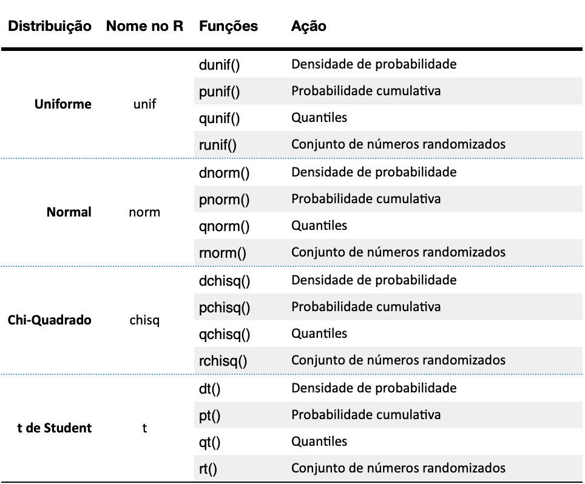

# Distribuições de Probabilidade {#sec-distribuicoes}

Distribuições teóricas são modelos matemáticos que descrevem como os dados se comportam. Elas são importantes porque permitem a modelagem e previsão de fenômenos naturais, fazendo inferências sobre uma população a partir de uma amostra e testando hipóteses para determinar a significância dos resultados observados.

Pacotes usados neste capítulo, carregados uma única vez no início, como recomendado no capítulo sobre pacotes (@sec-packages):

```{r, message=FALSE, warning=FALSE}
library(ggplot2)
```

Na medicina, esses conceitos são aplicados de várias maneiras. Ensaios clínicos utilizam distribuições teóricas para determinar a significância dos resultados dos testes de tratamento, por exemplo, modelando a distribuição dos resultados com a distribuição normal. Estudos epidemiológicos usam distribuições para modelar a incidência e prevalência de doenças, como a distribuição de Poisson para modelar o número de novos casos em um determinado período. A análise de sobrevivência utiliza a distribuição exponencial para modelar o tempo de sobrevivência dos pacientes após um tratamento ou o tempo até a ocorrência de um evento específico, como a recaída de uma doença. Distribuições teóricas de probabilidade são, portanto, elementos fundamentais da análise estatística.

O R, sendo uma linguagem estatística, naturalmente possui diversos comandos para criar conjuntos de números aleatórios com distribuições de diversos tipos. Para cada distribuição o R possui 4 funções principais: densidade de probabilidade (d), probabilidade cumulativa (p), quantiles (q) e números randomizados (r). Cada uma dessas funções é obtida colocando-se a letra correspondente (d, p, q, r) como prefixo do nome da distribuição no R. A tabela abaixo mostra algumas das distribuições e as funções associadas.



## Definindo o ponto de partida para a geração de números aleatórios

A função `set.seed()` do R é utilizada para definir a semente (ou seed, em inglês) de geração de números aleatórios, ou seja, o ponto de partida para a geração de números aleatórios. Isso é particularmente útil quando você precisa garantir que seus resultados sejam reprodutíveis. Ao definir uma semente específica, qualquer operação subsequente que envolva a geração de números aleatórios produzirá os mesmos resultados em diferentes execuções, desde que a mesma semente seja usada.

Sem definir uma semente, os resultados da simulação mudarão a cada execução. No entanto, ao usar `set.seed()`, você pode garantir que os resultados sejam consistentes.

```{r}
# Cada execução desse código resultará em uma sequência diferente de 5 números.
rnorm(5)
```

```{r}
# Cada execução desse código resultará sempre em na mesma sequencia de 5 números.
# Alterar o argumento da função set.seed irá mudar a sequencia de números.
set.seed(1)
rnorm(5)
```

A semente deve ser sempre um número inteiro. Diferentes números de sementes levarão a diferentes sequências de números aleatórios. Observe que `set.seed()` não altera os números gerados globalmente para toda a sessão R, mas garante que a sequência de números aleatórios gerados após definir a semente seja a mesma.

## Distribuição Uniforme

### `runif`

A função `runif()` gera um conjunto randomizado de números a partir de um distribuição uniforme. Os argumentos dessa função são: a quantidade de números, o valor mínimo e o valor máximo.

Veja abaixo como criar um conjunto randomizado de 20 números distribuídos de forma uniforme entre 0 e 1.

```{r}
ru1 <- runif(n = 20, min = 0, max = 1)
ru1
```

podemos arrendondar esses valores com a função round().

```{r}
# arredondando para 2 casas decimais
round(ru1, 2)
```

Podemos visualizar um histograma dessa distribuição com a função `hist()`. Veja que com poucos elementos a distribuição ainda não parece uniforme.

```{r}
hist(ru1)
```

Entretanto, a medida que aumentando o número de elementos, a forma da distribuição se parece cada vez mais com uma distribuição uniforme. Veja no código abaixo um conjunto randomizado de 10, 100, 1000 e 10.000 elementos criados com a função `runif(`) e os histogramas dessas distribuições.

```{r}
ru1 <- runif(n = 10, min = 0, max = 1)
ru2 <- runif(n = 100, min = 0, max = 1)
ru3 <- runif(n = 1000, min = 0, max = 1)
ru4 <- runif(n = 10000, min = 0, max = 1)
par(mfrow = c(2, 2)) # cria uma matrix 2x2 para plotar os gráficos
hist(ru1)
hist(ru2)
hist(ru3)
hist(ru4)
```

### `dunif`

A função `dunif()` calcula a função de densidade de probabilidade (PDF) da distribuição uniforme, ou seja, a probabilidade de que uma variável aleatória seja igual a um determinado valor. A função `dunif()` tem três argumentos:

-   x: o valor no qual calcular o PDF
-   min: o limite inferior da distribuição
-   max: o limite superior da distribuição

Veja como usar a função `dunif()` para calcular o PDF de uma distribuição uniforme entre 0 e 100 no valor 5:

```{r}
dunif(x=5, min=0, max=100)
```

Isso significa que a probabilidade de uma variável aleatória dessa distribuição ser igual a 5 é 0.01.

### `punif`

A função `punif()` calcula a função de densidade de probabilidade cumulativa (CDF) da distribuição uniforme, ou seja, a probabilidade de que uma variável aleatória seja menor ou igual a um determinado valor.

A função `punif()` requer três argumentos:

-   x: o valor no qual calcular o CDF\
-   min: o limite inferior da distribuição\
-   max: o limite superior da distribuição

Veja um exemplo de como usar a função `punif()` para calcular o CDF de uma distribuição uniforme entre 0 e 100 no valor 5:

```{r}
punif(5, min = 0, max = 100)
```

### `qunif`

A função `qunif()` calcula a função quantil da distribuição uniforme. A função quantil é o inverso do CDF. Dada um probabilidade como entrada, a função retorna o valor que tem essa probabilidade.

A função `qunif()` requer três argumentos:

-   p: a probabilidade\
-   min: o limite inferior da distribuição\
-   max: o limite superior da distribuição

Veja exemplo de como usar a função `qunif()` para calcular o quantil de uma distribuição uniforme entre 0 e 100 na probabilidade de 0.05:

```{r}
qunif(0.05, min = 0, max = 100)
```

## Distribuição Normal

A mais importante das distribuições de probabilidade teóricas é a distribuição normal. Diversos fenômenos na natureza seguem um padrão de distribuição simétrico e em forma de sino. Devido a essa forma, essa distribuição de frequências ficou conhecida como distribuição em sino (bell shaped). Como tantos fenômenos são distribuídos dessa forma, a busca por um modelo matemático para modelar essa distribuição tem uma longa e interessante trajetória na ciência, envolvendo diversos grandes matemáticos. O modelo matemático dessa curva se começou a ser construído por volta do ano de 1733 com o trabalho do matemático Abraham Demoivre, quando buscava modelos para prever resultados de jogos de azar e em 1786 por Pierre Laplace, um astrônomo e matemático. No entanto, a curva normal como modelo para a distribuição de erros na teoria científica é mais comumente associada a um astrônomo e matemático alemão, Karl Friedrich Gauss, que encontrou uma nova derivação da fórmula para a curva em 1809 [@gordon2006normal]. Por esse motivo, a curva normal às vezes é referida como a curva "Gaussiana". Em 1835, outro matemático e astrônomo, Lambert Quetelet, usou o modelo para descrever características fisiológicas e sociais humanas. Quetelet acreditava que "normal" significava média e que os desvios da média eram os erros da natureza. Apesar da visão distorcida de Quetelet, ele foi o primeiro matemático a estender o uso da curva de distribuição normal para os campos das ciências sociais e biomédicas [@stahl2006evolution].

### `rnorm`

A função `rnorm()` gera um conjunto de números randomizados a partir de um distribuição normal. Os argumentos dessa função são: a quantidade de números, a média e o desvio padrão. Se introduzirmos apenas a quantidade de números, a função `rnorm()` utiliza a distribuição normal padrão, com média = 0 e desvio padrão = 1.

Gerando um conjunto randomizado de 1000 números distribuídos de forma normal com média = 0 e desvio padrão = 1.

```{r}
set.seed(100)
rn1 <- rnorm(n = 1000, mean = 0, sd = 1)
plot(density(rn1)) 
```

Poderíamos também escrever a função acima com os argumentos pela ordem:

```{r}
set.seed(100)
rn1 <- rnorm(1000, 0, 1)
plot(density(rn1)) 
```

```{r}
# Inserindo apenas o número de valores a serem gerados
# Nesse caso a função rnorm usa os valores default para media e desvio padrão
# media = 0 e desvio padrão = 1 (curva normal padrão)
set.seed(100)
rn1 <- rnorm(1000)
plot(density(rn1)) 
```

### `dnorm`

A função `dnorm()` é a função de densidade de probabilidade (PDF) de uma distribuição normal e retorna o valor da densidade de probabilidade de um valor x, ou seja, a altura da curva normal naquele ponto. Tem como argumentos o valor x e a média e o desvio padrão da curva. O primeiro argumento é o ponto no eixo x do qual se pretende saber o valor da densidade de probabilidade, o segundo argumento é a média e o terceiro argumento é o desvio padrão.

Por exemplo, para saber o valor da densidade de probabilidade de x=2, numa curva normal padrão (média =0 e desvio padrão =1), o código seria:

```{r}
dnorm(2, mean = 0, sd = 1)
```

Numa curva normal padrão não precisamos informar os valores da média e do desvio padrão, bastando inserir o ponto do eixo x.

```{r}
dnorm(2)
```

```{r, echo=FALSE}
# Parâmetros informados pelo usuário
x.value      <- 2
media        <- 0
desviopadrao <- 1

# Parâmetros calculados a partir dos que foram informados
density.value <- dnorm(x.value, mean = media, sd = desviopadrao)
lim.inf <- media-4*desviopadrao
lim.sup <- media+4*desviopadrao

# Curva Normal Padrão
ggplot(NULL, aes(c(lim.inf,lim.sup))) + 
  geom_area(stat = "function", 
        fun = dnorm, 
        args = list(mean = media, sd = desviopadrao), 
        col="blue", 
        fill = "cornflowerblue", 
        alpha=0.6, 
        xlim = c(lim.inf,lim.sup)) + 
  ggtitle("Distribuição Normal") +
  xlab("x") + 
  ylab("density") +
  theme_classic() +
  theme(plot.title = element_text(size = 16, face = "bold"),
        plot.subtitle = element_text(size = 12, face = "bold"),
        axis.text.x   = element_text(colour="grey20",size=12)) +
  scale_x_continuous(breaks = seq(lim.inf,lim.sup,by = 1)) +
  geom_segment(aes(x = x.value, 
                   y = 0, 
                   xend = x.value, 
                   yend = density.value), 
               arrow = arrow(length = unit(0.2, "cm")), 
               color="red") +
  geom_segment(aes(x = x.value, 
                   y = density.value, 
                   xend = lim.inf, 
                   yend = density.value), 
               arrow = arrow(length = unit(0.2, "cm")), 
               color="red") +
  annotate("text", 
            x = lim.inf, 
            y = density.value, 
            size = 2, 
            fontface ="bold", 
            hjust=1, 
            label=paste(round(density.value,5)))
```

A função `dnorm(x)` pode ser usada também para gerar todos os pontos da curva normal. Isso pode ser útil para desenhar gráficos da curva normal com códigos bem curtos, quando a associamos à função `curve()`, como mostrado nos códigos abaixo.

```{r}
curve(dnorm(x), -3, 3)
```

```{r}
curve(dnorm(x, mean = 10, sd = 2), 4, 16)
```

```{r}
curve(dnorm(x, mean= 100, sd= 10), 50, 150)
```

Podemos inserir várias curvas num mesmo gráfico com o argumento `add=TRUE`.

```{r}
curve(dnorm(x, sd=1), col="black", xlim=c(-10,10), ylim=c(0,0.4), ylab="Densidade")
curve(dnorm(x, sd=2), col="brown", xlim=c(-10,10), ylim=c(0,0.4), ylab="Densidade", add=TRUE)
curve(dnorm(x, sd=3), col="blue",  xlim=c(-10,10), ylim=c(0,0.4), ylab="Densidade", add=TRUE)
curve(dnorm(x, sd=4), col="red",   xlim=c(-10,10), ylim=c(0,0.4), ylab="Densidade", add=TRUE)
curve(dnorm(x, sd=5), col="green", xlim=c(-10,10), ylim=c(0,0.4), ylab="Densidade", add=TRUE)
legend(x = 2.4, y = 0.41, lty=1, 
legend = c("σ = 1",   "σ = 2",   "σ = 3",  "σ = 4",  "σ = 5"),
col =    c("black",   "brown",   "blue",   "red",    "green"))
```

### `pnorm`

A função `pnorm(x)` é utilizada para calcular a função de distribuição acumulada (CDF) de uma distribuição normal. Em outras palavras, ela fornece a probabilidade de que uma variável aleatória com distribuição normal padrão seja menor ou igual a um determinado valor x. Do ponto de vista gráfico, essa função calcula área abaixo da curva normal, à esquerda de x, ou seja, a probabilidade de dados menores que x. O gráfico abaixo mostra a interpretação visual da função `pnorm(x)`.

```{r}
# calculando pnorm de x=2 na curva normal padrão
pnorm(2)
```

```{r, echo=FALSE}
x      <- 2
media  <- 0 #  média
dp     <- 1 # desvio padrão

# limites do gráfico: 4 desvios padrões abaixo e acima da média
lim.inf <- media-4*dp
lim.sup <- media+4*dp

# área à esquerda do ponto x, em percentual, com duas casas decimais depois da vírgula
left.area      <- round(pnorm(x, mean=media, sd=dp), 4)*100
left.area.text <- as.character(left.area)
left.area.text <- paste(left.area.text, "%", sep="")

# área à direta do ponto x, em percentual, com duas casas decimais depois da vírgula
right.area      <-  round(1- pnorm(x, mean=media, sd=dp), 4)* 100
right.area.text <- as.character(right.area)
right.area.text <- paste(right.area.text, "%", sep="")

# gráfico
ggplot(NULL, aes(c(lim.inf,lim.sup))) + 
    geom_area(stat = "function", 
            fun = dnorm,
            args = list(mean = media, sd = dp),
            col="blue", 
            fill = "red", 
            alpha=0.68, 
            xlim = c(lim.inf, x)) +
    geom_area(stat = "function", 
            fun = dnorm, 
            args = list(mean = media, sd = dp),
            col="blue", 
            fill = "cornflowerblue", 
            alpha=0.2, 
            xlim = c(x, lim.sup)) +
    geom_segment(aes(x = x, y = 0, xend = x, yend = dnorm(x, mean=media, sd=dp))) +
    labs(title = "Distribuição normal", 
         subtitle = "pnorm(2) = 0.9772499 ") +
    xlab("x") +
    ylab("probability") +
    annotate("text", x = media , 
             y = dnorm(media, mean=media, sd=dp)/3, 
             size = 10, 
             fontface ="bold", 
             hjust=0.5, 
             label=left.area.text) +
    theme_classic() +
    theme(plot.title = element_text(size = 16, face = "bold"),
                       plot.subtitle = element_text(size = 12, face = "bold"),
                       axis.text.x   = element_text(colour="grey20",size=12))
```

Observe que a função `pnorm(x)` usou os valores padrões de media = 0 e desvio padrão = 1. Caso seja necessário usar outros valores, basta inserir esses argumentos na função pnorm().

Vamos usar um estudo da ANAC (Agência Nacional de Aviação Civil) [@Silva2009] como exemplo. Nesse estudo foi a média da altura dos homens brasileiros usuários do sistema de aviação foi estimada em 173,1 cm com um desvio padrão de 7,3cm. Usando esses dados como exemplo, podemos calcular qual o percentual de homens dessa amostra com altura inferior a 190cm.

```{r}
pnorm(190, mean=173.1, sd=7.3)
```

A função `pnorm(x)` calcula a área abaixo da curva À ESQUERDA do ponto x. Como a área total abaixo de uma curva normal é 1, Para saber a área à direita basta subtrair o resultado de 1, como feito abaixo:

```{r}
1 - pnorm(190, mean=173.1, sd=7.3)
```

Ou seja, aproximadamente 1% dos homens brasileiros dessa amostra tem altura superior a 190cm.

```{r,echo=FALSE}
# Estudo da ANAC - Agencia Nacional de Aviação Civil
# LEVANTAMENTO DO PERFIL ANTROPOMÉTRICO DA POPULAÇÃO BRASILEIRA 
# USUÁRIA DO TRANSPORTE AÉREO NACIONAL – PROJETO CONHECER
# Resultados: 
# Estatura média 173,1 cm 
# desvio padrão 7,3 cm. 
# Apenas 1,2% da população com estatura acima de 190,1cm.
x  <- 190
h  <- 173.1 # altura média em cm
dp <- 7.3   # desvio padrão da altura em cm

# limites do gráfico: 4 desvios padrões abaixo e acima da média
lim.inf <- h-4*dp
lim.sup <- h+4*dp

# área à esquerda do ponto x, em percentual, com duas casas decimais depois da vírgula
left.area      <- round(pnorm(x, mean=h, sd=dp), 4)*100
left.area.text <- as.character(left.area)
left.area.text <- paste(left.area.text, "%", sep="")

# área à direta do ponto x, em percentual, com duas casas decimais depois da vírgula
right.area      <-  round(1- pnorm(x, mean=h, sd=dp), 4)* 100
right.area.text <- as.character(right.area)
right.area.text <- paste(right.area.text, "%", sep="")

# gráfico
ggplot(NULL, aes(c(lim.inf,lim.sup))) + 
    geom_area(stat = "function", 
            fun = dnorm,
            args = list(mean = h, sd = dp),
            col="blue", 
            fill = "red", 
            alpha=0.7, 
            xlim = c(lim.inf, x)) +
    geom_area(stat = "function", 
            fun = dnorm, 
            args = list(mean = h, sd = dp),
            col="blue", 
            fill = "cornflowerblue", 
            alpha=0.6, 
            xlim = c(x, lim.sup)) +
    geom_segment(aes(x = x, y = 0, xend = x, yend = dnorm(x, mean=h, sd=dp))) +
    labs(title = "Distribuição da altura da população brasileira", 
         subtitle = "Estudo ANAC - Projeto Conhecer - 2009") +
    xlab("x") +
    ylab("probability") +
    annotate("text", x = h , 
             y = dnorm(h, mean=h, sd=dp)/3, 
             size = 7, 
             fontface ="bold", 
             hjust=0.5, 
             label=left.area.text) +
    annotate("text", x = h, y = -0.001, size = 3, fontface ="bold", hjust=0.5, label=h) +
    annotate("text", x = x, y = -0.001, size = 3, fontface ="bold", hjust=0.5, label=x) +
    theme_classic() +
    theme(plot.title = element_text(size = 16, face = "bold"),
                       plot.subtitle = element_text(size = 12, face = "bold"),
                       axis.text.x   = element_text(colour="grey20",size=12))
```

### `qnorm`

A função `qnorm()` faz o calculo inverso da função `pnorm()`. é utilizada para calcular o quantil (ou percentil) de uma distribuição normal. Isso significa que ela fornece o valor x tal que a área sob a curva normal à esquerda de x é igual a uma probabilidade especificada p. O argumento da função `qnorm(p)` é extamente essa probabilidade, o percentual abaixo da curva à esquerda do ponto x. O resultado dessa função é o valor no eixo x que delimita essa área.

Com essa função podemos nos perguntar qual deve ser a altura das portas de um avião para que 99% dos brasileiros usuários dos aeroportos possam passar pela porta de um avião sem ter de se abaixar? Ou seja, qual a medida da estatura abaixo do qual estão 99% dos brasileiros dessa amostra? Lembrando que a média da altura dos homens brasileiros usuários do sistema de aviação foi estimada em 173,1 cm com um desvio padrão de 7,3cm, o código fica assim:

```{r}
qnorm(0.99, mean=173.1, sd=7.3)
```

Essa análise pode ser visualizada no gráfico abaixo:

```{r, echo=FALSE}
# Estudo da ANAC - Agencia Nacional de Aviação Civil
# LEVANTAMENTO DO PERFIL ANTROPOMÉTRICO DA POPULAÇÃO BRASILEIRA 
# USUÁRIA DO TRANSPORTE AÉREO NACIONAL – PROJETO CONHECER
# Resultados: 
# Estatura média 173,1 cm 
# desvio padrão 7,3 cm. 
# Apenas 1,2% da população com estatura acima de 190,1cm.
x  <- 190.0823
h  <- 173.1 # altura média em cm
dp <- 7.3   # desvio padrão da altura em cm

# limites do gráfico: 4 desvios padrões abaixo e acima da média
lim.inf <- h-4*dp
lim.sup <- h+4*dp

# área à esquerda do ponto x, em percentual, com duas casas decimais depois da vírgula
left.area      <- round(pnorm(x, mean=h, sd=dp), 4)*100
left.area.text <- as.character(left.area)
left.area.text <- paste(left.area.text, "%", sep="")

# área à direta do ponto x, em percentual, com duas casas decimais depois da vírgula
right.area      <-  round(1- pnorm(x, mean=h, sd=dp), 4)* 100
right.area.text <- as.character(right.area)
right.area.text <- paste(right.area.text, "%", sep="")

# gráfico
ggplot(NULL, aes(c(lim.inf,lim.sup))) + 
    geom_area(stat = "function", 
            fun = dnorm,
            args = list(mean = h, sd = dp),
            col="blue", 
            fill = "cornflowerblue", 
            alpha=0.2, 
            xlim = c(lim.inf, x)) +
    geom_area(stat = "function", 
            fun = dnorm, 
            args = list(mean = h, sd = dp),
            col="blue", 
            fill = "red", 
            alpha=0.8, 
            xlim = c(x, lim.sup)) +
    geom_segment(aes(x = x, y = 0, xend = x, yend = dnorm(x, mean=h, sd=dp))) +
    labs(title = "Qual a estatura abaixo da qual estão 99% dos Brasileiros", 
         subtitle = "Estudo ANAC - Projeto Conhecer - 2009") +
    xlab("x") +
    ylab("probability") +
    annotate("text", x = h , 
             y = dnorm(h, mean=h, sd=dp)/3, 
             size = 10, 
             fontface ="bold", 
             hjust=0.5, 
             label=left.area.text) +
    annotate("text", x = h, y = -0.001, size = 3, fontface ="bold", hjust=0.5, label=h) +
    annotate("text", x = x, y = -0.001, size = 3, fontface ="bold", hjust=0.5, label=x) +
    theme_classic() +
    theme(plot.title = element_text(size = 16, face = "bold"),
                       plot.subtitle = element_text(size = 12, face = "bold"),
                       axis.text.x   = element_text(colour="grey20",size=12))
```

## Distribuiçao t de Student

A distribuição t de Student (também conhecida como distribuição t) foi introduzida por William Sealy Gosset em 1908, sento usada para estimar a média de variáveis aleatórias normalmente distribuídas para as quais o tamanho da amostra é pequeno e o desvio padrão é desconhecido. A distribuição t parece muito semelhante à distribuição normal, e converge para a curva normal à medida que o tamanho da amostra aumenta.

### `rt()`

A função `rt()` cria conjunto randomizado de números a partir de um distribuição t de Student. Os argumentos dessa função são: a quantidade de números e os graus de liberdade (*degrees of freedom* - df).

```{r}
set.seed(1)
x <- rt(n = 1000, df = 10)
plot(density(x))
```

### `dt()`

As funções `dt()`, `pt()`, `qt()` funcionam da mesma forma que suas correspondentes na distribuição normal, como já discutido anteriormente, com a diferença de que o parâmetro da distribuição t são os graus de liberdade (degrees of freedom - df) e não a média e o desvio padrão.

A função `dt()` é a função de densidade de probabilidade (PDF) na curva de distribuição t. Tem como argumento o ponto no eixo x e os graus de liberdade e seu resultado é o valor da densidade de probabilidade, ou a altura da curva t nesse ponto.

Por exemplo, para saber o valor da densidade de probabilidade de x=2, numa curva de distribuição t com 5 graus de liberdade (df = 5), o código seria:

```{r}
dt(x=2, df=5)
```

```{r, echo=FALSE}
# Parâmetros informados pelo usuário
x.value      <- 2 # ponto no eixo x da curva de distribuição t
gl           <- 5 # graus de liberdade

# Parâmetros calculados a partir dos que foram informados
density.value <- dt(x.value, df=gl)
lim.inf <- -4
lim.sup <- +4

# Curva t
ggplot(NULL, aes(c(lim.inf,lim.sup))) + 
  geom_area(stat = "function", 
        fun = dt, 
        args = list(df=gl), 
        col="blue", 
        fill = "cornflowerblue", 
        alpha=0.3, 
        xlim = c(lim.inf,lim.sup)) + 
  ggtitle(label = "Distribuição t", subtitle = "x=2, df=5") +
  xlab("x") + 
  ylab("density") +
  theme_classic() +
  theme(plot.title = element_text(size = 16, face = "bold"),
        plot.subtitle = element_text(size = 12, face = "bold"),
        axis.text.x   = element_text(colour="grey20",size=12)) +
  scale_x_continuous(breaks = seq(lim.inf,lim.sup,by = 1)) +
  geom_segment(aes(x = x.value, 
                   y = 0, 
                   xend = x.value, 
                   yend = density.value), 
               arrow = arrow(length = unit(0.2, "cm")), 
               color="red") +
  geom_segment(aes(x = x.value, 
                   y = density.value, 
                   xend = lim.inf+1, 
                   yend = density.value), 
               arrow = arrow(length = unit(0.2, "cm")), 
               color="red") +
  annotate("text", 
            x = lim.inf+1 , 
            y = density.value, 
            size = 5, 
            fontface ="bold", 
            hjust=1, 
            label=paste(round(density.value,5)))
```

A função `dt()` pode ser usada também para gerar todos os pontos da curva, o que pode ser útil para desenhar gráficos da curva t com códigos bem curtos, quando a associamos à função `curve()`, como mostrado nos códigos abaixo.

```{r}
curve(dt(x, df = 5), 
      xlim = c(-4,4) )
```

Podemos inserir várias curvas num mesmo gráfico, usando o argumento add=TRUE.

```{r}
curve(dnorm(x),   col="black", xlim=c(-5,5), ylim=c(0,0.4), ylab="Densidade")
curve(dt(x,df=20),col="brown", add=TRUE)
curve(dt(x,df=5), col="blue",  add=TRUE)
curve(dt(x,df=2), col="red",   add=TRUE)
curve(dt(x,df=1), col="green", add=TRUE)
legend(x = 2.4, y = 0.41, lty=1, 
legend = c("normal curve","t, df=20","t, df=5","t, df=2","t, df=1"),
col =    c(       "black",   "brown",   "blue",    "red",  "green"))
```

### `pt()`

A função `pt(q)` é utilizada para calcular a função de distribuição acumulada (CDF) da distribuição t de Student. Ela fornece a probabilidade de que uma variável aleatória com uma distribuição t de Student seja menor ou igual a um determinado valor x. Ou seja, calcula área abaixo da curva de distribuição t, à esquerda de q (quantile).

Os argumentos dessa função são o quantile (q) e os graus de liberdade da curva t (df). O código e o gráfico abaixo mostram o resultado da função `pt()` e a a interpretação visual da função.

```{r}
pt(q = 2, df = 5)
```

```{r, echo=FALSE}
x.value <- 2
gl      <- 5 # graus de liberdade

# limites do gráfico: 4 desvios padrões abaixo e acima da média
lim.inf <- -4
lim.sup <- +4

# área à esquerda do ponto x, em percentual, com duas casas decimais depois da vírgula
left.area           <- round(pt(x.value, df= gl), 4)*100
left.area.decimal   <- round(pt(x.value, df= gl), 4)
left.area.text <- as.character(left.area)
left.area.text <- paste(left.area.text, "%", sep="")

left.area.text.decimal <- as.character(left.area.decimal)

# área à direta do ponto x, em percentual, com duas casas decimais depois da vírgula
right.area      <- round(1 - pt(x.value, df=gl), 4)* 100
right.area.text <- as.character(right.area)
right.area.text <- paste(right.area.text, "%", sep="")

# gráfico
ggplot(NULL, aes(c(lim.inf,lim.sup))) + 
    geom_area(stat = "function", 
            fun = dt,
            args = list(df= gl),
            col="blue", 
            fill = "red", 
            alpha=0.7, 
            xlim = c(lim.inf, x.value)) +
    geom_area(stat = "function", 
            fun = dt, 
            args = list(df= gl),
            col="blue", 
            fill = "cornflowerblue", 
            alpha=0.8, 
            xlim = c(x.value, lim.sup)) +
    geom_segment(aes(x = x.value, y = 0, xend = x.value, yend = dt(x.value, df= gl))) +
    labs(title = "Distribuição t", subtitle = "q = 2, df = 5") +
    xlab("quantiles") +
    ylab("density") +
   annotate("text", x = 0, 
             y = 0.15,
             size = 7, 
             fontface ="bold", 
             hjust=0.5, 
             label=left.area.text.decimal) +
  annotate("text", x = 0, 
             y = 0.115,
             size = 4, 
             fontface ="bold", 
             hjust=0.5, 
             label="ou") +
  annotate("text", x = 0, 
             y = 0.08,
             size = 7, 
             fontface ="bold", 
             hjust=0.5, 
             label=left.area.text) +
  
      theme_classic() +
  
      theme(plot.title = element_text(size = 16, face = "bold"),
                       plot.subtitle = element_text(size = 12, face = "bold"),
                       axis.text.x   = element_text(colour="grey20",size=12))
```

### `qt()`

A função `qt()`, faz o inverso da função `pt()`: dada uma área abaixo da curva de distribuição t, a função retorna o quantile (q) que delimita essa área à esquerda. Os argumentos dessa função são a área em decimais (p) e os graus de liberdade da curva t (df). O resultado da função é o quantile.

Como exemplo, usamos a probabilidade 0.9490303, que é justamente o resultado de `pt(q = 2, df = 5)` calculado acima. A função devolve então o quantil 2.

```{r}
qt(p = 0.9490303, df = 5)
```

## Distribuição Chi-quadrado

A distribuição qui-quadrado é frequentemente usada em testes estatísticos, como o teste de independência em tabelas de contingência ou o teste de ajuste (goodness-of-fit).

### `rchisq()`

A função `rchisq()` cria conjunto randomizado de números a partir de um distribuição Chi quadrado. Os argumentos dessa função são: a quantidade de números e os graus de liberdade (degrees of freedom - df).

```{r}
set.seed(1)
y <- rchisq(n = 1000, df = 3)
plot(density(y))
```

### `dchisq()`

A função `dchisq()` é utilizada para calcular a função densidade de probabilidade (PDF) de uma distribuição qui-quadrado ($\chi^2$). Ela retorna a densidade da função qui-quadrado para um dado valor x, ou seja, a altura da curva de densidade qui-quadrado naquele ponto específico.

Podemos usar a função `dchisq()` para construir gráficos da distribuição chi-quadrado, da mesma forma como fizemos com a curva normal.

```{r}
curve(dchisq(x, df=3), 
      col="black",
      xlim=c(0,30), 
      ylim=c(0,0.6),
      ylab="Chi Square Density")
```

E também podemos usar a o argumento add=TRUE para inserir várias curvas no mesmo gráfico.

```{r}
curve(dchisq(x, df=1 ),col="black", xlim=c(0,30), ylim=c(0,0.6), ylab="Chi Square Density")
curve(dchisq(x, df=2 ),col="red",         add=TRUE)
curve(dchisq(x, df=3 ),col="blue",        add=TRUE)
curve(dchisq(x, df=5 ),col="dark green",  add=TRUE)
curve(dchisq(x, df=10),col="brown",       add=TRUE)
legend(x = 25, y = 0.55, 
       legend = c("df=1","df=2","df=3","df=5","df=10"),
       col    = c("black","red","blue","dark green","brown"),
       lty=1)
```

As funções `pchisq()`, `qchisq()` funcionam da mesma forma que suas correspondentes na distribuição normal e t de Student, como já discutido anteriormente, lembrando que o parâmetro da distribuição chi-quadrado são os graus de liberdade (degrees of freedom - df).

### `pchisq()`

A função pchisq em R é usada para calcular a distribuição acumulada (CDF) da distribuição qui-quadrado ($\chi^2$). Os principais argumentos da função `pchisq()` são:

-   `q` é o valor da estatística qui-quadrado para o qual você deseja calcular a probabilidade acumulada.
-   `df` é o número de graus de liberdade da distribuição.

Por padrão a funçõa retorna probabilidade acumulada do valor da estatística ser menor ou igual a `q`. Caso deseje a probabilidade de ser **maior ou igual** a `q` é necessário acrescentar o argumento `lower.tail=FALSE`

Suponha que você tenha uma estatística qui-quadrado de 6 e 2 graus de liberdade e queira calcular a probabilidade acumulada P(x ≤ 6)

```{r}
pchisq(q = 6, df = 2)
```

O gráfico abaixo visualiza o uso da função `pchisq(q = 6, df = 2)`

```{r, echo=FALSE, message=FALSE, warning=FALSE}
# Definir os parâmetros
q <- 6
df <- 2

# Calcular a probabilidade acumulada
prob_acumulada <- round(pchisq(q, df), 5)

# Criar uma sequência de valores para o eixo x
x <- seq(0, 15, length.out = 1000)

# Calcular a densidade da distribuição qui-quadrado
y <- dchisq(x, df)

# Criar um data frame com os valores
data <- data.frame(x = x, y = y)

# Criar o gráfico
ggplot(data, aes(x = x, y = y)) +
  geom_area(aes(ifelse(x <= q, x, NA)), fill = "blue", alpha = 0.3) +
  geom_line(color = "blue") +
  geom_vline(xintercept = q, linetype = "dashed", color = "red") +
  annotate("text", x = q+1, y = max(y)/2, label = paste0("q = ", q), vjust = -0.5, color = "red") +
  annotate("text", x = 1.5, y = 0.05, label = paste0("prob = ", prob_acumulada), vjust = -0.5, color = "red") +
  labs(title = "Distribuição Qui-Quadrado com 2 Graus de Liberdade",
       subtitle = paste0("Probabilidade acumulada até q = ", q, ": ", prob_acumulada),
       x = "Valor da Estatística Qui-Quadrado",
       y = "Densidade") +
  theme_minimal()
```

### `qchisq()`

A função `qchisq()` é o oposto da `pchisq()`. É usada para calcular o quantil da distribuição qui-quadrado. Em outras palavras, ela encontra o valor `q` tal que a probabilidade acumulada até `q` seja igual a um dado valor de probabilidade `p`. Isso é útil em testes de hipóteses e intervalos de confiança onde se deseja encontrar os pontos críticos da distribuição qui-quadrado.

Como exemplo, usamos a probabilidade 0.9502129, que é o resultado de `pchisq(q = 6, df = 2)` calculado acima. A função devolve então o quantil 6.

```{r}
qchisq(p = 0.9502129, df = 2)
```

## Distribuição de Poisson

As funções para distribuição de Poisson seguem o mesmo padrão das anteriores:

-   `rpois()` cria conjunto randomizado de números numa distribuição de Poisson.
-   `dpois()` calcula a função de densidade de probabilidade (PDF) da distribuição Poisson. O primeiro argumento é o ponto no eixo x do qual se pretende saber o valor da densidade de probabilidade, o segundo argumento é o parâmetro lambda.
-   `ppois()` calcula a função de distribuição acumulada (CDF) da distribuição de Poisson, ou seja, calcula a probabilidade de que uma variável aleatória com uma distribuição de Poisson seja menor ou igual a um determinado valor x.
-   `qpois()` calcula o quantil de uma distribuição de Poisson, ou seja, retorna o valor x tal que a probabilidade acumulada P(X≤x)seja igual a uma probabilidade especificada p.

## Resumo

O R possui essas funções de densidade, densidade cumulativa, quantil e numeros randomizados para diversas funções. O quadro abaixo resume esse capítulo.

| Distribuição      | PDF (`d`)             | CDF (`p`)             | Quantil (`q`)         | Aleatório (`r`)       |
|---------------|---------------|---------------|---------------|---------------|
| Normal            | `dnorm`               | `pnorm`               | `qnorm`               | `rnorm`               |
| Binomial          | `dbinom`              | `pbinom`              | `qbinom`              | `rbinom`              |
| Poisson           | `dpois`               | `ppois`               | `qpois`               | `rpois`               |
| Qui-quadrado      | `dchisq`              | `pchisq`              | `qchisq`              | `rchisq`              |
| t de Student      | `dt`                  | `pt`                  | `qt`                  | `rt`                  |
| F                 | `df`                  | `pf`                  | `qf`                  | `rf`                  |
| Exponencial       | `dexp`                | `pexp`                | `qexp`                | `rexp`                |
| Gamma             | `dgamma`              | `pgamma`              | `qgamma`              | `rgamma`              |
| Beta              | `dbeta`               | `pbeta`               | `qbeta`               | `rbeta`               |
| Geométrica        | `dgeom`               | `pgeom`               | `qgeom`               | `rgeom`               |
| Hipergeométrica   | `dhyper`              | `phyper`              | `qhyper`              | `rhyper`              |
| Binomial Negativa | `dnbinom`             | `pnbinom`             | `qnbinom`             | `rnbinom`             |
| Uniforme          | `dunif`               | `punif`               | `qunif`               | `runif`               |
| Weibull           | `dweibull`            | `pweibull`            | `qweibull`            | `rweibull`            |
| Log-normal        | `dlnorm`              | `plnorm`              | `qlnorm`              | `rlnorm`              |
| Multinomial       | `dmultinom`           | \-                    | \-                    | `rmultinom`           |
| Cauchy            | `dcauchy`             | `pcauchy`             | `qcauchy`             | `rcauchy`             |
| Beta-Binomial     | `dbetabinom` (VGAM)   | `pbetabinom` (VGAM)   | `qbetabinom` (VGAM)   | `rbetabinom` (VGAM)   |
| Normal Inversa    | `dinvgauss` (statmod) | `pinvgauss` (statmod) | `qinvgauss` (statmod) | `rinvgauss` (statmod) |
| Pareto            | `dpareto` (VGAM)      | `ppareto` (VGAM)      | `qpareto` (VGAM)      | `rpareto` (VGAM)      |
